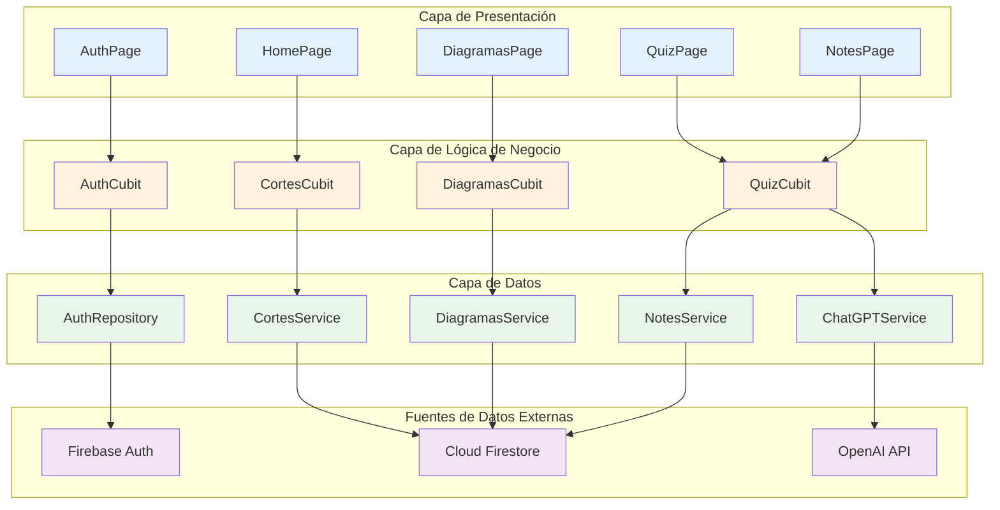
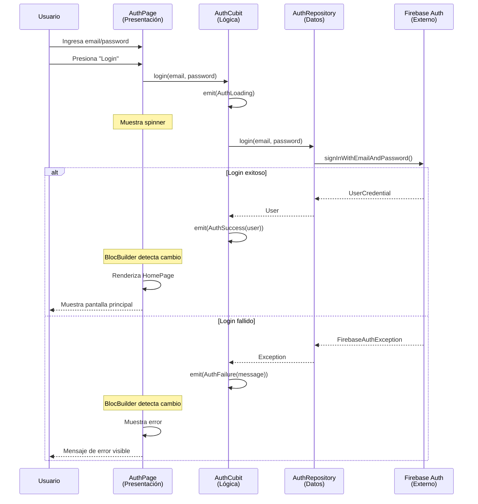

# Panorama General de la Arquitectura de la Aplicación

> **Nivel**: Intermedio
> **Prerrequisitos**: flutter-basics/03-state-management-intro.md
> **Tiempo de lectura**: 25 minutos

## Introducción

### ¿Qué es la Arquitectura de Software?

Imagina que vas a construir un edificio de apartamentos. Antes de empezar a poner ladrillos, un arquitecto crea planos que muestran:
- Dónde van las habitaciones (estructura)
- Cómo fluye el agua y la electricidad (conexiones)
- Cómo las personas se mueven entre pisos (flujos)
- Qué hace cada espacio (responsabilidades)

La arquitectura de software es exactamente lo mismo, pero para código. Define:
- Cómo se organiza el código (estructura)
- Cómo los componentes se comunican (conexiones)
- Cómo fluyen los datos (flujos)
- Qué hace cada parte (responsabilidades)

Una buena arquitectura hace que tu código sea:
- **Entendible**: Cualquiera puede ver el plano y entender cómo funciona
- **Mantenible**: Puedes arreglar una tubería sin demoler la casa entera
- **Testeable**: Puedes probar cada habitación independientemente
- **Escalable**: Puedes agregar pisos sin reconstruir la fundación

### Arquitectura de Tres Capas

Esta aplicación usa una arquitectura de tres capas, como un edificio de tres pisos, donde cada piso tiene su propósito específico y no puede saltarse pisos para comunicarse:

**Piso 3: Capa de Presentación (UI)**
- **Qué hace**: Muestra información y recibe interacciones del usuario
- **Habitantes**: Páginas (pages), Widgets, CustomPainters
- **Analogía**: Es la tienda o recepción - donde los clientes interactúan

**Piso 2: Capa de Lógica de Negocio**
- **Qué hace**: Procesa eventos, toma decisiones, coordina operaciones
- **Habitantes**: Cubits, Estados (States), Eventos (Events)
- **Analogía**: Es la gerencia - toma decisiones y coordina

**Piso 1: Capa de Datos**
- **Qué hace**: Accede a datos externos (Firebase, APIs), maneja persistencia
- **Habitantes**: Repositories, Services, Models
- **Analogía**: Es el almacén o cocina - donde se hace el trabajo real

**Reglas de Oro**:
1. Las capas solo hablan con la capa inmediatamente inferior
2. Los datos siempre fluyen hacia arriba
3. Los comandos siempre fluyen hacia abajo

```
Usuario toca botón (Capa 3)
    ↓
Cubit procesa evento (Capa 2)
    ↓
Service obtiene datos de Firebase (Capa 1)
    ↓ (datos suben)
Cubit emite nuevo estado (Capa 2)
    ↓
UI se actualiza (Capa 3)
```

### Inyección de Dependencias: Entregando Herramientas

Imagina que eres un chef. Necesitas un cuchillo para cocinar, pero no quieres tener que ir a la tienda a comprarlo cada vez que entras a la cocina. En lugar de eso, cuando empiezas tu turno, alguien te entrega el cuchillo que necesitas.

Eso es inyección de dependencias: en lugar de que cada componente cree sus propias herramientas (repositorios, services), se las "inyectamos" cuando se crean. Esto tiene ventajas enormes:

1. **Testing**: Puedes darle un cuchillo de mentira (mock) para practicar sin cortar nada real
2. **Reutilización**: El mismo cuchillo (instancia) se comparte entre varios chefs
3. **Flexibilidad**: Puedes cambiar el tipo de cuchillo sin cambiar cómo cocina el chef

En Flutter con BLoC, usamos `RepositoryProvider` para esto. Es como un dispensador de herramientas al que cualquiera puede acceder con `context.read<Herramienta>()`.

### Recorrido por main.dart: El Corazón de la App

El archivo `main.dart` es como el circuito eléctrico principal de un edificio: conecta todo y lo enciende. Veamos qué hace paso por paso:

**1. Preparación Inicial (antes de que nada se muestre)**
```dart
void main() async {
  // Asegura que Flutter esté listo
  WidgetsFlutterBinding.ensureInitialized();

  // Carga las variables de entorno (.env)
  await dotenv.load(fileName: '.env');
  OpenAI.apiKey = Env.openAIAPIKey;

  // Inicializa Firebase
  await Firebase.initializeApp(
    name: 'NeuroAnatomy',
    options: DefaultFirebaseOptions.currentPlatform,
  );

  // Arranca la aplicación
  runApp(const NeuroAnatomy());
}
```

Es como preparar el edificio antes de abrir: conectar la electricidad (Flutter binding), configurar el wifi (variables de entorno), conectar el agua (Firebase), y finalmente abrir las puertas (runApp).

**2. Configuración de Repositorios (Dispensador de Herramientas)**
```dart
MultiRepositoryProvider(
  providers: [
    RepositoryProvider<AuthRepository>(
      create: (context) => AuthRepository(),
    ),
  ],
  child: MaterialApp(...)
)
```

Aquí configuramos el "dispensador de herramientas". Ahora, en cualquier parte de la app, podemos pedir `context.read<AuthRepository>()` y obtendremos la misma instancia compartida.

**3. Configuración de la App**
```dart
MaterialApp(
  title: 'NeuroAnatomy',
  theme: mainTheme(),  // Colores y estilos
  debugShowCheckedModeBanner: false,
  home: // ... lógica de navegación
)
```

MaterialApp es la raíz de toda la aplicación. Define el tema visual, el título, y qué mostrar al inicio.

**4. Lógica de Navegación Basada en Autenticación**
```dart
BlocProvider<AuthCubit>(
  create: (context) =>
      AuthCubit(authRepository: context.read<AuthRepository>()),
  child: BlocBuilder<AuthCubit, FirebaseAuthState>(
      builder: (context, state) {
    if (state is AuthSuccess) {
      return HomePage();  // Usuario autenticado → Home
    } else if (state is AuthFailure ||
               state is AuthInitial ||
               state is AuthLoading) {
      return AuthPage();  // No autenticado → Login
    } else {
      return CircularProgressIndicator();  // Cargando
    }
  }),
)
```

Esta es la magia de la navegación basada en estado. No decimos "navega a HomePage". En lugar de eso, decimos: "Si el estado es AuthSuccess, muestra HomePage. Si no, muestra AuthPage".

Es como una puerta automática: se abre sola cuando detecta que tienes las credenciales correctas.

### Flujo Completo de Datos: Historia de un Login

Veamos una historia completa de cómo fluyen los datos cuando un usuario inicia sesión:

**Capítulo 1: El Usuario Actúa (Capa de Presentación)**
```
Usuario escribe email y contraseña
Usuario presiona "Iniciar Sesión"
```

**Capítulo 2: La UI Llama al Cubit (Presentación → Lógica)**
```dart
// AuthForm widget llama:
context.read<AuthCubit>().login(email, password)
```

**Capítulo 3: El Cubit Coordina (Lógica de Negocio)**
```dart
// AuthCubit primero emite estado de carga:
emit(AuthLoading(email: email, password: password))

// Luego llama al Repository:
final user = await authRepository.login(email, password);
```

**Capítulo 4: El Repository Accede a Firebase (Capa de Datos)**
```dart
// AuthRepository habla con Firebase:
final credentials = await FirebaseAuth.instance
    .signInWithEmailAndPassword(email: email, password: password);
return credentials.user;
```

**Capítulo 5: Los Datos Suben (Datos → Lógica)**
```dart
// El Repository devuelve el User al Cubit
// El Cubit emite nuevo estado:
emit(AuthSuccess(user: user))
```

**Capítulo 6: La UI Reacciona (Lógica → Presentación)**
```dart
// BlocBuilder detecta el cambio de estado
// Se reconstruye con el nuevo estado
// Como state es AuthSuccess, muestra HomePage
return HomePage();
```

Todo el viaje toma fracciones de segundo, pero cada paso está perfectamente orquestado.

---

## Documentación Técnica Formal

### Fundamento Teórico

#### Arquitectura en Capas (Layered Architecture)

La arquitectura en capas es un patrón arquitectónico que organiza el sistema en grupos (capas) donde cada capa tiene un rol y responsabilidad bien definidos (Fowler, 2002). Cada capa:

1. Provee servicios a la capa inmediatamente superior
2. Actúa como cliente de la capa inmediatamente inferior
3. Permanece agnóstica de las capas no adyacentes

**Ventajas**:
- **Separación de responsabilidades**: Cada capa tiene un propósito único (SRP - Single Responsibility Principle)
- **Independencia de capas**: Cambios en una capa no afectan otras si la interfaz se mantiene
- **Testabilidad**: Cada capa puede testearse independientemente mediante mocks de capas inferiores
- **Mantenibilidad**: Los desarrolladores pueden razonar sobre una capa sin entender toda la aplicación

**Variantes**:
- **Arquitectura de N capas**: Cualquier número de capas
- **Clean Architecture** (Martin, 2017): Círculos concéntricos con dependencias apuntando hacia dentro
- **Hexagonal Architecture** (Ports and Adapters): Lógica de negocio central con adaptadores intercambiables

#### Arquitectura de Tres Capas en Flutter

**Capa 1: Presentation Layer (Capa de Presentación)**

Responsable de la interacción con el usuario y la representación visual de datos.

**Componentes**:
- Widgets (StatelessWidget, StatefulWidget)
- Pages (pantallas completas)
- CustomPainters (renderizado personalizado)
- BlocBuilder, BlocListener (listeners de estado)

**Responsabilidades**:
- Renderizar UI basada en estado
- Capturar gestos y eventos de usuario
- Navegación entre pantallas
- Animaciones visuales

**Restricciones**:
- No debe contener lógica de negocio
- No debe acceder directamente a fuentes de datos (Firebase, APIs)
- Solo debe comunicarse con la capa de lógica de negocio mediante eventos/métodos

**Capa 2: Business Logic Layer (Capa de Lógica de Negocio)**

Responsable de procesar eventos, gestionar estado, y coordinar operaciones.

**Componentes en esta app**:
- Cubits (variante simplificada de BLoC)
- States (representaciones inmutables de estado)
- Events (en BLoC completo; en Cubit son métodos)

**Responsabilidades**:
- Validar input de usuario
- Decidir qué operaciones ejecutar
- Gestionar estado de aplicación
- Emitir nuevos estados
- Coordinar múltiples fuentes de datos si es necesario

**Restricciones**:
- No debe contener referencias a widgets o BuildContext (excepto para lectura de providers)
- No debe saber nada sobre UI (colores, layouts, animaciones)
- Debe ser completamente testeable sin framework de Flutter

**Capa 3: Data Layer (Capa de Datos)**

Responsable de acceso a datos, ya sean locales o remotos.

**Componentes**:
- Repositories (abstracciones de fuentes de datos)
- Services (implementaciones específicas)
- Models (clases de datos con serialización)
- Data sources (Firebase, APIs, bases de datos locales)

**Responsabilidades**:
- CRUD operations (Create, Read, Update, Delete)
- Serialización/deserialización de datos
- Caching de datos
- Manejo de errores de red/base de datos

**Restricciones**:
- No debe conocer sobre estado de la aplicación
- No debe referenciar Cubits o widgets
- Debe proveer APIs agnósticas de la fuente de datos (un Repository podría cambiar de Firebase a una API REST sin afectar capas superiores)

### Implementación en la Aplicación NeuroAnatomía

#### Punto de Entrada: main.dart

Ubicación: `/lib/main.dart`

El archivo main.dart orquesta la inicialización y configuración de la aplicación.

**Inicialización Asíncrona**

```dart
// /lib/main.dart (líneas 14-23)
void main() async {
  WidgetsFlutterBinding.ensureInitialized();
  await dotenv.load(fileName: '.env');
  OpenAI.apiKey = Env.openAIAPIKey;
  await Firebase.initializeApp(
    name: 'NeuroAnatomy',
    options: DefaultFirebaseOptions.currentPlatform,
  );
  runApp(const NeuroAnatomy());
}
```

**Análisis técnico**:

1. `WidgetsFlutterBinding.ensureInitialized()` (línea 15)
   - Inicializa el binding de Flutter antes de operaciones async
   - Garantiza que el framework esté listo para operaciones nativas
   - Requerido cuando main() es async

2. `dotenv.load(fileName: '.env')` (línea 16)
   - Carga variables de entorno desde archivo .env
   - Patrón de configuración segura (API keys no hardcodeadas)
   - .env debe estar en .gitignore para seguridad

3. `OpenAI.apiKey = Env.openAIAPIKey` (línea 17)
   - Configura SDK de OpenAI con API key
   - `Env` es una clase generada que tipifica variables de entorno
   - Permite acceso seguro a configuración sensible

4. `Firebase.initializeApp()` (líneas 18-21)
   - Inicializa Firebase SDK
   - `DefaultFirebaseOptions.currentPlatform` usa configuración específica de plataforma (iOS/Android)
   - Nombre 'NeuroAnatomy' permite múltiples instancias de Firebase (edge case)

#### Inyección de Dependencias

```dart
// /lib/main.dart (líneas 30-35)
MultiRepositoryProvider(
  providers: [
    RepositoryProvider<AuthRepository>(
      create: (context) => AuthRepository(),
    ),
  ],
  child: MaterialApp(...)
)
```

**Análisis técnico**:

- **MultiRepositoryProvider**: Widget de flutter_bloc que provee múltiples repositorios
- **Patrón Service Locator**: Los repositorios están disponibles globalmente vía context
- **Lazy initialization**: Los repositorios se crean cuando se accede por primera vez
- **Singleton implícito**: Una sola instancia de cada Repository existe en el árbol

**Acceso a repositorios**:
```dart
// Lectura única (no reconstruye en cambios)
final authRepo = context.read<AuthRepository>();

// Escucha continua (reconstruye en cambios) - no aplicable a Repository
final authRepo = context.watch<AuthRepository>();
```

#### Provisión de Cubits

```dart
// /lib/main.dart (líneas 40-42)
BlocProvider<AuthCubit>(
  create: (context) =>
      AuthCubit(authRepository: context.read<AuthRepository>()),
  child: BlocBuilder<AuthCubit, FirebaseAuthState>(...)
)
```

**Análisis técnico**:

- **BlocProvider**: Provee un Cubit al subárbol
- **Constructor dependency injection**: AuthCubit recibe AuthRepository vía constructor
- `context.read<AuthRepository>()`: Busca hacia arriba en el árbol hasta encontrar el RepositoryProvider
- **Inicialización inmediata**: AuthCubit se crea inmediatamente y ejecuta su constructor

#### Navegación Declarativa Basada en Estado

```dart
// /lib/main.dart (líneas 43-66)
BlocBuilder<AuthCubit, FirebaseAuthState>(
  builder: (context, state) {
    if (state is AuthSuccess) {
      return Navigator(
        onGenerateInitialRoutes: (navigator, initialRoute) {
          return [
            MaterialPageRoute(
              builder: (context) => const HomePage(),
            ),
          ];
        },
      );
    } else if (state is AuthFailure ||
        state is AuthInitial ||
        state is AuthLoading) {
      return const AuthPage();
    } else {
      return const Scaffold(
        body: Center(
          child: CircularProgressIndicator(),
        ),
      );
    }
  }
)
```

**Análisis técnico**:

1. **BlocBuilder**: Se reconstruye cada vez que AuthCubit emite un nuevo estado
2. **Pattern matching con type checking**: Usa `is` para determinar tipo de estado
3. **Navegación declarativa**: La UI mostrada es función pura del estado actual
4. **Navigator con onGenerateInitialRoutes**: Permite definir stack inicial de rutas
5. **Fallback**: Cláusula else muestra loading spinner para estados inesperados

**Flujo de estados**:
```
AuthInitial → AuthLoading → AuthSuccess (login exitoso)
                          ↘ AuthFailure (login fallido)
```

### Diagrama: Arquitectura de Tres Capas



### Diagrama: Flujo de Datos del Login



### Especificaciones Técnicas

#### Mapeo de Componentes a Capas

| Directorio | Capa | Componentes | Responsabilidad |
|-----------|------|-------------|-----------------|
| `/lib/pages` | Presentación | AuthPage, HomePage, DiagramasPage, QuizPage, NotesPage | Pantallas y UI |
| `/lib/widgets` | Presentación | LoadingButton, InteractiveIlustracion, DragIndicator | Componentes reutilizables |
| `/lib/painters` | Presentación | SegmentoPainter, VistaPainter | Renderizado personalizado |
| `/lib/cubits` | Lógica | AuthCubit, CortesCubit, QuizCubit, etc. | Gestión de estado |
| `/lib/repositories` | Datos | AuthRepository | Abstracción de Auth |
| `/lib/services` | Datos | CortesService, DiagramasService, NotesService, ChatGPTService | Acceso a datos |
| `/lib/models` | Datos | CorteCerebro, SegmentoCerebro, Note, Quiz | Estructuras de datos |

#### Dependencias entre Capas

```
Presentación → Lógica de Negocio (vía métodos de Cubit)
Lógica de Negocio → Datos (vía métodos de Repository/Service)
Datos → Fuentes Externas (Firebase, APIs)

Presentación ← Lógica de Negocio (vía Estados emitidos)
Lógica de Negocio ← Datos (vía valores de retorno/streams)
```

**Regla estricta**: Presentación NUNCA accede directamente a Datos (sin pasar por Lógica)

### Mejores Prácticas

#### 1. Mantener Capas Aisladas

```dart
// ❌ INCORRECTO: UI accediendo directamente a Firebase
class HomePage extends StatelessWidget {
  @override
  Widget build(BuildContext context) {
    return StreamBuilder(
      stream: FirebaseFirestore.instance.collection('cortes').snapshots(),
      // ...
    );
  }
}

// ✅ CORRECTO: UI accediendo a través de Cubit
class HomePage extends StatelessWidget {
  @override
  Widget build(BuildContext context) {
    return BlocBuilder<CortesCubit, CortesState>(
      builder: (context, state) {
        if (state is CortesLoaded) {
          return ListView(children: state.cortes.map(...));
        }
      },
    );
  }
}
```

#### 2. Inyección de Dependencias en Cubits

```dart
// ✅ Dependencias inyectadas via constructor
class AuthCubit extends Cubit<FirebaseAuthState> {
  final AuthRepository authRepository;

  AuthCubit({required this.authRepository}) : super(AuthInitial());
}

// Provisión
BlocProvider(
  create: (context) => AuthCubit(
    authRepository: context.read<AuthRepository>(),
  ),
)
```

#### 3. Estados Inmutables

```dart
// ✅ Estados con campos final y constructor const
abstract class CortesState extends Equatable {
  const CortesState();
}

class CortesLoaded extends CortesState {
  final List<CorteCerebro> cortes;

  const CortesLoaded({required this.cortes});

  @override
  List<Object> get props => [cortes];
}
```

### Desafíos Comunes

#### Desafío 1: Lógica de Negocio en UI

**Problema**: Colocar validación o cálculos complejos en widgets.

**Solución**: Mover toda lógica a Cubits.

```dart
// ❌ Lógica en UI
if (password.length < 8 && !password.contains(RegExp(r'[A-Z]'))) {
  showError('Contraseña débil');
}

// ✅ Lógica en Cubit
class AuthCubit {
  Future<void> signUp(String email, String password) async {
    if (!_validatePassword(password)) {
      emit(AuthFailure(message: 'Contraseña débil'));
      return;
    }
    // ...
  }

  bool _validatePassword(String password) {
    return password.length >= 8 && password.contains(RegExp(r'[A-Z]'));
  }
}
```

#### Desafío 2: Acceso Directo a Context desde Cubits

**Problema**: Intentar usar BuildContext dentro de Cubits para navegación o snackbars.

**Solución**: Usar BlocListener en la UI para side effects.

```dart
// ❌ Context en Cubit (imposible y mal diseño)
class AuthCubit {
  void logout(BuildContext context) {
    // ...
    Navigator.of(context).pushReplacementNamed('/login');
  }
}

// ✅ BlocListener para navegación
BlocListener<AuthCubit, AuthState>(
  listener: (context, state) {
    if (state is AuthInitial) {
      Navigator.of(context).pushReplacementNamed('/login');
    }
  },
  child: // ...
)
```

#### Desafío 3: Múltiples Fuentes de Verdad

**Problema**: Estado duplicado en UI y Cubit.

**Solución**: Single Source of Truth - el Cubit es la única fuente.

```dart
// ❌ Estado duplicado
class _HomePageState extends State<HomePage> {
  List<Corte> cortes = [];  // Estado local

  @override
  Widget build(BuildContext context) {
    return BlocBuilder<CortesCubit, CortesState>(
      builder: (context, state) {
        if (state is CortesLoaded) {
          cortes = state.cortes;  // Duplicación
        }
      },
    );
  }
}

// ✅ Cubit como única fuente de verdad
class _HomePageState extends State<HomePage> {
  @override
  Widget build(BuildContext context) {
    return BlocBuilder<CortesCubit, CortesState>(
      builder: (context, state) {
        if (state is CortesLoaded) {
          return ListView(
            children: state.cortes.map(...),  // Uso directo
          );
        }
      },
    );
  }
}
```

## Referencias

### Documentación Interna

- [Gestión de Estado](../flutter-basics/03-state-management-intro.md) - Fundamentos de estado
- [Estructura de Carpetas](./02-folder-structure.md) - Siguiente lectura recomendada
- [Patrón BLoC](../bloc-pattern/01-bloc-pattern-fundamentals.md) - Profundización en BLoC

### Referencias Externas

1. **Martin, R. C.** (2017). *Clean Architecture: A Craftsman's Guide to Software Structure and Design*. Prentice Hall.
2. **Fowler, M.** (2002). *Patterns of Enterprise Application Architecture*. Addison-Wesley. Chapter 1: "Layering".
3. **Vernon, V.** (2013). *Implementing Domain-Driven Design*. Addison-Wesley.
4. **Flutter Architecture Samples** (2024). https://github.com/brianegan/flutter_architecture_samples
5. **Soares, P.** (2021). *Flutter Complete Reference*. Alberto Miola. Chapter 6: "App Architecture".
6. **Angelov, F.** (2020). Flutter BLoC Architecture. https://bloclibrary.dev/#/architecture
7. **Google** (2018). Pragmatic State Management in Flutter. Google I/O 2019.

## Lecturas Adicionales

### Siguientes Pasos

- **02-folder-structure.md**: Organización detallada del código fuente
- **03-data-flow.md**: Flujos completos de datos en la aplicación
- **bloc-pattern/01-bloc-pattern-fundamentals.md**: Fundamentos del patrón BLoC

### Temas Avanzados

- **Clean Architecture**: Arquitectura de círculos concéntricos con inversión de dependencias
- **SOLID Principles**: Principios de diseño orientado a objetos
- **Dependency Injection Frameworks**: Alternativas como get_it, injectable
