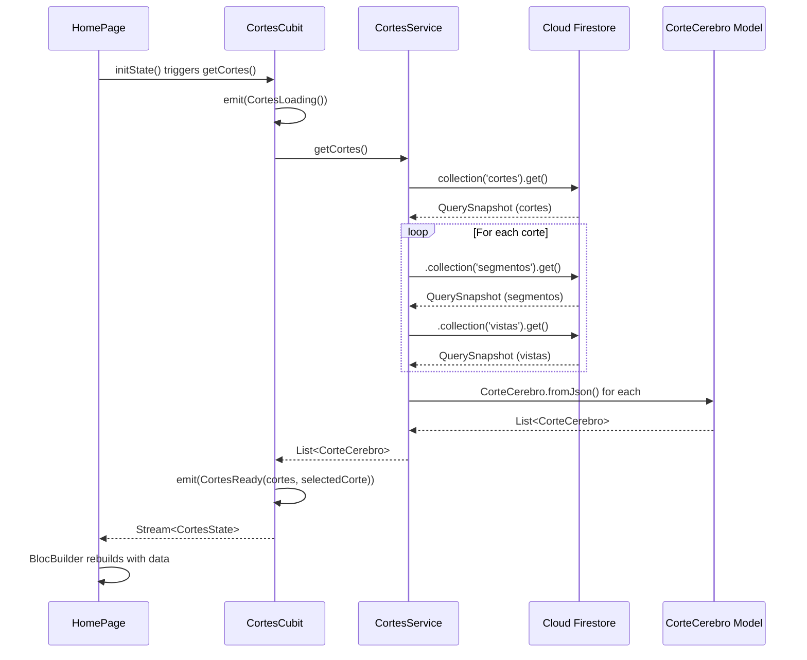
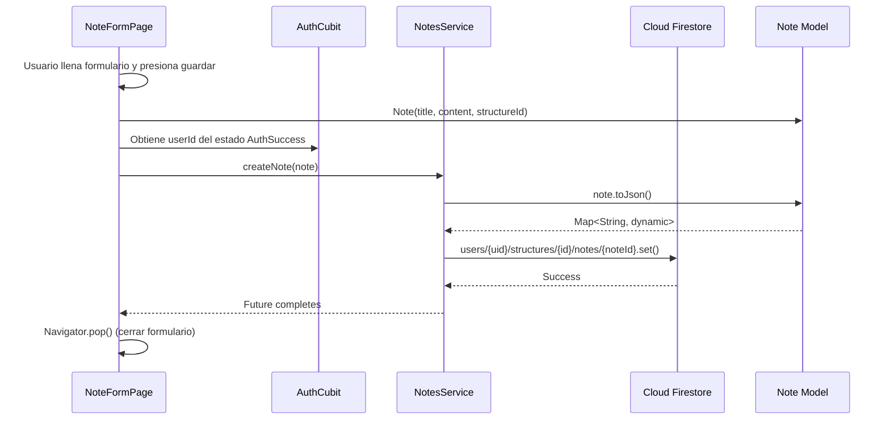
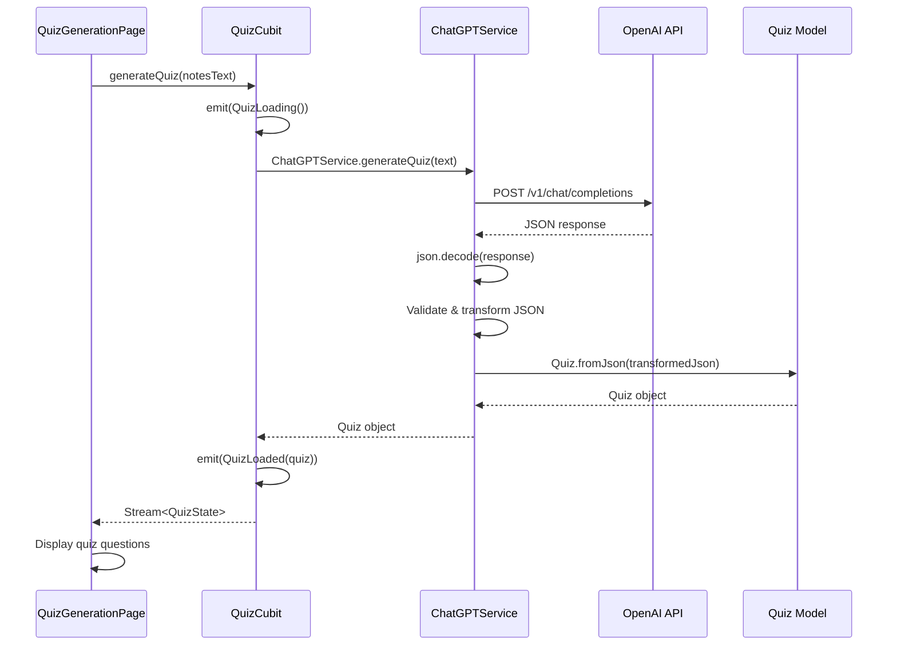
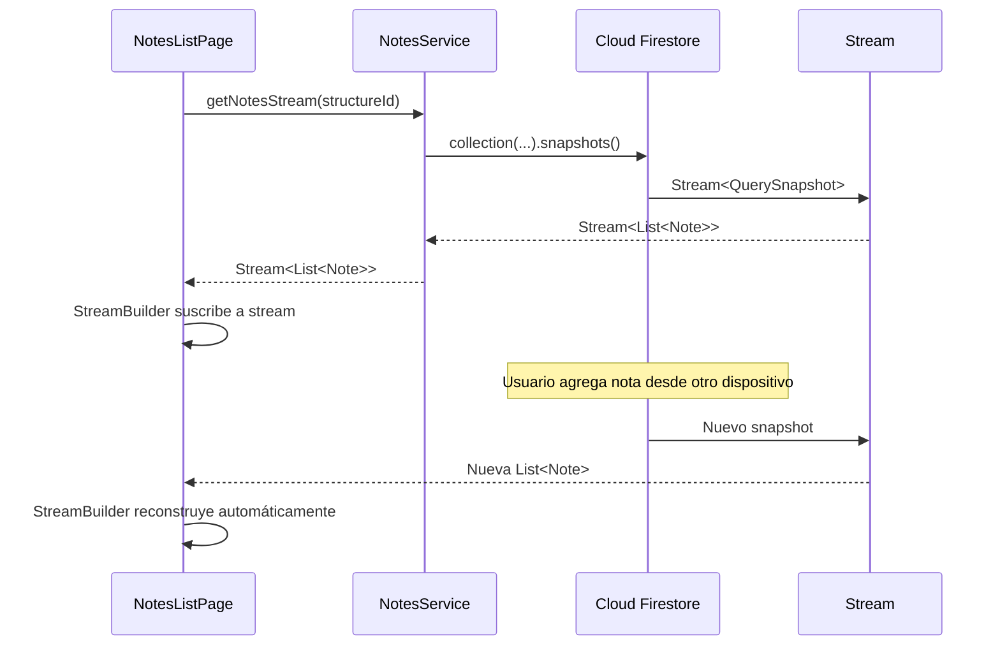

# Flujo de Datos en la Aplicación

> **Nivel**: Intermedio-Avanzado
> **Prerrequisitos**: Arquitectura de la Aplicación, Patrones BLoC, Firebase Integration
> **Tiempo de lectura**: 18 minutos

## Introducción

Imagina que el flujo de datos en la aplicación es como el sistema de pedidos de un restaurante moderno:

1. **El Cliente (UI)** ve el menú en una tablet y toca lo que quiere
2. **El Mesero (Cubit)** recibe el pedido y lo registra en el sistema
3. **La Cocina (Service)** prepara la comida consultando el inventario
4. **El Almacén (Firestore/API)** proporciona los ingredientes necesarios
5. **El Mesero (Cubit)** lleva la comida lista de vuelta al cliente
6. **El Cliente (UI)** recibe y disfruta su comida

Este flujo siempre va en la misma dirección y cada persona tiene un rol específico. El cliente nunca va directo al almacén, ni la cocina le entrega comida directamente al cliente. Este orden garantiza que todo funcione de manera predecible y organizada.

En la aplicación NeuroAnatomía, los datos siguen un flujo similar de tres capas:

- **Capa de Presentación (UI)**: Widgets que muestran información y capturan interacciones
- **Capa de Lógica de Negocio (Cubits)**: Procesan solicitudes y gestionan estado
- **Capa de Datos (Services/Repositories)**: Acceden a fuentes de datos externas

### ¿Por qué separar en capas?

Esta separación tiene beneficios concretos:

1. **Facilita el testing**: Puedes probar la lógica sin necesidad de Firebase
2. **Reutilización**: El mismo servicio puede usarse desde múltiples Cubits
3. **Cambios independientes**: Puedes cambiar cómo se almacenan los datos sin tocar la UI
4. **Debugging más fácil**: Sabes exactamente dónde buscar si algo falla

---

## Documentación Técnica Formal

### Arquitectura de Tres Capas

La aplicación implementa una arquitectura de tres capas estrictamente separadas:

```
┌─────────────────────────────────────┐
│   Presentation Layer (UI)           │
│   - Widgets (StatelessWidget)       │
│   - Pages                           │
│   - BlocBuilder/BlocConsumer        │
└────────────┬────────────────────────┘
             │ Events (method calls)
             ↓
┌─────────────────────────────────────┐
│   Business Logic Layer              │
│   - Cubits                          │
│   - State Management                │
│   - Business Rules                  │
└────────────┬────────────────────────┘
             │ Service calls
             ↓
┌─────────────────────────────────────┐
│   Data Layer                        │
│   - Services                        │
│   - Repositories                    │
│   - External APIs (Firestore, OpenAI)│
└─────────────────────────────────────┘
```

**Principios arquitectónicos**:
- **Flujo Unidireccional**: Datos fluyen de abajo hacia arriba, acciones de arriba hacia abajo
- **Dependency Injection**: Capas superiores dependen de abstracciones de capas inferiores
- **Separación de Responsabilidades**: Cada capa tiene un propósito único y bien definido

---

### Flujo 1: Carga Inicial de Cortes Cerebrales

Este flujo demuestra cómo se cargan datos complejos desde Firestore, incluyendo subcolecciones.

#### Diagrama de Secuencia



#### Implementación Detallada

**1. UI inicia la carga** (`/lib/pages/home_page/home_page.dart`)

```dart
class HomePage extends StatefulWidget {
  @override
  State<HomePage> createState() => _HomePageState();
}

class _HomePageState extends State<HomePage> {
  @override
  void initState() {
    super.initState();
    // Trigger data loading on page initialization
    context.read<CortesCubit>().getCortes();
  }

  @override
  Widget build(BuildContext context) {
    return BlocBuilder<CortesCubit, CortesState>(
      builder: (context, state) {
        if (state is CortesLoading) {
          return Center(child: CircularProgressIndicator());
        }

        if (state is CortesReady) {
          return CorteVisualization(
            corte: state.selectedCorte,
            // ... más propiedades
          );
        }

        return Container();
      },
    );
  }
}
```

**Flujo en UI**:
- `initState()` se llama una vez al montar el widget
- `context.read<CortesCubit>()` obtiene instancia del Cubit sin suscribirse
- `getCortes()` dispara la carga de datos
- `BlocBuilder` se suscribe a cambios de estado y reconstruye

**2. Cubit coordina la operación** (`/lib/cubits/cortes_cubit.dart/cortes_cubit.dart`)

```dart
Future<void> getCortes() async {
  emit(CortesLoading());  // 1. Estado loading inmediato
  try {
    final List<CorteCerebro> cortes = await _cortesService.getCortes();  // 2. Llama servicio
    emit(CortesReady(cortes: cortes, selectedCorte: cortes.first));  // 3. Emite datos
  } catch (e) {
    emit(CortesError(message: e.toString()));  // 4. Maneja errores
    rethrow;
  }
}
```

**Responsabilidades del Cubit**:
- Emitir estado `CortesLoading` para feedback inmediato en UI
- Delegar fetching de datos al servicio
- Transformar respuesta en estado apropiado (`CortesReady` con selección inicial)
- Manejar errores y emitir estado de error
- Propagar excepciones críticas con `rethrow` para debugging

**3. Service ejecuta consulta Firestore** (`/lib/services/cortes_service.dart`)

```dart
Future<List<CorteCerebro>> getCortes() async {
  // 1. Obtener colección principal de cortes
  final QuerySnapshot<Map<String, dynamic>> querySnapshot =
      await _firestore.collection('cortes').get();

  final List<Map<String, dynamic>> cortesJson = [];

  // 2. Para cada corte, obtener subcolecciones
  for (final QueryDocumentSnapshot<Map<String, dynamic>> doc
      in querySnapshot.docs) {
    final corteJson = doc.data();

    // 3. Obtener segmentos (subcolección)
    final QuerySnapshot<Map<String, dynamic>> segmentosSnapshot =
        await _firestore
            .collection('cortes')
            .doc(doc.id)
            .collection('segmentos')
            .get();

    final List<Map<String, dynamic>> segmentosJson = [];
    for (final doc in segmentosSnapshot.docs) {
      segmentosJson.add(doc.data());
    }

    // 4. Obtener vistas (subcolección)
    final QuerySnapshot<Map<String, dynamic>> vistasSnapshot =
        await _firestore
            .collection('cortes')
            .doc(doc.id)
            .collection('vistas')
            .get();

    final List<Map<String, dynamic>> vistasJson = [];
    for (final doc in vistasSnapshot.docs) {
      vistasJson.add(doc.data());
    }

    // 5. Agregar subcolecciones al JSON del corte
    corteJson['segmentos'] = segmentosJson;
    corteJson['vistas'] = vistasJson;
    cortesJson.add(corteJson);
  }

  // 6. Convertir JSON a objetos Dart tipados
  return cortesJson
      .map((e) => CorteCerebro.fromJson(e))
      .sorted((a, b) => a.id.compareTo(b.id))
      .toList();
}
```

**Análisis técnico**:
- **Líneas 2-3**: Query principal a colección `cortes`
- **Líneas 8-15**: Loop sobre cada documento para obtener subcolecciones
- **Líneas 17-29**: Fetch de subcolección `segmentos` para cada corte
- **Líneas 31-43**: Fetch de subcolección `vistas` para cada corte
- **Líneas 45-47**: Composición de JSON completo con datos anidados
- **Líneas 50-53**: Deserialización JSON → Objetos Dart con `fromJson()`

**Consideraciones de rendimiento**:
- Múltiples queries Firestore (1 + 2N donde N = número de cortes)
- Operaciones secuenciales (no paralelas) debido a loop
- Trade-off: Simplicidad vs performance (aceptable para dataset pequeño)

**4. Serialización JSON** (`/lib/models/corte_cerebro.dart`)

```dart
@JsonSerializable()
class CorteCerebro extends Equatable {
  @JsonKey()
  final String id;

  @JsonKey()
  final String nombre;

  @JsonKey()
  final List<SegmentoCerebro> segmentos;

  @JsonKey(defaultValue: [])
  final List<VistaCerebro> vistas;

  // ... más campos

  factory CorteCerebro.fromJson(Map<String, dynamic> json) =>
      _$CorteCerebroFromJson(json);

  Map<String, dynamic> toJson() => _$CorteCerebroToJson(this);
}
```

**Características de `json_serializable`**:
- `@JsonSerializable()`: Genera código de serialización en archivo `.g.dart`
- `fromJson()`: Factory constructor para deserializar
- Maneja objetos anidados automáticamente (`List<SegmentoCerebro>`)
- `defaultValue`: Valor por defecto si campo no existe en JSON

**Archivo generado** (`corte_cerebro.g.dart`):
```dart
CorteCerebro _$CorteCerebroFromJson(Map<String, dynamic> json) =>
    CorteCerebro(
      id: json['id'] as String,
      nombre: json['nombre'] as String,
      segmentos: (json['segmentos'] as List<dynamic>)
          .map((e) => SegmentoCerebro.fromJson(e as Map<String, dynamic>))
          .toList(),
      vistas: (json['vistas'] as List<dynamic>?)
          ?.map((e) => VistaCerebro.fromJson(e as Map<String, dynamic>))
          .toList() ?? [],
      // ...
    );
```

**Ventajas**:
- Type-safe: Casting automático con validación
- Null safety: Manejo de campos opcionales
- Recursivo: Serializa objetos anidados
- Generado: Menos código manual, menos errores

---

### Flujo 2: Creación de Nota de Usuario

Este flujo demuestra escritura de datos con almacenamiento específico por usuario.

#### Diagrama de Secuencia



#### Implementación Detallada

**1. UI captura entrada de usuario**

```dart
// Conceptual - formulario de creación de nota
class NoteFormPage extends StatefulWidget {
  final String structureId;

  @override
  State<NoteFormPage> createState() => _NoteFormPageState();
}

class _NoteFormPageState extends State<NoteFormPage> {
  final _titleController = TextEditingController();
  final _contentController = TextEditingController();

  Future<void> _saveNote() async {
    // 1. Crear modelo Note
    final note = Note(
      id: DateTime.now().millisecondsSinceEpoch.toString(),
      title: _titleController.text,
      content: _contentController.text,
      structureId: widget.structureId,
      createdAt: DateTime.now(),
    );

    // 2. Obtener NotesService con userId del AuthCubit
    final authState = context.read<AuthCubit>().state;
    if (authState is AuthSuccess) {
      final userId = authState.user.uid;
      final notesService = NotesService(userId: userId);

      // 3. Guardar nota
      await notesService.createNote(note);

      // 4. Navegar atrás
      Navigator.pop(context);
    }
  }

  @override
  Widget build(BuildContext context) {
    return Scaffold(
      appBar: AppBar(title: Text('Nueva Nota')),
      body: Column(
        children: [
          TextField(
            controller: _titleController,
            decoration: InputDecoration(labelText: 'Título'),
          ),
          TextField(
            controller: _contentController,
            decoration: InputDecoration(labelText: 'Contenido'),
            maxLines: 5,
          ),
          ElevatedButton(
            onPressed: _saveNote,
            child: Text('Guardar'),
          ),
        ],
      ),
    );
  }
}
```

**Análisis**:
- Formulario típico con `TextEditingController`
- Crea modelo `Note` con datos del formulario
- Obtiene `userId` del estado de `AuthCubit`
- Crea instancia de `NotesService` con userId (dependency injection manual)
- Llama método async `createNote()`
- Navega atrás al completar

**2. Service persiste en Firestore** (`/lib/services/notes_service.dart`)

```dart
class NotesService {
  final FirebaseFirestore _firestore = FirebaseFirestore.instance;
  final String userId;

  NotesService({required this.userId});

  Future<void> createNote(Note note) async {
    await _firestore
        .collection('users')
        .doc(userId)
        .collection('structures')
        .doc(note.structureId)
        .collection('notes')
        .doc(note.id)
        .set(note.toJson());
  }
}
```

**Estructura de datos en Firestore**:
```
users/
  {userId}/
    structures/
      {structureId}/
        notes/
          {noteId}/
            - title: "Hipocampo"
            - content: "Región del cerebro..."
            - createdAt: Timestamp
```

**Ventajas de esta estructura**:
- **Seguridad**: Firestore Rules pueden validar que `userId` coincida con auth
- **Organización**: Notas agrupadas por estructura cerebral
- **Escalabilidad**: Queries eficientes por usuario y estructura
- **Aislamiento**: Cada usuario tiene su propio subárbol de datos

**3. Modelo con JSON Serialization** (`/lib/models/note.dart`)

```dart
@JsonSerializable()
class Note extends Equatable {
  @JsonKey()
  final String? id;

  @JsonKey()
  final String title;

  @JsonKey()
  final String content;

  @JsonKey()
  final String structureId;

  @JsonKey()
  final DateTime? createdAt;

  const Note({
    this.id,
    required this.title,
    required this.content,
    required this.structureId,
    this.createdAt,
  });

  factory Note.fromJson(Map<String, dynamic> json) => _$NoteFromJson(json);

  Map<String, dynamic> toJson() => _$NoteToJson(this);
}
```

**Características**:
- Campos opcionales (`id`, `createdAt`) para creación inicial
- `toJson()` convierte objeto Dart → Map para Firestore
- `fromJson()` convierte Map de Firestore → objeto Dart
- Equatable para comparación basada en valores

---

### Flujo 3: Generación de Quiz con IA

Este flujo demuestra integración con API externa (OpenAI) y parsing de respuestas.

#### Diagrama de Secuencia



#### Implementación Detallada

**1. Cubit inicia generación** (`/lib/cubits/quiz_cubit/quiz_cubit.dart`)

```dart
Future<void> generateQuiz(String text) async {
  emit(QuizLoading());
  try {
    final quiz = await ChatGPTService.generateQuiz(text);
    emit(QuizLoaded(quiz: quiz));
  } catch (e) {
    emit(QuizError(message: e.toString()));
  }
}
```

**Características**:
- Estado loading para mostrar progreso (llamadas a IA pueden tomar segundos)
- Delegación completa de lógica de IA al servicio
- Manejo de errores comprehensivo (red, API, parsing)

**2. Service gestiona llamada a OpenAI** (`/lib/services/chat_gpt_service.dart`)

```dart
class ChatGPTService {
  static Future<Quiz> generateQuiz(String text) async {
    try {
      // 1. Llamada a API de OpenAI
      final quizResponse = await OpenAI.instance.chat.create(
        model: 'gpt-3.5-turbo',
        responseFormat: {"type": "json_object"},
        messages: [
          OpenAIChatCompletionChoiceMessageModel(
            content: [
              OpenAIChatCompletionChoiceMessageContentItemModel.text(
                'When I send text, create a small quiz. Each question has 4 short answers. '
                'Answer in JSON format: {"q":[{"q":"question","a":["correct","answer2","answer3","answer4"]}]}. '
                'Answer length <500 chars, avoid spaces/linebreaks.',
              )
            ],
            role: OpenAIChatMessageRole.system,
          ),
          OpenAIChatCompletionChoiceMessageModel(
            content: [
              OpenAIChatCompletionChoiceMessageContentItemModel.text(text)
            ],
            role: OpenAIChatMessageRole.user,
          )
        ],
        temperature: 0.3,
        maxTokens: 1000,
      );

      // 2. Extraer respuesta
      final quizStr = quizResponse.choices.first.message.content?.first.text;

      if (quizStr == null || quizStr.isEmpty) {
        throw Exception('Quiz not generated: empty response');
      }

      // 3. Parsear JSON
      final quizJson = json.decode(quizStr);

      // 4. Validar estructura
      if (quizJson['q'] == null) {
        throw Exception('Invalid quiz format: missing "q" field');
      }

      // 5. Transformar respuestas
      for (var question in quizJson['q']) {
        if (question['a'] == null || (question['a'] as List).isEmpty) {
          throw Exception('Invalid question format: missing answers');
        }
        question['rightAnswer'] = question['a'][0];  // Guardar respuesta correcta
        question['a'].shuffle();  // Mezclar opciones
      }

      // 6. Crear objeto Quiz
      return Quiz.fromJson(quizJson);
    } catch (e) {
      throw Exception('Error generating quiz: $e');
    }
  }
}
```

**Análisis detallado**:

**Líneas 5-25 - Construcción del prompt**:
- `model: 'gpt-3.5-turbo'`: Modelo de lenguaje específico
- `responseFormat: {"type": "json_object"}`: Fuerza respuesta en JSON
- Mensaje `system`: Instrucciones para el modelo (prompt engineering)
- Mensaje `user`: Texto de las notas del usuario
- `temperature: 0.3`: Baja variabilidad para respuestas consistentes
- `maxTokens: 1000`: Límite de longitud de respuesta

**Líneas 27-32 - Extracción y validación**:
- Navega estructura de respuesta de OpenAI
- Valida que respuesta no esté vacía

**Líneas 34-38 - Parsing JSON**:
- Convierte string JSON a Map Dart
- Valida estructura esperada

**Líneas 40-52 - Transformación de datos**:
- Guarda primera opción como respuesta correcta
- Mezcla opciones para evitar patrón predecible
- Validación de cada pregunta

**Líneas 54-56 - Creación de modelo**:
- Deserializa JSON transformado a objeto `Quiz` tipado

**Patrón de prompt engineering**:
```
System: "Eres un generador de quizzes. Formato: {...}"
User: "Contenido de las notas del usuario"
```

Este patrón separa instrucciones del modelo (system) de input del usuario (user).

**3. Modelo Quiz** (`/lib/models/quiz.dart`)

```dart
@JsonSerializable()
class Quiz extends Equatable {
  @JsonKey(name: 'q')
  final List<QuizQuestion> questions;

  const Quiz({required this.questions});

  factory Quiz.fromJson(Map<String, dynamic> json) => _$QuizFromJson(json);

  Map<String, dynamic> toJson() => _$QuizToJson(this);

  @override
  List<Object?> get props => [questions];

  Quiz copyWith({List<QuizQuestion>? questions}) {
    return Quiz(questions: questions ?? this.questions);
  }
}
```

**Características**:
- `@JsonKey(name: 'q')`: Mapeo de campo JSON no estándar
- `copyWith`: Método helper para actualizaciones inmutables
- Equatable para comparación de quizzes

---

### Flujo 4: Actualización en Tiempo Real de Notas

Este flujo demuestra Streams de Firestore para actualizaciones reactivas.

#### Diagrama de Secuencia



#### Implementación

**Service con Stream** (`/lib/services/notes_service.dart`)

```dart
Stream<List<Note>> getNotesStream(String structureId) {
  return _firestore
      .collection('users')
      .doc(userId)
      .collection('structures')
      .doc(structureId)
      .collection('notes')
      .snapshots()  // ← Retorna Stream, no Future
      .map((QuerySnapshot<Map<String, dynamic>> querySnapshot) =>
          querySnapshot.docs
              .map((DocumentSnapshot<Map<String, dynamic>> doc) {
            final Map<String, dynamic> data = doc.data()!;
            data['id'] = doc.id;
            return Note.fromJson(data);
          }).toList());
}
```

**Características de Streams**:
- `.snapshots()`: Crea stream que emite en cada cambio de Firestore
- `.map()`: Transforma cada snapshot a `List<Note>`
- Emisión automática cuando datos cambian en servidor

**UI con StreamBuilder**:

```dart
class NotesListPage extends StatelessWidget {
  final String structureId;

  @override
  Widget build(BuildContext context) {
    final authState = context.watch<AuthCubit>().state;
    if (authState is! AuthSuccess) return Container();

    final notesService = NotesService(userId: authState.user.uid);

    return StreamBuilder<List<Note>>(
      stream: notesService.getNotesStream(structureId),
      builder: (context, snapshot) {
        if (snapshot.connectionState == ConnectionState.waiting) {
          return CircularProgressIndicator();
        }

        if (snapshot.hasError) {
          return Text('Error: ${snapshot.error}');
        }

        if (!snapshot.hasData || snapshot.data!.isEmpty) {
          return Text('No hay notas');
        }

        final notes = snapshot.data!;
        return ListView.builder(
          itemCount: notes.length,
          itemBuilder: (context, index) {
            final note = notes[index];
            return ListTile(
              title: Text(note.title),
              subtitle: Text(note.content),
            );
          },
        );
      },
    );
  }
}
```

**Funcionamiento**:
1. `StreamBuilder` se suscribe al stream
2. Cada snapshot de Firestore dispara el builder
3. UI se reconstruye automáticamente con datos nuevos
4. No necesita Cubit para este caso simple (Stream directo a UI)

**ConnectionState**:
- `none`: Sin conexión
- `waiting`: Esperando primer dato
- `active`: Stream emitiendo datos
- `done`: Stream cerrado

---

### Manejo de Errores en Flujos de Datos

#### Estrategia por Capa

**Capa de Datos (Services)**:
```dart
Future<List<CorteCerebro>> getCortes() async {
  try {
    final snapshot = await _firestore.collection('cortes').get();
    return snapshot.docs.map((doc) => CorteCerebro.fromJson(doc.data())).toList();
  } on FirebaseException catch (e) {
    // Error específico de Firebase
    throw Exception('Error de Firestore: ${e.message}');
  } catch (e) {
    // Otros errores
    throw Exception('Error obteniendo cortes: $e');
  }
}
```

**Capa de Lógica (Cubits)**:
```dart
Future<void> getCortes() async {
  emit(CortesLoading());
  try {
    final cortes = await _cortesService.getCortes();
    emit(CortesReady(cortes: cortes, selectedCorte: cortes.first));
  } catch (e) {
    emit(CortesError(message: e.toString()));  // Captura y emite como estado
    rethrow;  // Opcional: propagar para logging
  }
}
```

**Capa de Presentación (UI)**:
```dart
BlocBuilder<CortesCubit, CortesState>(
  builder: (context, state) {
    if (state is CortesError) {
      return Center(
        child: Column(
          children: [
            Icon(Icons.error),
            Text(state.message),
            ElevatedButton(
              onPressed: () => context.read<CortesCubit>().getCortes(),
              child: Text('Reintentar'),
            ),
          ],
        ),
      );
    }
    // ... otros estados
  },
)
```

**Ventajas de esta estrategia**:
- Errores se capturan cerca de la fuente
- Se transforman en estados manejables por UI
- UI puede mostrar mensajes específicos y opciones de recuperación
- Aplicación nunca crashea por errores de red/datos

---

### Optimizaciones de Performance

#### 1. Caching de Imágenes

```dart
// CorteInteractivoCubit usa cache en disco
Future<Uint8List?> _getImageFromCache(ImageMode mode, String corteId) async {
  final directory = await getTemporaryDirectory();
  final file = File('$path/${mode.name}_${corteId}_v1.png');
  if (await file.exists()) return file.readAsBytes();
  return null;
}
```

**Beneficio**: Evita descargas repetidas de imágenes pesadas.

#### 2. Carga Paralela

```dart
final images = await Future.wait(
  ImageMode.values.map((mode) => loadImage(mode))
);
```

**Beneficio**: Descarga múltiples imágenes simultáneamente en lugar de secuencialmente.

#### 3. Equatable para Comparación Eficiente

```dart
class CortesReady extends CortesState {
  @override
  List<Object?> get props => [cortes, selectedCorte, selectedSegmento];
}
```

**Beneficio**: BlocBuilder solo reconstruye si el estado realmente cambió (comparación profunda).

---

### Patrones de Diseño Implementados

1. **Repository Pattern**: Abstracción de fuentes de datos
2. **Dependency Injection**: Inyección de servicios en Cubits
3. **Observer Pattern**: Streams y BLoC
4. **Factory Pattern**: `fromJson()` factory constructors
5. **State Pattern**: Máquinas de estados en Cubits

## Referencias

### Documentación Interna
- [Fundamentos del Patrón BLoC](/docs/bloc-pattern/01-bloc-pattern-fundamentals.md)
- [BLoC en la Aplicación NeuroAnatomía](/docs/bloc-pattern/03-bloc-in-neuroanatomy-app.md)
- [Cloud Firestore](/docs/firebase/03-cloud-firestore.md)
- [Services y Repositories](/docs/firebase/04-services-and-repositories.md)
- [JSON Serialization](/docs/technical/02-json-serialization.md)

### Archivos de Código Relevantes
- `/lib/services/cortes_service.dart` - Queries complejas con subcolecciones
- `/lib/services/notes_service.dart` - CRUD y Streams en tiempo real
- `/lib/services/chat_gpt_service.dart` - Integración API externa
- `/lib/models/` - Modelos con JSON serialization
- `/lib/cubits/` - Cubits coordinando flujos

### Referencias Externas
1. Cloud Firestore Documentation - https://firebase.google.com/docs/firestore
2. JSON and serialization in Flutter - https://docs.flutter.dev/development/data-and-backend/json
3. Dart Streams - https://dart.dev/tutorials/language/streams
4. OpenAI API Documentation - https://platform.openai.com/docs
5. Martin, R. C. (2017). *Clean Architecture*. Prentice Hall. (Separation of Concerns)
6. Fowler, M. (2002). *Patterns of Enterprise Application Architecture*. Addison-Wesley. (Repository Pattern)

## Lecturas Adicionales

**Temas relacionados**:
- Programación asíncrona en Dart (`async`/`await`, `Future`, `Stream`)
- JSON serialization avanzada (custom converters)
- Firestore security rules
- Error handling strategies
- Performance optimization en Flutter
