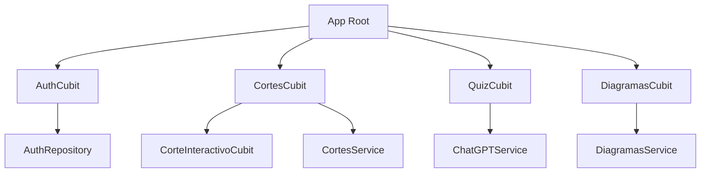
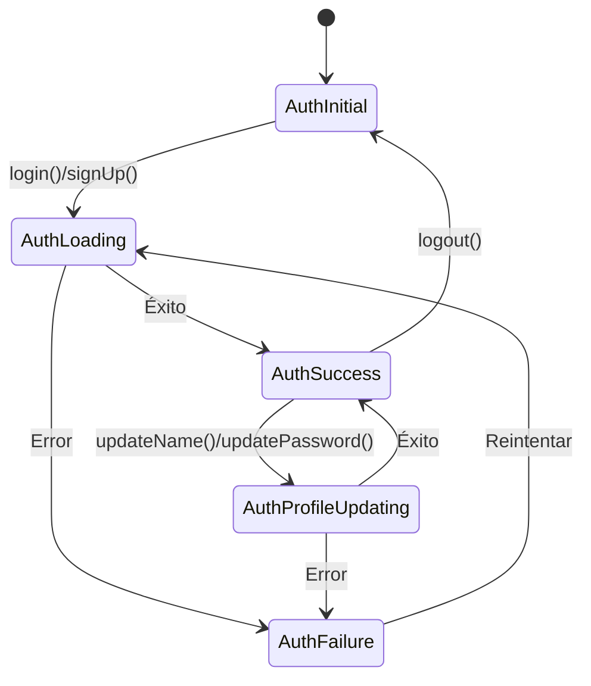
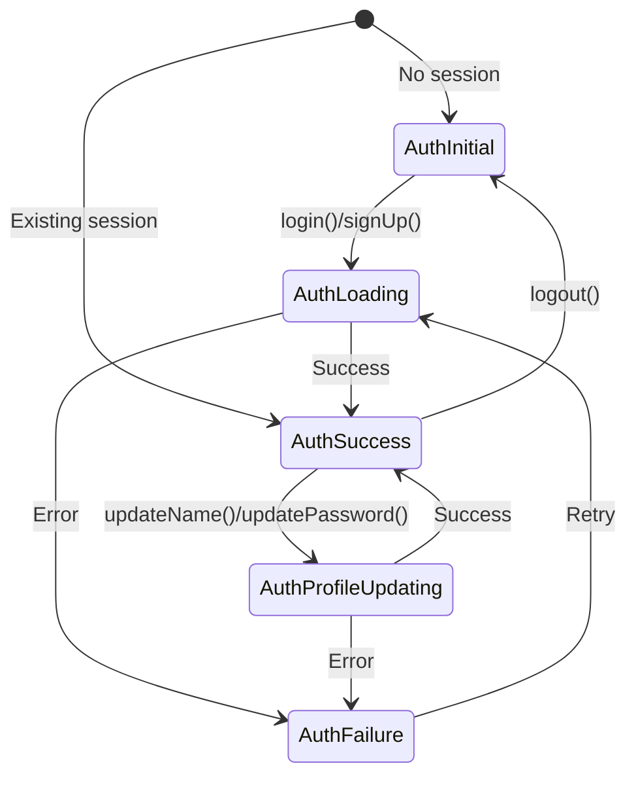
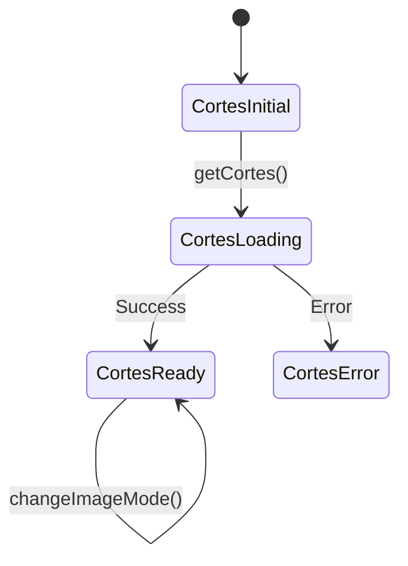
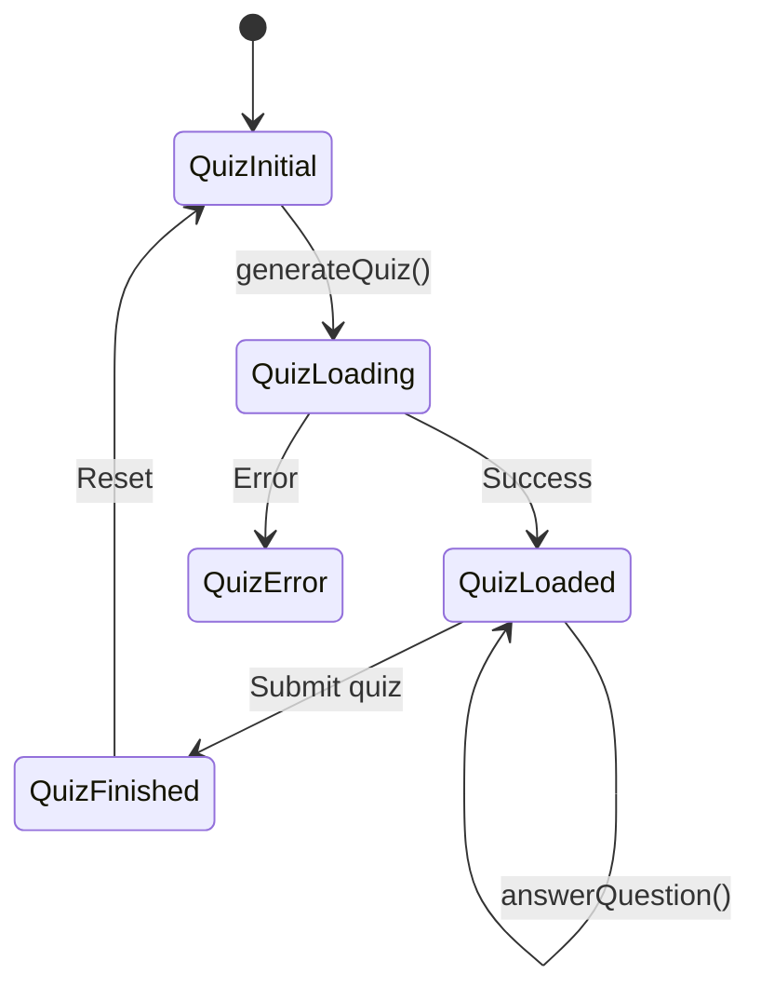

# BLoC en la Aplicación NeuroAnatomía

> **Nivel**: Intermedio-Avanzado
> **Prerrequisitos**: Fundamentos del Patrón BLoC, Cubit Simplificado
> **Tiempo de lectura**: 20 minutos

## Introducción

Imagina que la aplicación NeuroAnatomía es como un museo interactivo del cerebro. En este museo, hay diferentes departamentos, cada uno con su propio administrador (Cubit):

- **AuthCubit**: El guardia de seguridad que controla quién puede entrar al museo (autenticación)
- **CortesCubit**: El guía principal que te muestra los diferentes cortes del cerebro y te ayuda a navegar entre ellos
- **QuizCubit**: El profesor que genera exámenes personalizados basados en lo que has estudiado
- **DiagramasCubit**: El curador de la galería de diagramas médicos (vías neurológicas y estructuras)
- **CorteInteractivoCubit**: El técnico que carga y optimiza las imágenes de alta resolución del cerebro

Cada administrador trabaja de forma independiente pero coordinada. No necesitas saber cómo funcionan internamente; solo les pides lo que necesitas y ellos te entregan el resultado. Este diseño modular hace que la aplicación sea fácil de entender, mantener y extender.

---

## Documentación Técnica Formal

### Arquitectura General de Cubits

La aplicación NeuroAnatomía implementa cinco Cubits principales, cada uno responsable de un dominio funcional específico:



### 1. AuthCubit - Gestión de Autenticación

**Archivo**: `/lib/cubits/auth_cubit/auth_cubit.dart`

**Responsabilidad**: Gestionar el ciclo de vida completo de autenticación del usuario mediante Firebase Authentication.

#### Estados

```dart
abstract class FirebaseAuthState extends Equatable {
  const FirebaseAuthState();
  @override
  List<Object> get props => [];
}

class AuthInitial extends FirebaseAuthState {}

class AuthLoading extends FirebaseAuthState {
  final String email;
  final String password;
  const AuthLoading({required this.email, required this.password});
}

class AuthSuccess extends FirebaseAuthState {
  final User user;
  const AuthSuccess({required this.user});
}

class AuthProfileUpdating extends AuthSuccess {
  final String? name;
  final String? password;
  const AuthProfileUpdating({
    required super.user,
    this.password,
    this.name,
  });
}

class AuthFailure extends FirebaseAuthState {
  final String message;
  const AuthFailure({required this.message});
}
```

**Diagrama de Estados**:



#### Métodos Principales

**1. Constructor con Verificación de Sesión**
```dart
AuthCubit({required this.authRepository}) : super(AuthInitial()) {
  final user = authRepository.currentUser;
  if (user != null) {
    emit(AuthSuccess(user: user));
  } else {
    emit(AuthInitial());
  }
}
```
- **Líneas 11-18**: Al crear el Cubit, verifica si existe sesión activa
- Si existe usuario autenticado, emite `AuthSuccess` inmediatamente
- Esto permite persistencia de sesión entre reinicios de la app

**2. Login**
```dart
Future<void> login(String email, String password) async {
  emit(AuthLoading(email: email, password: password));
  try {
    final user = await authRepository.login(email, password);
    if (user != null) emit(AuthSuccess(user: user));
  } catch (e) {
    emit(AuthFailure(message: e.toString()));
  }
}
```
- **Línea 21**: Emite estado de carga inmediato (muestra spinner en UI)
- **Línea 23**: Operación asíncrona con Firebase Auth
- **Línea 24**: Éxito → emite `AuthSuccess` con objeto `User`
- **Línea 26**: Error → emite `AuthFailure` con mensaje de error

**3. Actualización de Perfil**
```dart
Future<void> updateName(String name) async {
  if (state is! AuthSuccess) return;
  final user = (state as AuthSuccess).user;
  emit(AuthProfileUpdating(user: user, name: name));
  try {
    final user = await authRepository.updateName(name);
    emit(AuthSuccess(user: user!));
  } catch (e) {
    emit(AuthFailure(message: e.toString()));
  }
}
```
- **Línea 41**: Guard clause - solo procede si el usuario está autenticado
- **Línea 43**: Emite estado intermedio `AuthProfileUpdating` (extiende `AuthSuccess`)
- Permite mostrar feedback "Guardando..." mientras mantiene UI de usuario autenticado

**Patrón de Diseño**: Guard clauses (`if (state is! AuthSuccess) return`) previenen operaciones en estados inválidos.

---

### 2. CortesCubit - Navegación de Cortes Cerebrales

**Archivo**: `/lib/cubits/cortes_cubit.dart/cortes_cubit.dart`

**Responsabilidad**: Gestionar el estado de los cortes cerebrales, incluyendo carga de datos, selección de corte/segmento, y modos de visualización.

#### Estados

```dart
abstract class CortesState extends Equatable {
  const CortesState();
}

class CortesInitial extends CortesState {}

class CortesLoading extends CortesState {}

class CortesReady extends CortesState {
  final List<CorteCerebro> cortes;
  final CorteCerebro selectedCorte;
  final SegmentoCerebro? selectedSegmento;
  final bool isShowingVistas;
  final ImageMode imageMode;

  const CortesReady({
    required this.cortes,
    required this.selectedCorte,
    this.selectedSegmento,
    this.isShowingVistas = false,
    this.imageMode = ImageMode.real,
  });
}

class CortesError extends CortesState {
  final String message;
  const CortesError({required this.message});
}
```

**Características de `CortesReady`**:
- Contiene múltiples piezas de estado relacionadas
- Estado compuesto: lista completa + selección actual
- Valores por defecto para campos opcionales

#### Métodos Principales

**1. Cargar Cortes**
```dart
Future<void> getCortes() async {
  emit(CortesLoading());
  try {
    final List<CorteCerebro> cortes = await _cortesService.getCortes();
    emit(CortesReady(cortes: cortes, selectedCorte: cortes.first));
  } catch (e) {
    emit(CortesError(message: e.toString()));
    rethrow;
  }
}
```
- **Línea 16**: Emite loading inmediato
- **Línea 18**: Fetch desde Firestore (incluye subcolecciones)
- **Línea 19**: Inicializa con primer corte seleccionado por defecto
- **Línea 22**: `rethrow` permite que errores críticos se propaguen

**2. Selección de Corte con Preservación de Segmento**
```dart
void selectCorte(CorteCerebro corte) {
  if (state is! CortesReady) return;
  final currentSelectedSegmento = (state as CortesReady).selectedSegmento;
  final segmentoInNewCorte = corte.segmentos.firstWhereOrNull(
    (s) => s.id == currentSelectedSegmento?.id,
  );
  emit(
    CortesReady(
      cortes: (state as CortesReady).cortes,
      selectedCorte: corte,
      selectedSegmento: segmentoInNewCorte,
      isShowingVistas: (state as CortesReady).isShowingVistas,
      imageMode: (state as CortesReady).imageMode,
    ),
  );
}
```

**Lógica sofisticada** (líneas 26-41):
- Al cambiar de corte, intenta mantener el mismo segmento seleccionado
- Si el nuevo corte tiene un segmento con el mismo ID, lo selecciona
- Si no existe, `segmentoInNewCorte` será `null`
- Preserva `isShowingVistas` e `imageMode` al cambiar cortes

**Patrón**: Preservación de contexto entre transiciones de estado.

**3. Métodos de Utilidad**
```dart
void selectCorteById(String id) {
  if (state is! CortesReady) return;
  final cortes = (state as CortesReady).cortes;
  final corte = cortes.firstWhereOrNull((c) => c.id == id);
  if (corte == null) return;
  selectCorte(corte);
}
```
- Abstracción sobre `selectCorte()` que busca por ID
- Usado para navegación (adelante/atrás/arriba/abajo desde modelo `CorteCerebro`)

**4. Alternancia de Modos**
```dart
void toggleShowingVistas() {
  if (state is! CortesReady) return;
  emit(
    CortesReady(
      cortes: (state as CortesReady).cortes,
      selectedCorte: (state as CortesReady).selectedCorte,
      selectedSegmento: (state as CortesReady).selectedSegmento,
      isShowingVistas: !(state as CortesReady).isShowingVistas,
      imageMode: (state as CortesReady).imageMode,
    ),
  );
}
```
- Invierte el booleano `isShowingVistas`
- Requiere emitir estado completo nuevo (estados son inmutables)
- Patrón repetitivo pero garantiza inmutabilidad

---

### 3. QuizCubit - Generación de Quizzes con IA

**Archivo**: `/lib/cubits/quiz_cubit/quiz_cubit.dart`

**Responsabilidad**: Gestionar el ciclo de vida de quizzes generados por IA mediante OpenAI API.

#### Estados

```dart
abstract class QuizState extends Equatable {
  const QuizState();
}

class QuizInitial extends QuizState {}

class QuizLoading extends QuizState {}

class QuizLoaded extends QuizState {
  final Quiz quiz;
  const QuizLoaded({required this.quiz});
}

class QuizFinished extends QuizState {
  final Quiz quiz;
  final int score;
  const QuizFinished({required this.quiz, required this.score});

  int get totalScore => quiz.questions.length;
}

class QuizError extends QuizState {
  final String message;
  const QuizError({required this.message});
}
```

**Nota especial**: `QuizFinished` incluye computed property `totalScore`.

#### Métodos Principales

**1. Generación de Quiz**
```dart
Future<void> generateQuiz(String text) async {
  emit(QuizLoading());
  try {
    final quiz = await ChatGPTService.generateQuiz(text);
    emit(QuizLoaded(quiz: quiz));
  } catch (e) {
    emit(QuizError(message: e.toString()));
  }
}
```
- **Línea 13**: Estado loading mientras espera respuesta de OpenAI
- **Línea 15**: `ChatGPTService.generateQuiz()` hace request HTTP a OpenAI API
- Parsing de JSON a objetos `Quiz` sucede en el servicio
- Manejo de errores captura problemas de red, API, o parsing

**2. Responder Pregunta con Actualización Inmutable**
```dart
Future<void> answerQuestion(QuizQuestion question, String answer) async {
  final state = this.state;
  if (state is QuizLoaded) {
    final answeredQuestion = question.copyWith(selectedAnswer: answer);

    final answeredQuestions = [
      ...state.quiz.questions.map((q) {
        if (q == question) {
          return answeredQuestion;
        }
        return q;
      })
    ];

    emit(
      QuizLoaded(
        quiz: state.quiz.copyWith(questions: answeredQuestions),
      ),
    );
  }
}
```

**Análisis detallado**:
- **Línea 25**: Crea nueva instancia de pregunta con respuesta seleccionada
- **Líneas 27-34**: Mapea todas las preguntas, reemplazando solo la modificada
- **Línea 38**: Usa `copyWith` para crear nuevo objeto `Quiz` inmutable
- **Patrón**: Actualización inmutable de objetos anidados mediante spread operator y map

**Ventaja**: Mantiene inmutabilidad sin mutar objetos existentes.

---

### 4. DiagramasCubit - Carga de Diagramas Médicos

**Archivo**: `/lib/cubits/diagramas_cubit/diagramas_cubit.dart`

**Responsabilidad**: Cargar diagramas neurológicos (vías o estructuras subcorticales) desde Firestore.

#### Estados

```dart
abstract class DiagramasState extends Equatable {
  const DiagramasState();
}

class DiagramasInitial extends DiagramasState {}

class DiagramasLoading extends DiagramasState {}

class DiagramasLoaded extends DiagramasState {
  final List<Diagrama> diagramas;
  const DiagramasLoaded({required this.diagramas});
}

class DiagramasError extends DiagramasState {
  final String message;
  const DiagramasError({required this.message});
}
```

**Patrón estándar**: Initial → Loading → Loaded/Error

#### Implementación

```dart
class DiagramasCubit extends Cubit<DiagramasState> {
  final DiagramaType type;
  final DiagramasService _diagramasService;

  DiagramasCubit(
    this._diagramasService, {
    required this.type,
  }) : super(DiagramasInitial());

  Future<void> getDiagramas() async {
    emit(DiagramasLoading());
    try {
      final diagramas = await _diagramasService.getDiagramas(type);
      emit(DiagramasLoaded(diagramas: diagramas));
    } catch (e) {
      emit(DiagramasError(message: e.toString()));
    }
  }
}
```

**Característica única** (líneas 9-14):
- El Cubit se inicializa con un `DiagramaType` (vías o estructuras)
- Un Cubit por tipo de diagrama (se crean dos instancias en la app)
- Patrón de especialización mediante parámetro de constructor

**Uso en la app**:
```dart
// En main.dart o donde se proveen los Cubits
BlocProvider(
  create: (_) => DiagramasCubit(
    context.read<DiagramasService>(),
    type: DiagramaType.vias,
  )..getDiagramas(),
),
BlocProvider(
  create: (_) => DiagramasCubit(
    context.read<DiagramasService>(),
    type: DiagramaType.estructuras,
  )..getDiagramas(),
),
```

---

### 5. CorteInteractivoCubit - Gestión de Imágenes

**Archivo**: `/lib/cubits/corte_interactivo/corte_interactivo_cubit.dart`

**Responsabilidad**: Cargar, cachear y gestionar imágenes de cortes cerebrales en múltiples modos (real y acuarela).

#### Estados

```dart
abstract class CorteInteractivoState extends Equatable {
  const CorteInteractivoState();
}

class CorteInteractivoInitial extends CorteInteractivoState {}

class CorteInteractivoLoading extends CorteInteractivoState {}

class CorteInteractivoReady extends CorteInteractivoState {
  final List<DisplayableImage> images;
  const CorteInteractivoReady({required this.images});
}

class CorteInteractivoError extends CorteInteractivoState {
  final String message;
  const CorteInteractivoError({required this.message});
}
```

#### Implementación Avanzada

```dart
class CorteInteractivoCubit extends Cubit<CorteInteractivoState> {
  final CorteCerebro corte;

  CorteInteractivoCubit({required this.corte})
      : super(CorteInteractivoInitial());

  Future<void> getImages() async {
    emit(CorteInteractivoLoading());
    try {
      final images = (await Future.wait(
        ImageMode.values.map((mode) async {
          final cachedImage = await _getImageFromCache(mode, corte.id);
          if (cachedImage != null) {
            final decodedImage = await decodeImageFromList(cachedImage);
            return DisplayableImage(
                image: decodedImage, bytes: cachedImage, mode: mode);
          }
          final imageUrl = corte.imageUrlForMode(mode);
          if (imageUrl == null) return null;
          final data =
              await NetworkAssetBundle(Uri.parse(imageUrl)).load(imageUrl);
          final bytes = data.buffer.asUint8List();
          final decodedImage = await decodeImageFromList(bytes);
          _saveImageInCache(bytes, mode, corte.id);
          return DisplayableImage(
              image: decodedImage, bytes: bytes, mode: mode);
        }),
      ))
          .whereType<DisplayableImage>()
          .toList();
      if (isClosed) return;

      emit(CorteInteractivoReady(
        images: images,
      ));
    } catch (e) {
      if (isClosed) return;
      emit(CorteInteractivoError(message: e.toString()));
    }
  }
}
```

**Análisis de complejidad**:

**Líneas 23-43**: Lógica sofisticada de carga paralela con cache
- **Future.wait**: Carga todos los modos de imagen en paralelo
- **_getImageFromCache**: Verifica si imagen está en cache local
- Si está en cache → decodifica directo
- Si no está → descarga de red, guarda en cache, decodifica
- **whereType<DisplayableImage>()**: Filtra nulls (imágenes que no existen)

**Líneas 44 y 50**: Verificación `isClosed`
- Protección contra race condition
- Si el Cubit se cierra mientras carga imágenes, no emite estado
- Previene exception "Cannot emit new states after calling close"

**Optimizaciones implementadas**:
1. **Carga paralela**: `Future.wait` carga múltiples imágenes simultáneamente
2. **Cache en disco**: Usa `path_provider` para almacenar en temp directory
3. **Versioning**: `_v1.png` en nombre de archivo permite invalidar cache
4. **Decodificación eficiente**: `decodeImageFromList` es más eficiente que `Image.network`

**Patrón de Cache**:
```dart
Future<Uint8List?> _getImageFromCache(ImageMode mode, String corteId) async {
  final directory = await getTemporaryDirectory();
  final path = directory.path;
  final file = File('$path/${mode.name}_${corteId}_v1.png');
  if (!await file.exists()) return null;
  return file.readAsBytes();
}
```

---

### Integración de Cubits con UI

#### BlocProvider - Inyección de Dependencias

Los Cubits se proveen en el árbol de widgets mediante `BlocProvider`:

```dart
// En main.dart o punto de entrada
MultiBlocProvider(
  providers: [
    BlocProvider(
      create: (context) => AuthCubit(
        authRepository: context.read<AuthRepository>(),
      ),
    ),
    BlocProvider(
      create: (context) => CortesCubit(
        context.read<CortesService>(),
      )..getCortes(), // Carga inicial
    ),
    BlocProvider(create: (_) => QuizCubit()),
  ],
  child: MaterialApp(...),
)
```

**Características**:
- `context.read<T>()`: Obtiene dependencias del árbol superior
- `..getCortes()`: Cascade operator para inicialización inmediata
- Cubits disponibles en todo el árbol de widgets descendiente

#### BlocBuilder - Reconstrucción Reactiva

```dart
BlocBuilder<CortesCubit, CortesState>(
  builder: (context, state) {
    if (state is CortesLoading) {
      return CircularProgressIndicator();
    }

    if (state is CortesError) {
      return Text('Error: ${state.message}');
    }

    if (state is CortesReady) {
      return CorteVisualization(
        corte: state.selectedCorte,
        segmento: state.selectedSegmento,
      );
    }

    return Container();
  },
)
```

**Funcionamiento**:
1. `BlocBuilder` se suscribe al Stream del Cubit
2. Cada `emit()` dispara el builder
3. Pattern matching con `is` para renderizar UI según estado
4. Solo reconstruye el widget envuelto, no todo el árbol

#### BlocConsumer - Listener + Builder

Para side effects (navegación, snackbars) más reconstrucción:

```dart
BlocConsumer<AuthCubit, FirebaseAuthState>(
  listener: (context, state) {
    if (state is AuthSuccess) {
      Navigator.pushReplacementNamed(context, '/home');
    }
    if (state is AuthFailure) {
      ScaffoldMessenger.of(context).showSnackBar(
        SnackBar(content: Text(state.message)),
      );
    }
  },
  builder: (context, state) {
    // UI rendering
  },
)
```

**Uso**: Separación de side effects (listener) y rendering (builder).

---

### Diagramas de Máquinas de Estados

#### AuthCubit State Machine



#### CortesCubit State Machine



#### QuizCubit State Machine



---

### Mejores Prácticas Implementadas

1. **Guard Clauses**: Validar estado antes de operaciones
   ```dart
   if (state is! CortesReady) return;
   ```

2. **Inmutabilidad**: Usar `copyWith` y spread operators
   ```dart
   final newQuiz = quiz.copyWith(questions: [...newQuestions]);
   ```

3. **Manejo de Errores**: Try-catch en todas las operaciones async
   ```dart
   try { ... } catch (e) { emit(ErrorState(e.toString())); }
   ```

4. **Type Safety**: Aprovechar sistema de tipos de Dart
   ```dart
   if (state is AuthSuccess) {
     final user = state.user; // Type-safe access
   }
   ```

5. **Verificación de Lifecycle**: Prevenir emisiones después de close
   ```dart
   if (isClosed) return;
   emit(newState);
   ```

6. **Inyección de Dependencias**: Constructor injection para testabilidad
   ```dart
   AuthCubit({required this.authRepository}) : super(AuthInitial());
   ```

## Referencias

### Documentación Interna
- [Fundamentos del Patrón BLoC](./01-bloc-pattern-fundamentals.md)
- [Cubit: BLoC Simplificado](./02-cubit-simplified-bloc.md)
- [Flujo de Datos](/docs/architecture/03-data-flow.md)
- [Arquitectura de la Aplicación](/docs/architecture/01-app-architecture-overview.md)

### Archivos de Código Relevantes
- `/lib/cubits/auth_cubit/auth_cubit.dart` - Autenticación
- `/lib/cubits/cortes_cubit.dart/cortes_cubit.dart` - Navegación de cortes
- `/lib/cubits/quiz_cubit/quiz_cubit.dart` - Generación de quizzes
- `/lib/cubits/diagramas_cubit/diagramas_cubit.dart` - Diagramas
- `/lib/cubits/corte_interactivo/corte_interactivo_cubit.dart` - Imágenes

### Referencias Externas
1. BLoC Library Documentation. https://bloclibrary.dev
2. Angelov, F. (2020). "BLoC Architecture Best Practices". https://bloclibrary.dev/#/architecture
3. Flutter State Management - BLoC Pattern. https://docs.flutter.dev/development/data-and-backend/state-mgmt/options#bloc--rx
4. Equatable Package. https://pub.dev/packages/equatable
5. Dart Async Programming. https://dart.dev/codelabs/async-await

## Lecturas Adicionales

**Siguiente paso**: Lee [Flujo de Datos](/docs/architecture/03-data-flow.md) para entender cómo los Cubits interactúan con Services y Repositories.

**Temas avanzados**:
- Testing de Cubits con `bloc_test`
- BlocObserver para monitoreo global
- Hydrated BLoC para persistencia automática
- Composición de múltiples Cubits
