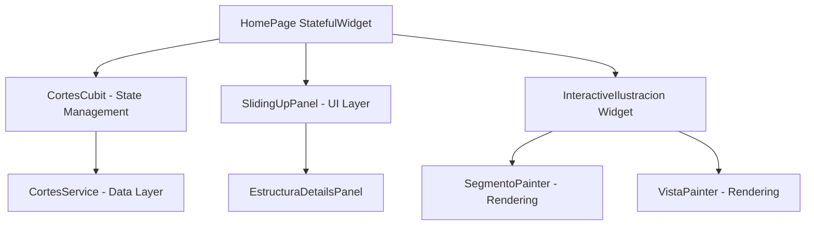
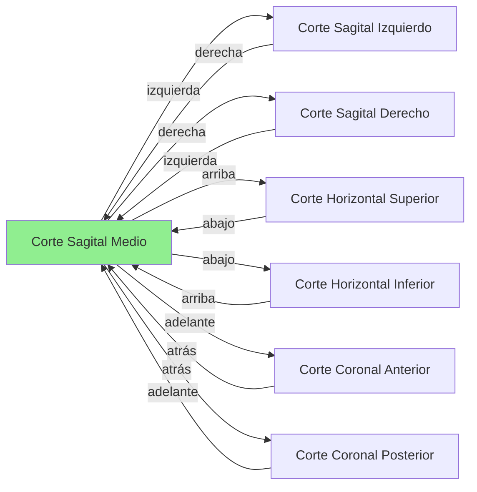
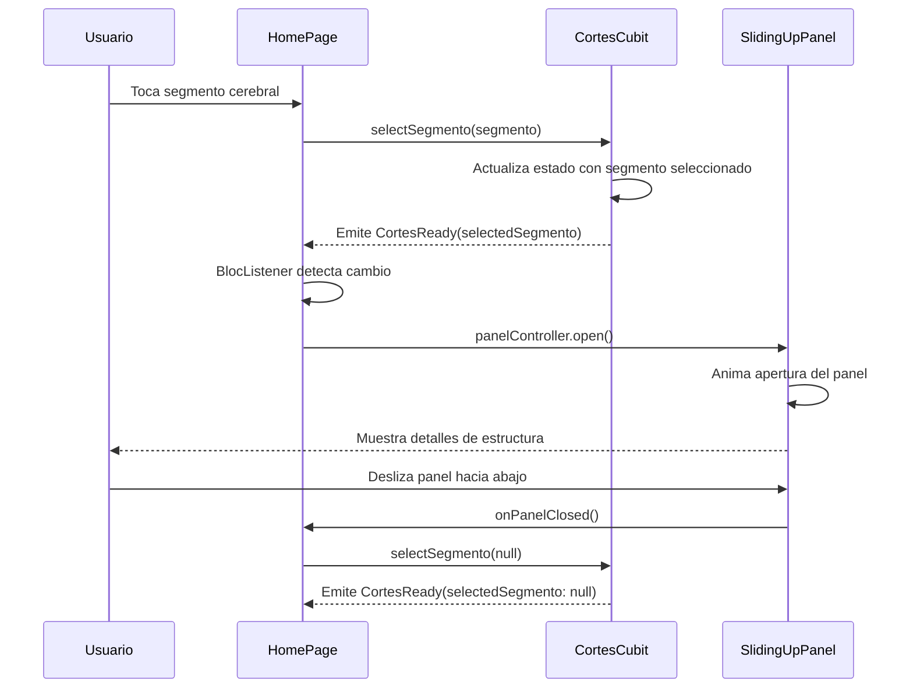

# Visualización Interactiva del Cerebro

> **Nivel**: Intermedio
> **Prerrequisitos**: Widgets y UI, State Management, BLoC Pattern
> **Tiempo de lectura**: 20 minutos

## Introducción

Imagina que estás explorando un atlas tridimensional del cerebro, donde puedes navegar entre diferentes cortes como si estuvieras hojeando las páginas de un libro. Cada corte muestra una imagen del cerebro desde un ángulo específico, y cuando tocas una región, aparece información detallada sobre esa estructura cerebral. Eso es exactamente lo que hace la funcionalidad de visualización interactiva de esta aplicación.

La HomePage es como el corazón de la aplicación: es donde los usuarios pasan la mayor parte de su tiempo explorando el cerebro. En lugar de mostrar solo imágenes estáticas, la aplicación permite tocar regiones específicas del cerebro para resaltarlas y ver información detallada. Además, puedes navegar en seis direcciones (adelante, atrás, arriba, abajo, izquierda, derecha) entre diferentes cortes cerebrales, creando una experiencia de navegación tridimensional dentro de un espacio bidimensional.

### ¿Cómo funciona la navegación?

Piensa en el cerebro como un cubo. Cada cara del cubo es un corte diferente. Desde cualquier corte, puedes moverte a otro corte adyacente usando botones de navegación. Por ejemplo, si estás viendo un corte sagital (vista lateral del cerebro), puedes moverte hacia la derecha o izquierda para ver cortes paralelos, o puedes moverte hacia arriba, abajo, adelante o atrás para cambiar completamente de perspectiva.

Cada corte cerebral (representado por el modelo `CorteCerebro`) contiene:
- Una imagen del cerebro (en modo real o acuarela)
- Una lista de segmentos cerebrales (estructuras anatómicas)
- Referencias a otros cortes en las seis direcciones
- Indicadores visuales llamados "vistas" que muestran hacia dónde puedes navegar

### Modos de visualización

La aplicación ofrece dos modos de visualización de imágenes:
1. **Modo Real**: Muestra fotografías reales de cortes cerebrales
2. **Modo Acuarela**: Muestra versiones estilizadas en acuarela que facilitan la identificación de estructuras

Puedes alternar entre estos modos con un simple botón, y la aplicación recuerda tu preferencia mientras navegas.

### Interacción con estructuras

Cuando tocas una región del cerebro:
1. La región se resalta con un color verde translúcido
2. Un panel desliza desde la parte inferior de la pantalla
3. El panel muestra el nombre de la estructura, una descripción, y otros cortes donde aparece la misma estructura
4. Puedes cerrar el panel deslizándolo hacia abajo o tocando la misma estructura nuevamente

Este diseño permite una exploración fluida e intuitiva del cerebro sin saturar la pantalla con información.

---

## Documentación Técnica Formal

### Fundamento Teórico

La visualización interactiva del cerebro implementa un patrón de interfaz de usuario conocido como "información contextual bajo demanda" (information on demand), donde los detalles se revelan solo cuando el usuario los solicita mediante interacción directa. Este enfoque reduce la carga cognitiva y permite una navegación más eficiente en conjuntos de datos complejos (Shneiderman, 1996).

El sistema de navegación multidireccional implementa una estructura de grafo dirigido donde cada nodo representa un corte cerebral y las aristas representan las conexiones direccionales entre cortes. Esta arquitectura permite una navegación espacial coherente que preserva la orientación del usuario dentro del modelo tridimensional del cerebro.

### Arquitectura del Componente

El componente de visualización interactiva se organiza en tres capas principales:



### Implementación en la Aplicación NeuroAnatomía

#### Modelo de Datos: CorteCerebro

El modelo `CorteCerebro` representa un corte cerebral individual con toda su información asociada:

```dart
// Ubicación: /lib/models/corte_cerebro.dart:10-87
@JsonSerializable()
class CorteCerebro extends Equatable {
  final String id;
  final String nombre;
  final String realImage;
  final String? aquarelaImage;
  final List<SegmentoCerebro> segmentos;
  final List<VistaCerebro> vistas;

  // Referencias de navegación en seis direcciones
  final String? derechaId;
  final String? izquierdaId;
  final String? arribaId;
  final String? abajoId;
  final String? atrasId;

  String? imageUrlForMode(ImageMode mode) {
    switch (mode) {
      case ImageMode.real:
        return realImage;
      case ImageMode.aquarela:
        return aquarelaImage;
    }
  }
}
```

**Características clave:**
- **Equatable**: Permite comparaciones eficientes de objetos basadas en sus propiedades
- **JSON Serialization**: Facilita la conversión desde/hacia Firestore
- **Navigation References**: Los campos `derechaId`, `izquierdaId`, etc., forman el grafo de navegación
- **Multiple Image Modes**: Soporte para diferentes visualizaciones de la misma información

#### Modelo de Datos: SegmentoCerebro

Representa una estructura anatómica individual dentro de un corte:

```dart
// Ubicación: /lib/models/segmento_cerebro.dart:9-40
@JsonSerializable()
class SegmentoCerebro extends Equatable {
  final String id;
  final String nombre;

  @SvgPathListConverter()
  final List<Path> path;  // Forma geométrica de la estructura en SVG
}
```

El campo `path` contiene las coordenadas geométricas que definen la forma de la estructura cerebral, permitiendo la detección precisa de toques y el renderizado de resaltados.

#### HomePage: Componente Principal

La HomePage orquesta todos los elementos de la visualización interactiva:

```dart
// Ubicación: /lib/pages/home_page/home_page.dart:17-111
class HomePage extends StatefulWidget {
  @override
  Widget build(BuildContext context) {
    return BlocProvider<CortesCubit>(
      create: (context) => CortesCubit(CortesService())..getCortes(),
      child: Scaffold(
        appBar: AppBar(
          title: const Image(
            image: AssetImage('assets/logo.png'),
            height: 40,
          ),
          actions: [
            IconButton(
              onPressed: () {
                context.read<AuthCubit>().logout();
              },
              icon: const Icon(Icons.logout),
            ),
          ],
        ),
        body: BlocConsumer<CortesCubit, CortesState>(
          listener: (context, state) {
            if (state is CortesReady) {
              final selectedSegmento = state.selectedSegmento;
              if (selectedSegmento != null) {
                panelController.open();
              } else {
                panelController.close();
              }
            }
          },
          builder: (context, state) {
            // Manejo de estados de carga, error y éxito
          },
        ),
      ),
    );
  }
}
```

**Patrón BlocConsumer**: Combina `BlocBuilder` y `BlocListener` para:
- **Builder**: Reconstruir la UI cuando cambia el estado
- **Listener**: Ejecutar efectos secundarios (abrir/cerrar panel) sin reconstruir todo

#### Sistema de Navegación Multidireccional

La navegación entre cortes se implementa mediante botones direccionales que consultan el grafo de conexiones:

```dart
// Ubicación: /lib/pages/home_page/home_page.dart:213-234
Widget _buildIzquierdaButton(BuildContext context) {
  final state = context.read<CortesCubit>().state as CortesReady;
  final currentCorte = state.selectedCorte;
  final izquierdaId = currentCorte.izquierdaId;

  if (izquierdaId == null) {
    return IconButton(
      icon: const Icon(Icons.arrow_back_ios),
      color: Colors.transparent,  // Ocultar si no hay navegación disponible
    );
  }

  return IconButton(
    onPressed: () {
      final corteTo = state.cortes.firstWhereOrNull(
        (corte) => corte.id == izquierdaId,
      );
      if (corteTo != null) {
        context.read<CortesCubit>().selectCorte(corteTo);
      }
    },
    icon: const Icon(Icons.arrow_back_ios),
  );
}
```

Este patrón se repite para las seis direcciones (izquierda, derecha, arriba, abajo, adelante, atrás), creando una interfaz de navegación consistente.

#### Widget InteractiveIlustracion

El widget central que renderiza el corte cerebral y maneja la interacción:

```dart
// Ubicación: /lib/pages/home_page/home_page.dart:388-420
Widget _buildInteractiveIlustration(
    CortesReady cortesState, BuildContext context) {
  final width = context.mediaQuery.size.width;
  final viewWidth = width > 840 ? width * 0.40 : width * 0.8;

  return Center(
    child: SizedBox(
      width: viewWidth,
      child: InteractiveIlustracion(
        key: ValueKey(cortesState.selectedCorte.id),
        corteCerebro: cortesState.selectedCorte,
        showVistas: cortesState.isShowingVistas,
        onEstructuraTap: (segmento) {
          if (segmento.id == cortesState.selectedSegmento?.id) {
            context.read<CortesCubit>().selectSegmento(null);
            return;
          }
          context.read<CortesCubit>().selectSegmento(segmento);
        },
        onVistaTap: (vista) {
          context.read<CortesCubit>().selectCorteById(vista.toCorteId);
        },
        highlightedSegmentos: cortesState.selectedSegmento != null
            ? [cortesState.selectedSegmento!]
            : [],
        imageMode: cortesState.imageMode,
        onImageModeChange: (mode) {
          context.read<CortesCubit>().changeImageMode(mode);
        },
      ),
    ),
  );
}
```

**Callbacks de interacción:**
- `onEstructuraTap`: Maneja toques en segmentos cerebrales (toggle de selección)
- `onVistaTap`: Maneja toques en indicadores de navegación
- `onImageModeChange`: Alterna entre modos de visualización

#### Panel Deslizante de Detalles

Implementado con el paquete `sliding_up_panel`:

```dart
// Ubicación: /lib/pages/home_page/home_page.dart:148-197
return SlidingUpPanel(
  controller: panelController,
  parallaxEnabled: true,
  parallaxOffset: 0.4,
  maxHeight: panelHeightOpen,
  minHeight: 0,
  onPanelSlide: (position) {
    final currentTop = panelHeightOpen * position;
    final hideFab = position > 0.5;
    setState(() {
      _fabPadding = currentTop + _initialFabHeight;
      showFab = !hideFab;  // Ocultar FAB cuando el panel está abierto
    });
  },
  onPanelClosed: () {
    context.read<CortesCubit>().selectSegmento(null);
  },
  panelBuilder: (sc) {
    return EstructuraDetailsPanel(
      segmento: cortesState.selectedSegmento,
      scrollController: sc,
      allCortes: allCortesWithSegmento,
      imageMode: imageMode,
    );
  },
);
```

**Características avanzadas:**
- **Parallax Effect**: Crea profundidad visual (offset: 0.4)
- **Dynamic FAB Positioning**: El FloatingActionButton se mueve con el panel
- **Auto-deselección**: Cerrar el panel deselecciona la estructura

### Diagrama de Flujo de Navegación



### Diagrama de Secuencia: Interacción con Estructura



### Especificaciones Técnicas

#### Responsive Design

El tamaño del widget de ilustración se ajusta según el ancho de pantalla:

```dart
final width = context.mediaQuery.size.width;
final viewWidth = width > 840 ? width * 0.40 : width * 0.8;
```

- **Pantallas grandes (>840px)**: 40% del ancho de pantalla
- **Pantallas pequeñas (<840px)**: 80% del ancho de pantalla

#### Gestión de Estado

El `CortesCubit` mantiene:
- Lista completa de cortes cargados desde Firestore
- Corte actualmente seleccionado
- Segmento actualmente seleccionado (si existe)
- Modo de imagen actual (real/acuarela)
- Estado de visibilidad de las vistas de navegación

Estados posibles:
```dart
// CortesLoading: Cargando cortes desde Firestore
// CortesError: Error al cargar datos
// CortesReady: Datos listos para visualización
```

#### Optimizaciones de Rendimiento

1. **ValueKey para InteractiveIlustracion**: Fuerza reconstrucción completa al cambiar de corte
   ```dart
   key: ValueKey(cortesState.selectedCorte.id)
   ```

2. **Lazy Loading de Imágenes**: Las imágenes se cargan bajo demanda en `CorteInteractivoCubit`

3. **Equatable en Modelos**: Previene reconstrucciones innecesarias comparando valores reales

### Mejores Prácticas

1. **Separación de Responsabilidades**:
   - HomePage: Orquestación y layout
   - InteractiveIlustracion: Renderizado e interacción
   - CortesCubit: Lógica de negocio y estado
   - CortesService: Acceso a datos

2. **Gestión de Estados Nulos**:
   ```dart
   if (izquierdaId == null) {
     transparent = true;  // Mostrar botón transparente en lugar de ocultar
   }
   ```
   Esto preserva el layout y evita desplazamientos visuales.

3. **Uso de BlocConsumer**:
   Combinar builder y listener solo cuando se necesitan efectos secundarios además de reconstrucción.

4. **Callbacks Opcionales**:
   ```dart
   onEstructuraTap?.call(segmento);  // Safe navigation
   ```

### Desafíos Comunes

#### Problema: El panel no se abre/cierra correctamente

**Causa**: El `panelController` no está adjunto cuando se intenta usar.

**Solución**:
```dart
if (!panelController.isAttached) return;
```

#### Problema: Imágenes no se muestran al cambiar de modo

**Causa**: El campo `aquarelaImage` puede ser nulo si no se ha subido una imagen en acuarela.

**Solución**: Validar antes de cambiar modo o mostrar mensaje al usuario.

#### Problema: Navegación crea ciclos infinitos

**Causa**: Referencias bidireccionales mal configuradas en Firestore.

**Solución**: Validar la integridad del grafo de navegación antes de desplegar.

## Referencias

### Documentación Interna
- [Widgets y UI](/docs/flutter-basics/02-widgets-and-ui.md)
- [BLoC Pattern](/docs/bloc-pattern/01-bloc-pattern-fundamentals.md)
- [Custom Painting y SVG](/docs/features/02-custom-painting-and-svg.md)
- [Arquitectura de la Aplicación](/docs/architecture/01-app-architecture-overview.md)

### Referencias Externas

1. **Flutter Documentation** (2024). "Layouts in Flutter". https://docs.flutter.dev/ui/layout
2. **Shneiderman, B.** (1996). "The Eyes Have It: A Task by Data Type Taxonomy for Information Visualizations". *Proceedings of the IEEE Symposium on Visual Languages*, pp. 336-343.
3. **Material Design Guidelines** (2024). "Navigation patterns". https://m3.material.io/components/navigation-drawer
4. **sliding_up_panel package** (2023). https://pub.dev/packages/sliding_up_panel
5. **Purves, D., et al.** (2018). *Neuroscience* (6th ed.). Oxford University Press. Capítulo 1: "Studying the Nervous System".
6. **Nolte, J.** (2020). *The Human Brain: An Introduction to its Functional Anatomy* (8th ed.). Elsevier. Capítulo 2: "Gross Anatomy and General Organization of the Central Nervous System".

## Lecturas Adicionales

- **Siguiente**: [Custom Painting y SVG](/docs/features/02-custom-painting-and-svg.md) - Aprende cómo se renderizan las regiones cerebrales interactivas
- **Relacionado**: [Notas y Datos de Usuario](/docs/features/03-notes-and-user-data.md) - Cómo los usuarios guardan información sobre estructuras
- **Avanzado**: [Layouts y Responsive Design](/docs/ui-ux/02-layouts-and-responsive-design.md) - Profundiza en técnicas de diseño responsive
