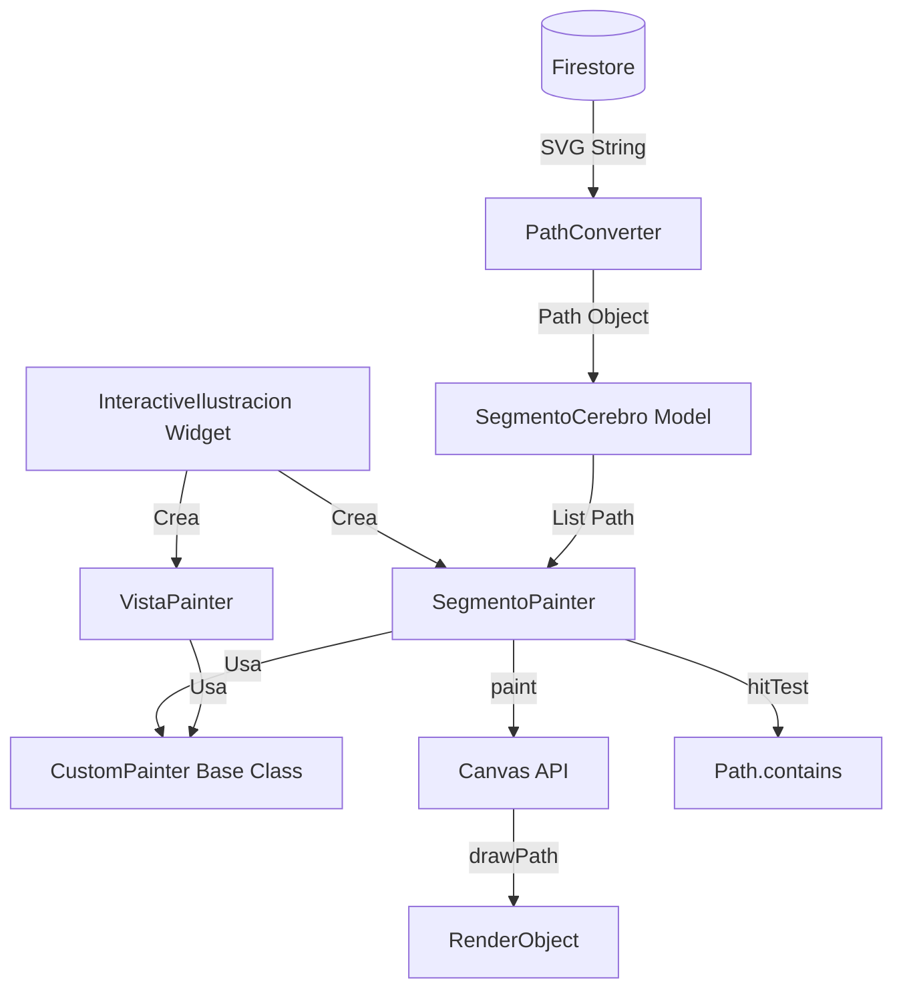
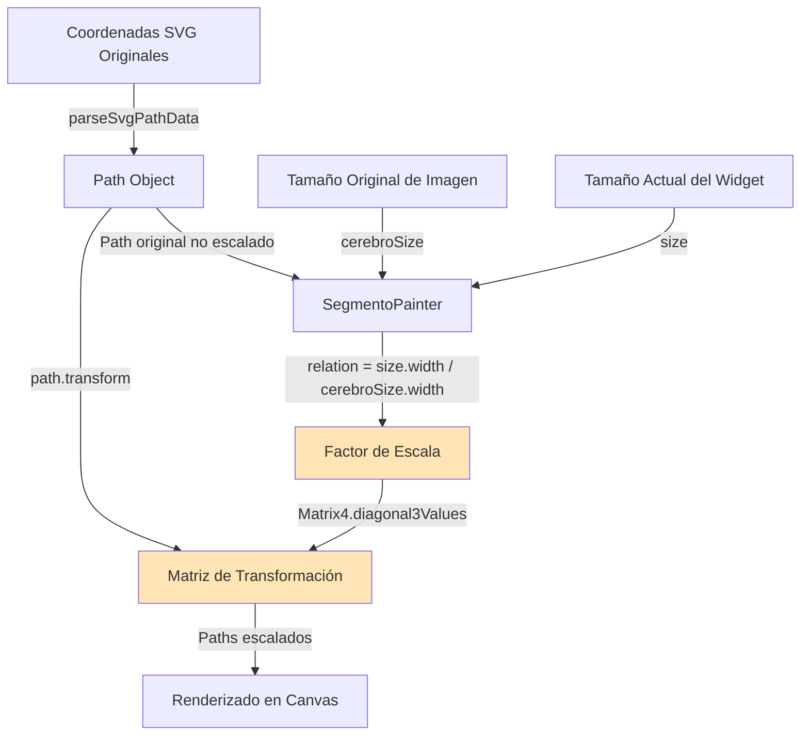
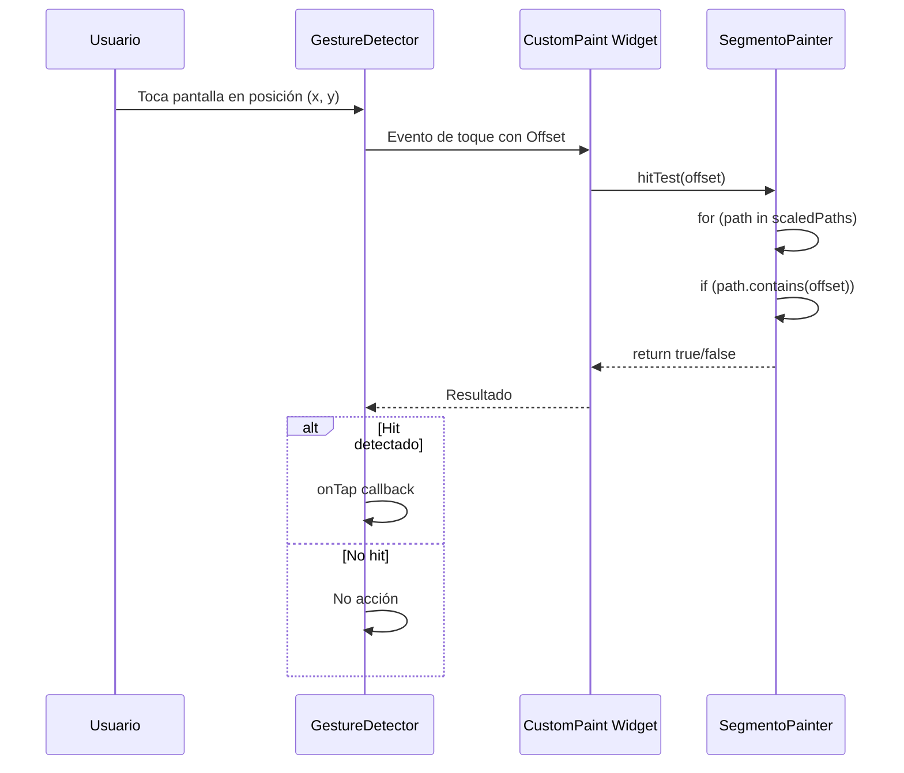

# Custom Painting y SVG

> **Nivel**: Avanzado
> **Prerrequisitos**: Widgets y UI, Coordenadas y transformaciones matemáticas básicas
> **Tiempo de lectura**: 25 minutos

## Introducción

Imagina que tienes un lienzo digital donde puedes dibujar cualquier forma que desees usando código. Eso es exactamente lo que permite `CustomPainter` en Flutter: dibujar gráficos personalizados pixel por pixel. En esta aplicación, necesitamos dibujar formas complejas que representan estructuras cerebrales sobre imágenes del cerebro, y detectar cuando el usuario toca dentro de esas formas.

Piensa en `CustomPainter` como tener un pincel digital. En lugar de decirle a Flutter "pon un botón aquí" o "muestra un texto allá", le dices "dibuja esta forma exacta en estas coordenadas con este color". Es como la diferencia entre usar bloques de LEGO prediseñados versus esculpir algo a mano.

### ¿Por qué necesitamos Custom Painting?

Los widgets estándar de Flutter son rectangulares por naturaleza. Pero las estructuras del cerebro tienen formas orgánicas e irregulares: el hipocampo no es un rectángulo, ni tampoco el tálamo. Necesitamos una forma de:

1. Dibujar formas arbitrarias e irregulares
2. Detectar cuando el usuario toca dentro de esas formas
3. Resaltar esas formas con colores
4. Escalar las formas para que coincidan con diferentes tamaños de pantalla

### Formato SVG: El lenguaje de las formas

SVG (Scalable Vector Graphics) es un formato que describe formas usando coordenadas y comandos matemáticos. En lugar de almacenar una imagen como una cuadrícula de píxeles, SVG almacena instrucciones para dibujar la forma:

```
M 150,0 L 75,200 L 225,200 Z
```

Esto se lee como:
- **M 150,0**: Mueve el lápiz a la posición (150, 0)
- **L 75,200**: Dibuja una línea hasta (75, 200)
- **L 225,200**: Dibuja una línea hasta (225, 200)
- **Z**: Cierra el camino conectando al punto inicial

Estas instrucciones forman un triángulo. Las estructuras cerebrales en esta aplicación se definen usando paths SVG mucho más complejos con curvas y múltiples segmentos.

### El proceso de pintura

Cuando necesitamos dibujar una estructura cerebral:

1. **Carga de datos**: Obtenemos el path SVG desde Firestore
2. **Parsing**: Convertimos el texto SVG en un objeto `Path` de Flutter
3. **Escalado**: Transformamos las coordenadas para que coincidan con el tamaño de pantalla actual
4. **Renderizado**: Dibujamos el path sobre la imagen del cerebro
5. **Hit Testing**: Detectamos si un toque del usuario cae dentro del path

---

## Documentación Técnica Formal

### Fundamento Teórico

La API `CustomPainter` de Flutter proporciona acceso de bajo nivel al pipeline de renderizado mediante un modelo de renderizado en modo inmediato (immediate mode rendering). A diferencia del modelo declarativo de widgets, donde describimos qué queremos que aparezca en pantalla, con `CustomPainter` especificamos imperativamente cómo dibujarlo (Eisenberg & Bellamy-Royds, 2014).

El formato SVG (Scalable Vector Graphics) define formas mediante geometría vectorial utilizando curvas de Bézier y comandos de path. SVG es independiente de resolución, permitiendo escalado sin pérdida de calidad (W3C SVG Specification, 2018).

La detección de toques en formas arbitrarias requiere algoritmos de "punto dentro de polígono" (point-in-polygon). Flutter implementa esto mediante el método `contains()` de la clase `Path`, que utiliza el algoritmo de winding number para determinar la inclusión de puntos (Hormann & Agathos, 2001).

### Arquitectura de Custom Painting



### Implementación en la Aplicación NeuroAnatomía

#### Clase CustomPainter

`CustomPainter` es una clase abstracta que proporciona dos métodos principales:

```dart
abstract class CustomPainter {
  void paint(Canvas canvas, Size size);
  bool shouldRepaint(covariant CustomPainter oldDelegate);
  bool? hitTest(Offset position) => null;
}
```

- **paint**: Donde realizamos el dibujo real
- **shouldRepaint**: Determina si necesitamos redibujar cuando cambian las propiedades
- **hitTest**: Determina si un punto está dentro de nuestra forma

#### SegmentoPainter: Dibujando Estructuras Cerebrales

`SegmentoPainter` es responsable de renderizar segmentos cerebrales y detectar toques:

```dart
// Ubicación: /lib/painters/segmento_painter.dart:1-59
class SegmentoPainter extends CustomPainter {
  final SegmentoCerebro segmento;
  final bool isHighlighted;
  final Size cerebroSize;
  final Color highlightColor;

  List<Path> scaledPaths = [];

  SegmentoPainter({
    required this.segmento,
    required this.isHighlighted,
    required this.cerebroSize,
    required this.highlightColor,
  });

  @override
  void paint(Canvas canvas, Size size) {
    // Calcular relación de escala
    final relation = size.width / cerebroSize.width;

    // Escalar y cerrar cada path
    for (var segmento in segmento.path) {
      scaledPaths.add(segmento.transform(Matrix4.diagonal3Values(
        relation,
        relation,
        1,
      ).storage)
        ..close());
    }

    // Configurar pintura
    final paint = Paint()
      ..color = isHighlighted ? highlightColor : Colors.transparent
      ..style = PaintingStyle.fill
      ..strokeWidth = 2;

    // Dibujar cada path escalado
    for (var path in scaledPaths) {
      canvas.drawPath(path, paint);
    }
  }

  @override
  bool shouldRepaint(covariant CustomPainter oldDelegate) {
    return true;  // Siempre redibujar cuando cambien las propiedades
  }

  @override
  bool hitTest(Offset position) {
    for (var path in scaledPaths) {
      if (path.contains(position)) {
        return true;
      }
    }
    return false;
  }
}
```

**Detalles de implementación:**

1. **Escalado Proporcional**:
   ```dart
   final relation = size.width / cerebroSize.width;
   ```
   Esta relación asegura que las coordenadas SVG (definidas para la imagen original) se escalen correctamente al tamaño actual del widget.

2. **Transformación Matrix4**:
   ```dart
   Matrix4.diagonal3Values(relation, relation, 1)
   ```
   Matriz de transformación diagonal que escala x e y uniformemente, dejando z sin cambios. Esto preserva las proporciones de las formas.

3. **Múltiples Paths**:
   Un `SegmentoCerebro` puede contener múltiples paths (por ejemplo, estructuras con agujeros o partes desconectadas):
   ```dart
   final List<Path> path;  // Lista de paths en segmento_cerebro.dart:21
   ```

4. **Fill vs Stroke**:
   ```dart
   ..style = PaintingStyle.fill
   ```
   Rellenamos las formas en lugar de solo dibujar sus contornos.

#### VistaPainter: Indicadores de Navegación

`VistaPainter` dibuja líneas punteadas que indican hacia dónde puede navegar el usuario:

```dart
// Ubicación: /lib/painters/vista_painter.dart:1-60
class VistaPainter extends CustomPainter {
  final Path vista;
  final Size cerebroSize;

  Path scaledPath = Path();

  VistaPainter({
    required this.vista,
    required this.cerebroSize,
  });

  @override
  void paint(Canvas canvas, Size size) {
    final relation = size.width / cerebroSize.width;

    // Escalar el path
    scaledPath = vista.transform(Matrix4.diagonal3Values(
      relation,
      relation,
      1,
    ).storage);

    // Crear path punteado
    final dashedPath = dashPath(
      scaledPath,
      dashArray: CircularIntervalList<double>(<double>[10.0, 10.0]),
    );

    // Configurar pintura para línea negra
    final paint = Paint()
      ..color = Colors.black
      ..strokeCap = StrokeCap.round
      ..style = PaintingStyle.stroke
      ..strokeWidth = 5;

    canvas.drawPath(dashedPath, paint);
  }

  @override
  bool hitTest(Offset position) {
    final pathBounds = scaledPath.getBounds();
    const padding = 10;

    // Crear área tocable alrededor de la línea
    final pathWithArea = Path()
      ..moveTo(pathBounds.left - padding, pathBounds.top - padding)
      ..lineTo(pathBounds.right + padding, pathBounds.top - padding)
      ..lineTo(pathBounds.right + padding, pathBounds.bottom + padding)
      ..lineTo(pathBounds.left - padding, pathBounds.bottom + padding)
      ..close();

    return pathWithArea.contains(position);
  }
}
```

**Características especiales:**

1. **Líneas Punteadas**:
   ```dart
   dashPath(scaledPath, dashArray: CircularIntervalList<double>([10.0, 10.0]))
   ```
   Crea un patrón de 10px dibujado, 10px espacio, usando el paquete `path_drawing`.

2. **Hit Testing de Líneas**:
   Las líneas no tienen área, por lo que creamos un rectángulo invisible alrededor de la línea con 10px de padding para facilitar el toque.

3. **Stroke vs Fill**:
   ```dart
   ..style = PaintingStyle.stroke
   ```
   Dibujamos solo el contorno, no rellenamos.

### Canvas API: El Lienzo Digital

La clase `Canvas` proporciona métodos de bajo nivel para dibujar:

```dart
// Métodos principales utilizados:
canvas.drawPath(Path path, Paint paint)     // Dibuja una forma
canvas.drawLine(Offset p1, Offset p2, Paint paint)  // Dibuja una línea
canvas.drawCircle(Offset c, double radius, Paint paint)  // Dibuja un círculo
canvas.drawRect(Rect rect, Paint paint)     // Dibuja un rectángulo

// Transformaciones:
canvas.translate(double dx, double dy)      // Mueve el origen
canvas.rotate(double radians)               // Rota el canvas
canvas.scale(double sx, [double sy])        // Escala el canvas
```

En esta aplicación, principalmente usamos `drawPath()` para renderizar las formas SVG.

### Paint: Configuración del Pincel

La clase `Paint` configura cómo se dibujan las formas:

```dart
final paint = Paint()
  ..color = Colors.green.withValues(alpha: 0.5)  // Color con transparencia
  ..style = PaintingStyle.fill                    // Rellenar forma
  ..strokeWidth = 2                               // Ancho de línea (si stroke)
  ..strokeCap = StrokeCap.round                   // Extremos redondeados
  ..blendMode = BlendMode.multiply;               // Modo de mezcla
```

**Propiedades importantes:**
- `color`: Color del dibujo (soporta RGBA con transparencia)
- `style`: `fill` (relleno) o `stroke` (contorno)
- `strokeWidth`: Grosor de líneas
- `blendMode`: Cómo se mezcla con el contenido existente

### Conversión SVG a Path

La conversión de strings SVG a objetos `Path` se maneja mediante conversores JSON personalizados:

```dart
// Ubicación: /lib/json_converters/path_list_converter.dart
class SvgPathListConverter implements JsonConverter<List<Path>, List<dynamic>> {
  const SvgPathListConverter();

  @override
  List<Path> fromJson(List<dynamic> json) {
    return json.map((pathString) {
      return parseSvgPathData(pathString as String);  // Del paquete path_drawing
    }).toList();
  }

  @override
  List<dynamic> toJson(List<Path> paths) {
    // No necesitamos convertir de vuelta a SVG en esta app
    throw UnimplementedError();
  }
}
```

El paquete `path_drawing` proporciona `parseSvgPathData()` que interpreta comandos SVG:

**Comandos SVG comunes:**
- `M x,y`: Move to (mover a posición)
- `L x,y`: Line to (línea a posición)
- `H x`: Horizontal line to (línea horizontal)
- `V y`: Vertical line to (línea vertical)
- `C x1,y1 x2,y2 x,y`: Cubic Bézier curve (curva cúbica)
- `Q x1,y1 x,y`: Quadratic Bézier curve (curva cuadrática)
- `Z`: Close path (cerrar camino)

### Diagrama: Sistema de Coordenadas y Escalado



### Proceso de Hit Testing



### Especificaciones Técnicas

#### Complejidad de Hit Testing

El algoritmo `Path.contains()` tiene complejidad O(n) donde n es el número de vértices en el path. Para paths SVG complejos con cientos de vértices, esto puede ser costoso.

**Optimización**: Usar bounding box checks primero:

```dart
@override
bool hitTest(Offset position) {
  final bounds = scaledPath.getBounds();
  if (!bounds.contains(position)) {
    return false;  // Fuera del bounding box, retorno rápido
  }
  return scaledPath.contains(position);  // Check detallado solo si necesario
}
```

#### Precisión de Escalado

El escalado uniforme preserva las proporciones:
```dart
Matrix4.diagonal3Values(s, s, 1)  // s = factor de escala
```

Si las proporciones de la imagen original y el widget difieren, podríamos necesitar escalado no uniforme:
```dart
final sx = size.width / cerebroSize.width;
final sy = size.height / cerebroSize.height;
Matrix4.diagonal3Values(sx, sy, 1)
```

Sin embargo, esto distorsionaría las formas. Esta aplicación mantiene aspect ratio de las imágenes.

#### Rendimiento de Repaint

```dart
@override
bool shouldRepaint(covariant CustomPainter oldDelegate) {
  return true;  // Siempre redibujar
}
```

En producción, esto debería ser más selectivo:

```dart
@override
bool shouldRepaint(SegmentoPainter oldDelegate) {
  return oldDelegate.isHighlighted != isHighlighted ||
         oldDelegate.segmento != segmento;
}
```

Esto evita redibujados innecesarios cuando las propiedades no cambian.

### Mejores Prácticas

1. **Cachear Paths Escalados**:
   ```dart
   List<Path> scaledPaths = [];  // Variable de instancia
   ```
   Los paths escalados se almacenan en vez de recalcularse en cada frame.

2. **Cerrar Paths**:
   ```dart
   scaledPath..close()
   ```
   Asegura que las formas estén completamente cerradas para un relleno adecuado.

3. **Usar Equatable en Modelos**:
   ```dart
   class SegmentoCerebro extends Equatable
   ```
   Permite comparaciones eficientes en `shouldRepaint`.

4. **Transparencia para Resaltados**:
   ```dart
   Colors.green.withValues(alpha: 0.5)
   ```
   Permite ver la imagen subyacente a través del resaltado.

5. **Hit Testing Amplio para Líneas**:
   Añadir padding alrededor de líneas delgadas para facilitar el toque en dispositivos móviles.

### Desafíos Comunes

#### Problema: Los paths no se renderizan en la posición correcta

**Causa**: Factor de escala calculado incorrectamente o coordenadas SVG mal formadas.

**Solución**: Verificar que `cerebroSize` corresponda al tamaño real de la imagen original. Debuggear con:
```dart
print('Original size: $cerebroSize');
print('Widget size: $size');
print('Scale relation: $relation');
```

#### Problema: Hit testing no funciona

**Causa**: El path no está cerrado o las coordenadas escaladas están mal.

**Solución**:
- Asegurar que todos los paths terminen con `..close()`
- Verificar que `scaledPaths` esté poblada antes del hit test
- Renderizar el bounding box visualmente para debugging:
  ```dart
  canvas.drawRect(path.getBounds(), Paint()..style = PaintingStyle.stroke);
  ```

#### Problema: Rendimiento lento con muchos segmentos

**Causa**: Demasiados CustomPaint widgets superpuestos.

**Solución**: Combinar múltiples segmentos en un solo CustomPainter cuando sea posible, o usar `RepaintBoundary` para aislar áreas que cambian frecuentemente.

#### Problema: Paths se distorsionan en diferentes pantallas

**Causa**: Escalado no uniforme o aspect ratio no preservado.

**Solución**: Usar `FittedBox` con `BoxFit.contain` alrededor del widget, o mantener aspect ratio manualmente.

## Referencias

### Documentación Interna
- [Visualización Interactiva del Cerebro](/docs/features/01-interactive-brain-visualization.md)
- [Widgets y UI](/docs/flutter-basics/02-widgets-and-ui.md)
- [Componentes Reutilizables](/docs/components/02-painters.md)

### Referencias Externas

1. **Flutter CustomPaint Documentation** (2024). https://api.flutter.dev/flutter/widgets/CustomPaint-class.html
2. **Eisenberg, J. D., & Bellamy-Royds, A.** (2014). *SVG Essentials* (2nd ed.). O'Reilly Media.
3. **W3C** (2018). "Scalable Vector Graphics (SVG) 2 Specification". https://www.w3.org/TR/SVG2/
4. **path_drawing package** (2023). https://pub.dev/packages/path_drawing
5. **Hormann, K., & Agathos, A.** (2001). "The point in polygon problem for arbitrary polygons". *Computational Geometry*, 20(3), 131-144.
6. **Flutter Rendering Pipeline** (2024). https://docs.flutter.dev/resources/architectural-overview#rendering-and-layout
7. **Nystrom, B.** (2021). "Understanding Flutter's CustomPainter". *Medium Flutter Community*.

## Lecturas Adicionales

- **Siguiente**: [Notas y Datos de Usuario](/docs/features/03-notes-and-user-data.md)
- **Relacionado**: [Async Programming](/docs/technical/01-async-programming.md) - Para entender cómo se cargan los paths desde Firestore
- **Profundización**: Algoritmos de geometría computacional para hit testing avanzado
- **Avanzado**: Optimizaciones de renderizado con Layers y RepaintBoundary
