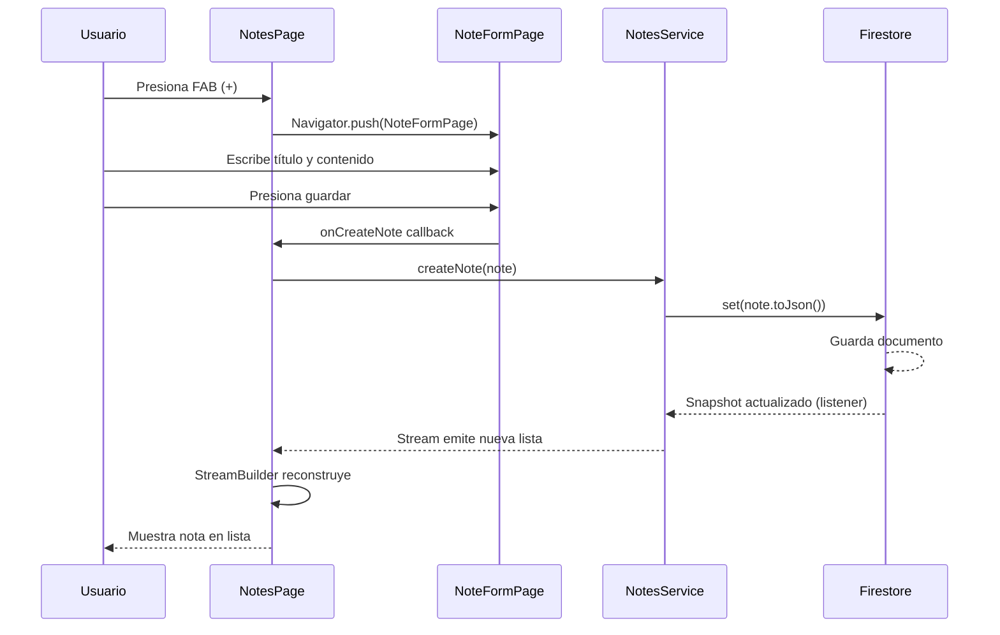
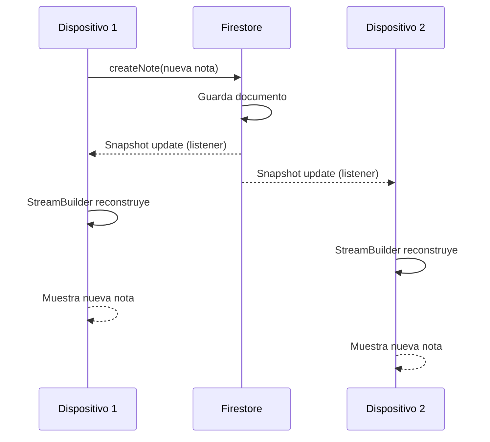

# Notas y Datos de Usuario

> **Nivel**: Intermedio
> **Prerrequisitos**: Firebase Firestore, State Management, Async Programming
> **Tiempo de lectura**: 18 minutos

## Introducción

Imagina que estás estudiando anatomía del cerebro y descubres algo interesante sobre el hipocampo. Quieres guardar tus observaciones para repasarlas más tarde. Eso es exactamente lo que permite el sistema de notas: tomar apuntes personales sobre cualquier estructura cerebral que estés explorando.

Lo especial de este sistema es que tus notas son completamente privadas y se actualizan en tiempo real. Si tienes la aplicación abierta en tu teléfono y tu tableta simultáneamente, crear una nota en un dispositivo la hace aparecer instantáneamente en el otro. Es como tener un cuaderno digital sincronizado automáticamente.

### ¿Cómo funcionan los datos de usuario?

Piensa en Firestore como un archivero digital gigante. Cada usuario tiene su propio cajón privado en ese archivero. Dentro de tu cajón, hay carpetas para cada estructura cerebral que has estudiado. Dentro de cada carpeta, guardas tus notas individuales.

La estructura se ve así:
```
users/
  └── tu_usuario_id/
      └── structures/
          ├── hipocampo/
          │   └── notes/
          │       ├── nota_1
          │       └── nota_2
          ├── talamo/
          │   └── notes/
          │       └── nota_1
          └── amigdala/
              └── notes/
                  └── nota_1
```

Esta organización asegura que tus notas permanezcan privadas y organizadas por estructura cerebral.

### Actualización en Tiempo Real

En lugar de tener que presionar un botón de "actualizar" para ver tus notas más recientes, la aplicación escucha cambios en Firestore. Cuando se crea, modifica o elimina una nota, Firestore notifica automáticamente a la aplicación y la interfaz se actualiza inmediatamente. Es como tener un asistente que constantemente revisa si hay cambios y te los muestra de inmediato.

### Operaciones CRUD

CRUD significa Create (crear), Read (leer), Update (actualizar), Delete (eliminar). Estas son las cuatro operaciones básicas que puedes hacer con datos:

- **Create**: Añadir una nueva nota
- **Read**: Ver tus notas existentes
- **Update**: Modificar una nota que ya escribiste
- **Delete**: Eliminar una nota que ya no necesitas

La aplicación implementa las cuatro operaciones de manera intuitiva: tocas el botón + para crear, tocas una nota para editarla, y mantienes presionada una nota para eliminarla.

---

## Documentación Técnica Formal

### Fundamento Teórico

El sistema de notas implementa un patrón de almacenamiento de datos específico por usuario (user-scoped data storage) utilizando Cloud Firestore como backend. Este patrón asegura el aislamiento de datos mediante reglas de seguridad a nivel de documento y permite consultas eficientes mediante la estructura jerárquica de colecciones y subcolecciones (Tamboli, 2019).

La sincronización en tiempo real se logra mediante listeners de Firestore que establecen conexiones WebSocket persistentes, permitiendo actualizaciones push del servidor al cliente sin polling (Firebase Documentation, 2024). Este enfoque minimiza el uso de ancho de banda y proporciona latencia mínima en actualizaciones de datos.

### Arquitectura de Datos de Usuario

```mermaid
graph TB
    User[Usuario Autenticado] -->|UID| UserDoc[users/{userId}]
    UserDoc -->|Subcolección| Structures[structures/]

    Structures -->|Documento| Structure1[{structureId}]
    Structures -->|Documento| Structure2[{structureId}]

    Structure1 -->|Subcolección| Notes1[notes/]
    Structure2 -->|Subcolección| Notes2[notes/]

    Notes1 -->|Documentos| Note1A[note1]
    Notes1 -->|Documentos| Note1B[note2]
    Notes2 -->|Documentos| Note2A[note1]

    style UserDoc fill:#FFE4B5
    style Structures fill:#98FB98
    style Notes1 fill:#87CEEB
```

### Implementación en la Aplicación NeuroAnatomía

#### Modelo de Datos: Note

El modelo `Note` representa una nota individual sobre una estructura cerebral:

```dart
// Ubicación: /lib/models/note.dart:6-48
@JsonSerializable()
class Note extends Equatable {
  final String? id;
  final String title;
  final String content;
  final String structureId;
  final DateTime? createdAt;
  final DateTime? updatedAt;

  const Note({
    this.id,
    required this.title,
    required this.content,
    required this.structureId,
    this.createdAt,
    this.updatedAt,
  });

  factory Note.fromJson(Map<String, dynamic> json) => _$NoteFromJson(json);
  Map<String, dynamic> toJson() => _$NoteToJson(this);

  @override
  List<Object?> get props => [
    id,
    title,
    content,
    structureId,
    createdAt,
    updatedAt,
  ];
}
```

**Características clave:**
- **Nullable ID**: El ID es nulo al crear la nota (Firestore asigna el ID)
- **structureId**: Vincula la nota a una estructura cerebral específica
- **Timestamps**: Rastrean creación y última modificación
- **Equatable**: Permite comparaciones eficientes de objetos

#### NotesService: Capa de Acceso a Datos

`NotesService` encapsula todas las operaciones de Firestore para notas:

```dart
// Ubicación: /lib/services/notes_service.dart:4-88
class NotesService {
  final FirebaseFirestore _firestore = FirebaseFirestore.instance;
  final String userId;

  NotesService({required this.userId});

  // CREATE: Crear nueva nota
  Future<void> createNote(Note note) async {
    await _firestore
        .collection('users')
        .doc(userId)
        .collection('structures')
        .doc(note.structureId)
        .collection('notes')
        .doc(note.id)
        .set(note.toJson());
  }

  // DELETE: Eliminar nota por ID
  Future<void> deleteNoteById(String structureId, String noteId) async {
    await _firestore
        .collection('users')
        .doc(userId)
        .collection('structures')
        .doc(structureId)
        .collection('notes')
        .doc(noteId)
        .delete();
  }

  // UPDATE: Actualizar nota existente
  Future<void> updateNoteById(String noteId, Note note) async {
    await _firestore
        .collection('users')
        .doc(userId)
        .collection('structures')
        .doc(note.structureId)
        .collection('notes')
        .doc(noteId)
        .update(note.toJson());
  }

  // READ: Obtener nota individual
  Future<Note?> getNoteById(String structureId, String noteId) async {
    final DocumentSnapshot<Map<String, dynamic>> doc = await _firestore
        .collection('users')
        .doc(userId)
        .collection('structures')
        .doc(structureId)
        .collection('notes')
        .doc(noteId)
        .get();

    return doc.exists ? Note.fromJson(doc.data()!) : null;
  }

  // READ: Obtener todas las notas de una estructura
  Future<List<Note>> getNotes(String structureId) async {
    final QuerySnapshot<Map<String, dynamic>> querySnapshot = await _firestore
        .collection('users')
        .doc(userId)
        .collection('structures')
        .doc(structureId)
        .collection('notes')
        .get();

    return querySnapshot.docs.map((doc) {
      final data = doc.data();
      data['id'] = doc.id;  // Añadir ID del documento
      return Note.fromJson(data);
    }).toList();
  }

  // STREAM: Escuchar cambios en tiempo real
  Stream<List<Note>> getNotesStream(String structureId) {
    return _firestore
        .collection('users')
        .doc(userId)
        .collection('structures')
        .doc(structureId)
        .collection('notes')
        .snapshots()
        .map((querySnapshot) =>
            querySnapshot.docs.map((doc) {
              final data = doc.data();
              data['id'] = doc.id;
              return Note.fromJson(data);
            }).toList());
  }
}
```

**Patrón de Servicio:**
- **Constructor con userId**: Cada instancia está vinculada a un usuario específico
- **Paths Consistentes**: Todas las operaciones usan la misma estructura de colecciones
- **Futures vs Streams**: Futures para operaciones únicas, Streams para actualizaciones continuas

#### NotesPage: Interfaz de Usuario

La página de notas combina visualización en tiempo real con edición interactiva:

```dart
// Ubicación: /lib/pages/notes_page/notes_page.dart:10-173
class NotesPage extends StatefulWidget {
  final SegmentoCerebro segmento;

  @override
  Widget build(BuildContext context) {
    final userId = (context.read<AuthCubit>().state as AuthSuccess).user.uid;

    return Scaffold(
      appBar: AppBar(
        title: isSelecting
            ? const Text('Selecciona las notas')
            : Text('Notas ${widget.segmento.nombre}'),
        actions: [
          IconButton(
            onPressed: () {
              selectedNotesForActivity.clear();
              setState(() {
                isSelecting = !isSelecting;
              });
            },
            icon: const Icon(Icons.chat),
          ),
        ],
      ),
      floatingActionButton: FloatingActionButton(
        onPressed: () {
          if (isSelecting) {
            // Navegar a quiz con notas seleccionadas
            Navigator.of(context).push(
              MaterialPageRoute(
                builder: (context) =>
                    QuizaPage(notes: selectedNotesForActivity),
              ),
            );
          } else {
            pushNoteFormPage(userId: userId);
          }
        },
        child: isSelecting ? const Icon(Icons.check) : const Icon(Icons.add),
      ),
      body: StreamBuilder<List<Note>>(
        stream: NotesService(userId: userId).getNotesStream(widget.segmento.id),
        builder: (context, snapshot) {
          if (snapshot.hasData) {
            currentNotes = snapshot.data!;
            if (currentNotes.isEmpty) {
              return const Center(
                child: Text('No hay notas, agrega una usando el botón +'),
              );
            }
            return ListView.builder(
              itemCount: snapshot.data!.length,
              itemBuilder: (context, index) {
                final note = snapshot.data![index];
                if (isSelecting) {
                  return _buildCheckboxListTile(userId, note);
                } else {
                  return _buildListTile(userId, note);
                }
              },
            );
          } else {
            return const Center(child: CircularProgressIndicator());
          }
        },
      ),
    );
  }
}
```

**Características de UI:**

1. **StreamBuilder**: Widget que se reconstruye automáticamente cuando llegan nuevos datos del stream
2. **Modo Dual**: Normal (ver/editar) vs Selección (elegir notas para quiz)
3. **FloatingActionButton Dinámico**: Cambia de "+" (crear) a "✓" (confirmar selección)

#### Interacciones de Usuario

```dart
// Ubicación: /lib/pages/notes_page/notes_page.dart:98-116
Widget _buildListTile(String userId, Note note) {
  return ListTile(
    title: Text(note.title),
    subtitle: Text(
      note.content,
      maxLines: 2,
      overflow: TextOverflow.ellipsis,
    ),
    onTap: () {
      // Editar nota
      pushNoteFormPage(userId: userId, existingNote: note);
    },
    onLongPress: () {
      // Eliminar nota
      NotesService(userId: userId).deleteNoteById(note.structureId, note.id!);
    },
  );
}
```

**Gestos implementados:**
- **Tap**: Abrir editor para modificar la nota
- **Long Press**: Eliminar la nota (sin confirmación para simplicidad)

#### Modo de Selección para Quiz

```dart
// Ubicación: /lib/pages/notes_page/notes_page.dart:118-152
Widget _buildCheckboxListTile(String userId, Note note) {
  return CheckboxListTile(
    title: Text(note.title),
    subtitle: Text(
      note.content,
      maxLines: 2,
      overflow: TextOverflow.ellipsis,
    ),
    value: selectedNotesForActivity.contains(note),
    controlAffinity: ListTileControlAffinity.leading,
    onChanged: (value) {
      setState(() {
        if (value == true) {
          if (selectedNotesForActivity.length >= 5) {
            ScaffoldMessenger.of(context).showSnackBar(
              const SnackBar(
                content: Text(
                  'Solo puedes seleccionar hasta 5 notas por actividad',
                ),
              ),
            );
            return;
          }
          selectedNotesForActivity.add(note);
        } else {
          selectedNotesForActivity.remove(note);
        }
      });
    },
  );
}
```

**Validación de límites**: Máximo 5 notas seleccionables para evitar sobrecargar la API de OpenAI.

### Diagrama de Secuencia: Crear Nota



### Diagrama de Secuencia: Actualización en Tiempo Real



### Especificaciones Técnicas

#### Estructura de Datos en Firestore

Ejemplo de documento de nota en Firestore:

```json
{
  "title": "Función del Hipocampo",
  "content": "El hipocampo es crucial para la formación de nuevas memorias declarativas...",
  "structureId": "hipocampo",
  "createdAt": "2024-01-15T10:30:00.000Z",
  "updatedAt": "2024-01-16T14:20:00.000Z"
}
```

Path completo: `users/{userId}/structures/hipocampo/notes/{noteId}`

#### Reglas de Seguridad de Firestore

Para proteger los datos de usuario, las reglas de seguridad deben garantizar:

```javascript
rules_version = '2';
service cloud.firestore {
  match /databases/{database}/documents {
    match /users/{userId}/structures/{structureId}/notes/{noteId} {
      allow read, write: if request.auth != null && request.auth.uid == userId;
    }
  }
}
```

Solo el usuario propietario puede leer y escribir sus notas.

#### Manejo de Streams

El `StreamBuilder` maneja tres estados:

```dart
StreamBuilder<List<Note>>(
  stream: notesStream,
  builder: (context, snapshot) {
    if (snapshot.connectionState == ConnectionState.waiting) {
      return CircularProgressIndicator();  // Cargando
    }
    if (snapshot.hasError) {
      return Text('Error: ${snapshot.error}');  // Error
    }
    if (snapshot.hasData) {
      return ListView(...);  // Datos disponibles
    }
    return Text('No data');  // Sin datos
  },
)
```

#### Optimización: Añadir ID del Documento

Firestore no incluye automáticamente el ID del documento en `data()`:

```dart
querySnapshot.docs.map((doc) {
  final data = doc.data();
  data['id'] = doc.id;  // Añadir ID manualmente
  return Note.fromJson(data);
})
```

Esto permite que el modelo `Note` tenga su ID para operaciones UPDATE y DELETE.

### Mejores Prácticas

1. **Inyección de userId**:
   ```dart
   NotesService({required this.userId})
   ```
   Hace el servicio específico de usuario y previene acceso accidental a datos de otros usuarios.

2. **Paths Consistentes**:
   Usar siempre la misma estructura de colecciones evita errores y facilita reglas de seguridad.

3. **Streams para Listas, Futures para Operaciones Únicas**:
   - `getNotesStream()`: Para visualización continua
   - `createNote()`, `updateNote()`, `deleteNote()`: Futures para operaciones puntuales

4. **Manejo de Documentos Inexistentes**:
   ```dart
   return doc.exists ? Note.fromJson(doc.data()!) : null;
   ```
   Previene errores al intentar parsear documentos que no existen.

5. **Validación en UI**:
   Limitar selección a 5 notas antes de enviar a OpenAI para controlar costos y calidad de quiz.

### Desafíos Comunes

#### Problema: Las notas no se actualizan en tiempo real

**Causa**: No usar `StreamBuilder` o el stream no está conectado correctamente.

**Solución**: Asegurar que `getNotesStream()` retorna un Stream de Firestore y que `StreamBuilder` está en el árbol de widgets.

#### Problema: Error al eliminar nota con long press

**Causa**: El ID de la nota es nulo.

**Solución**: Verificar que el ID se añade correctamente al parsear desde Firestore:
```dart
data['id'] = doc.id;
```

#### Problema: Usuario puede ver notas de otros usuarios

**Causa**: Reglas de seguridad de Firestore mal configuradas.

**Solución**: Implementar reglas que validen `request.auth.uid == userId`.

#### Problema: Pérdida de datos al editar nota

**Causa**: Usar `set()` en lugar de `update()`.

**Solución**:
- `set()`: Sobrescribe documento completo (puede perder campos)
- `update()`: Modifica solo campos especificados (preferido para ediciones)

#### Problema: Stream no se cierra, causando memory leaks

**Causa**: `StreamBuilder` maneja automáticamente la suscripción, pero listeners manuales deben cancelarse.

**Solución**: Si usas listeners manuales:
```dart
StreamSubscription? _subscription;

@override
void dispose() {
  _subscription?.cancel();
  super.dispose();
}
```

### Consideraciones de Rendimiento

1. **Límites de Firestore**:
   - 1 escritura por segundo por documento (suficiente para notas)
   - Lecturas gratuitas: 50,000/día (generous para app educativa)

2. **Offline Persistence**:
   Firestore cache localmente los datos, permitiendo lectura offline y sincronización automática al reconectar.

3. **Indexación**:
   Consultas simples por collection path no requieren índices compuestos.

## Referencias

### Documentación Interna
- [Firebase Firestore](/docs/firebase/03-cloud-firestore.md)
- [Services y Repositories](/docs/firebase/04-services-and-repositories.md)
- [Async Programming](/docs/technical/01-async-programming.md)
- [JSON Serialization](/docs/technical/02-json-serialization.md)

### Referencias Externas

1. **Firebase Firestore Documentation** (2024). "Get realtime updates with Cloud Firestore". https://firebase.google.com/docs/firestore/query-data/listen
2. **Tamboli, A.** (2019). *Cloud Firestore in Practice*. O'Reilly Media. Chapter 4: "Data Modeling".
3. **Flutter StreamBuilder** (2024). https://api.flutter.dev/flutter/widgets/StreamBuilder-class.html
4. **Firestore Security Rules** (2024). https://firebase.google.com/docs/firestore/security/get-started
5. **Moroney, L.** (2017). *The Definitive Guide to Firebase*. Apress. Chapter 5: "Cloud Firestore".
6. **Reactive Programming with Streams** (2024). Dart Language Documentation. https://dart.dev/tutorials/language/streams

## Lecturas Adicionales

- **Siguiente**: [Generación de Quiz con IA](/docs/features/04-ai-quiz-generation.md) - Aprende cómo las notas se usan para generar quizzes
- **Relacionado**: [Arquitectura de Datos](/docs/architecture/03-data-flow.md) - Flujo completo de datos en la aplicación
- **Profundización**: Modelado de datos NoSQL y estrategias de desnormalización
- **Avanzado**: Transacciones y operaciones por lotes en Firestore
