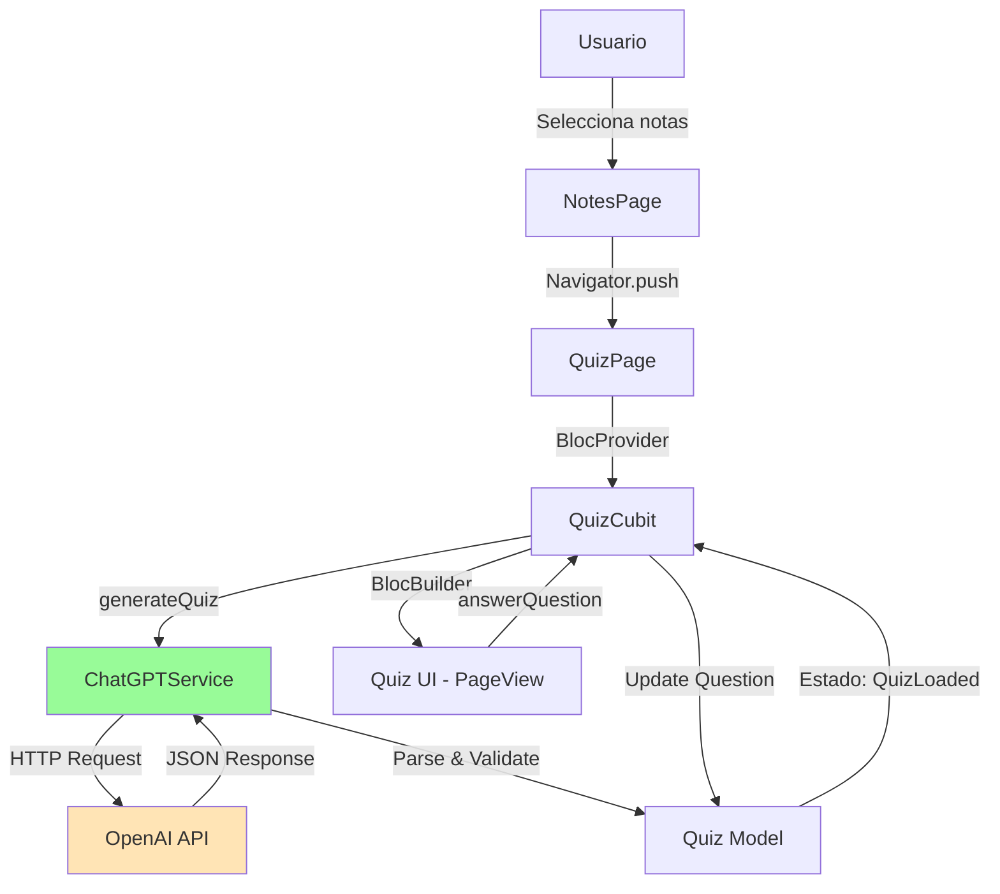
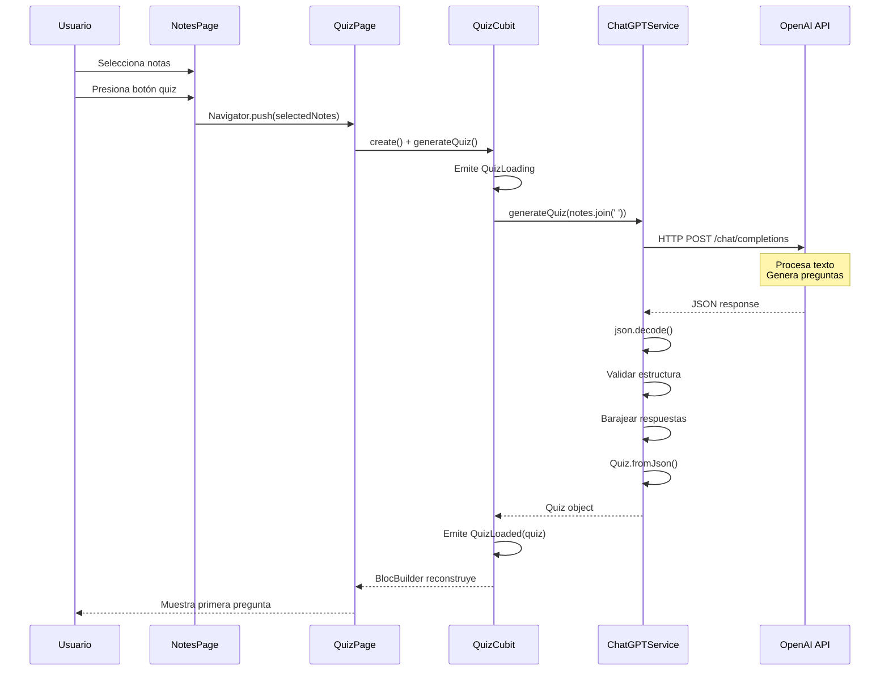
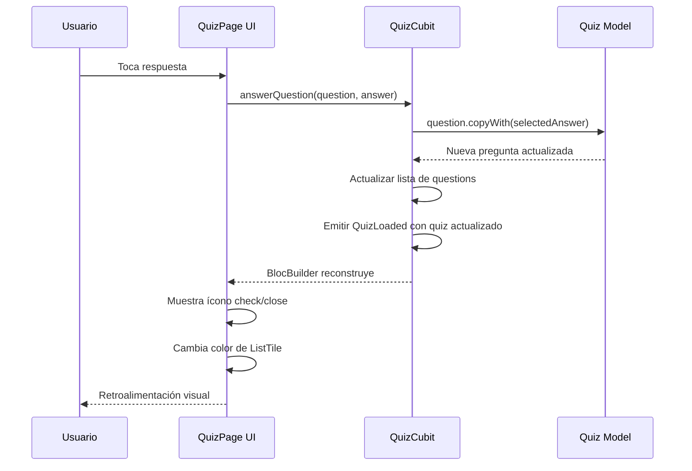

# Generación de Quiz con Inteligencia Artificial

> **Nivel**: Avanzado
> **Prerrequisitos**: Async Programming, JSON, API Integration, Notas y Datos de Usuario
> **Tiempo de lectura**: 22 minutos

## Introducción

Imagina que tienes un tutor personal que puede leer todos tus apuntes sobre neuroanatomía y crear instantáneamente un examen personalizado para evaluarte. Eso es exactamente lo que hace esta característica: toma tus notas sobre estructuras cerebrales y usa inteligencia artificial para generar preguntas de opción múltiple.

El proceso es sorprendentemente simple desde la perspectiva del usuario:
1. Seleccionas entre 1 y 5 notas que has escrito
2. Presionas un botón
3. Esperas unos segundos mientras la IA procesa tu contenido
4. Aparece un quiz interactivo con preguntas basadas en tus notas

Detrás de escena, la aplicación se comunica con la API de OpenAI (los creadores de ChatGPT), envía el contenido de tus notas, y recibe de vuelta un conjunto estructurado de preguntas con respuestas.

### ¿Cómo funciona la IA?

La aplicación usa GPT-3.5-turbo, un modelo de lenguaje que ha sido entrenado con enormes cantidades de texto. Piensa en él como un estudiante excepcionalmente talentoso que ha leído millones de libros y puede entender patrones en el lenguaje.

Cuando le envías tus notas, el modelo:
1. Lee y entiende el contenido
2. Identifica los conceptos clave
3. Formula preguntas que evalúan la comprensión de esos conceptos
4. Genera respuestas plausibles pero incorrectas (distractores)
5. Devuelve todo en un formato estructurado que la aplicación puede procesar

### Ingeniería de Prompts

Un "prompt" es la instrucción que le das al modelo de IA. Es como darle instrucciones a un asistente: la claridad y especificidad de tus instrucciones determina la calidad del resultado.

La aplicación usa un prompt cuidadosamente diseñado que le dice al modelo:
- Qué tipo de contenido espera (preguntas de quiz)
- Cuántas opciones debe tener cada pregunta (4)
- En qué formato debe responder (JSON)
- Qué tan cortas deben ser las respuestas

Este prompt actúa como un "molde" que da forma a la respuesta de la IA.

### Del Texto al Quiz

El modelo de IA no "sabe" lo que es un quiz en términos de código. Genera texto. La aplicación debe:
1. Enviar el prompt y las notas
2. Recibir una respuesta de texto en formato JSON
3. Validar que el JSON sea válido
4. Convertir el JSON en objetos Dart (Quiz y QuizQuestion)
5. Barajear las respuestas para que la correcta no siempre esté primera
6. Mostrar el quiz en la interfaz

Cada paso puede fallar, por lo que el código incluye manejo robusto de errores.

---

## Documentación Técnica Formal

### Fundamento Teórico

La generación automática de preguntas de evaluación mediante modelos de lenguaje de gran escala (Large Language Models, LLMs) representa una aplicación de procesamiento de lenguaje natural (NLP) en el dominio educativo. GPT-3.5-turbo, basado en la arquitectura Transformer (Vaswani et al., 2017), utiliza mecanismos de atención para comprender contexto y generar texto coherente y contextualmente relevante (Brown et al., 2020).

La ingeniería de prompts (prompt engineering) es el proceso de diseñar instrucciones efectivas para modelos de lenguaje. La especificidad del formato de salida (JSON), la limitación de longitud, y la estructura de las instrucciones afectan significativamente la calidad y utilidad de las respuestas generadas (Liu et al., 2023).

En contextos educativos, los LLMs han demostrado capacidad para generar preguntas de evaluación que cubren taxonomías cognitivas de Bloom, desde conocimiento factual hasta aplicación y análisis (Kasneci et al., 2023).

### Arquitectura de Generación de Quiz



### Implementación en la Aplicación NeuroAnatomía

#### ChatGPTService: Integración con OpenAI

El servicio encapsula toda la lógica de comunicación con la API de OpenAI:

```dart
// Ubicación: /lib/services/chat_gpt_service.dart:6-61
class ChatGPTService {
  static Future<Quiz> generateQuiz(String text) async {
    try {
      final quizResponse = await OpenAI.instance.chat.create(
        model: 'gpt-3.5-turbo',
        responseFormat: {"type": "json_object"},
        messages: [
          OpenAIChatCompletionChoiceMessageModel(
            content: [
              OpenAIChatCompletionChoiceMessageContentItemModel.text(
                'When I send text, create a small quiz. Each question has 4 short answers. '
                'Answer in JSON format: {"q":[{"q":"question","a":["correct","answer2","answer3","answer4"]}]}. '
                'Answer length <500 chars, avoid spaces/linebreaks.',
              )
            ],
            role: OpenAIChatMessageRole.system,
          ),
          OpenAIChatCompletionChoiceMessageModel(
            content: [
              OpenAIChatCompletionChoiceMessageContentItemModel.text(text)
            ],
            role: OpenAIChatMessageRole.user,
          )
        ],
        temperature: 0.3,
        maxTokens: 1000,
      );

      final quizStr = quizResponse.choices.first.message.content?.first.text;

      if (quizStr == null || quizStr.isEmpty) {
        throw Exception('Quiz not generated: empty response');
      }

      final quizJson = json.decode(quizStr);

      // Validar formato de respuesta
      if (quizJson['q'] == null) {
        throw Exception('Invalid quiz format: missing "q" field');
      }

      // Añadir respuesta correcta y barajear opciones
      for (var question in quizJson['q']) {
        if (question['a'] == null || (question['a'] as List).isEmpty) {
          throw Exception('Invalid question format: missing answers');
        }
        question['rightAnswer'] = question['a'][0];
        question['a'].shuffle();
      }

      return Quiz.fromJson(quizJson);
    } catch (e) {
      throw Exception('Error generating quiz: $e');
    }
  }
}
```

**Componentes clave:**

1. **Configuración del Modelo**:
   ```dart
   model: 'gpt-3.5-turbo'
   ```
   GPT-3.5-turbo ofrece un balance entre calidad, velocidad y costo.

2. **Formato de Respuesta JSON**:
   ```dart
   responseFormat: {"type": "json_object"}
   ```
   Fuerza al modelo a responder en JSON válido, reduciendo errores de parsing.

3. **Mensajes del Chat**:
   - **System Message**: Instrucciones generales sobre cómo comportarse
   - **User Message**: El contenido específico (las notas del usuario)

4. **Parámetros de Generación**:
   ```dart
   temperature: 0.3      // Baja creatividad, alta consistencia
   maxTokens: 1000       // Límite de longitud de respuesta
   ```

5. **Post-procesamiento**:
   ```dart
   question['rightAnswer'] = question['a'][0];  // Guardar respuesta correcta
   question['a'].shuffle();                      // Barajear opciones
   ```
   La IA pone la respuesta correcta primero; debemos barajearla para evitar patrones predecibles.

#### Diseño del Prompt

El prompt del sistema es crítico para la calidad del quiz:

```
'When I send text, create a small quiz. Each question has 4 short answers. '
'Answer in JSON format: {"q":[{"q":"question","a":["correct","answer2","answer3","answer4"]}]}. '
'Answer length <500 chars, avoid spaces/linebreaks.'
```

**Elementos del prompt:**
- **Tarea clara**: "create a small quiz"
- **Especificación de formato**: "4 short answers", "JSON format"
- **Ejemplo de estructura**: `{"q":[{"q":"question","a":[...]}]}`
- **Restricciones**: "length <500 chars, avoid spaces/linebreaks"

Este prompt fue refinado iterativamente para producir resultados consistentes y parseables.

#### Modelos de Datos: Quiz y QuizQuestion

**Quiz**: Contenedor para múltiples preguntas

```dart
// Ubicación: /lib/models/quiz.dart:7-30
@JsonSerializable()
class Quiz extends Equatable {
  @JsonKey(name: 'q')
  final List<QuizQuestion> questions;

  const Quiz({required this.questions});

  factory Quiz.fromJson(Map<String, dynamic> json) => _$QuizFromJson(json);
  Map<String, dynamic> toJson() => _$QuizToJson(this);

  @override
  List<Object?> get props => [questions];

  Quiz copyWith({List<QuizQuestion>? questions}) {
    return Quiz(questions: questions ?? this.questions);
  }
}
```

**QuizQuestion**: Pregunta individual con respuestas

```dart
// Ubicación: /lib/models/quiz_question.dart:6-49
@JsonSerializable()
class QuizQuestion extends Equatable {
  @JsonKey(name: 'q')
  final String question;

  @JsonKey(name: 'a')
  final List<String> answers;

  @JsonKey(name: 'id')
  final String? selectedAnswer;

  @JsonKey()
  final String rightAnswer;

  const QuizQuestion({
    required this.question,
    required this.answers,
    required this.selectedAnswer,
    required this.rightAnswer,
  });

  bool get isCorrect => selectedAnswer == rightAnswer;

  QuizQuestion copyWith({
    String? question,
    List<String>? answers,
    String? selectedAnswer,
  }) {
    return QuizQuestion(
      question: question ?? this.question,
      answers: answers ?? this.answers,
      selectedAnswer: selectedAnswer ?? this.selectedAnswer,
      rightAnswer: rightAnswer,
    );
  }
}
```

**Características importantes:**
- **Mapeo JSON con nombres cortos**: `@JsonKey(name: 'q')` coincide con el formato compacto de la API
- **selectedAnswer nullable**: Nulo hasta que el usuario responda
- **Getter isCorrect**: Lógica de validación encapsulada
- **copyWith**: Permite crear versiones modificadas inmutables

#### QuizPage: Interfaz de Usuario

La página del quiz implementa un carrusel de preguntas con retroalimentación visual:

```dart
// Ubicación: /lib/pages/quiz_page/quiz_page.dart:6-204
class QuizaPage extends StatelessWidget {
  final List<Note> notes;

  @override
  Widget build(BuildContext context) {
    return Scaffold(
      appBar: AppBar(title: const Text('Quiz')),
      body: BlocProvider<QuizCubit>(
        create: (context) =>
            QuizCubit()..generateQuiz(notes.map((e) => e.content).join(' ')),
        child: _QuizPageDisplay(),
      ),
    );
  }
}

class _QuizPageDisplay extends StatefulWidget {
  @override
  State<_QuizPageDisplay> createState() => _QuizPageDisplayState();
}

class _QuizPageDisplayState extends State<_QuizPageDisplay> {
  int _currentIndex = 0;
  final _pageController = PageController();

  @override
  Widget build(BuildContext context) {
    return BlocBuilder<QuizCubit, QuizState>(
      builder: (context, state) {
        if (state is QuizLoaded) {
          return Padding(
            padding: const EdgeInsets.all(16.0),
            child: Column(
              children: [
                Expanded(
                  child: PageView.builder(
                    controller: _pageController,
                    itemCount: state.quiz.questions.length,
                    itemBuilder: (context, index) {
                      final question = state.quiz.questions[index];
                      final questionAlreadyAnswered = question.selectedAnswer != null;

                      return Column(
                        children: [
                          const Spacer(),
                          Center(
                            child: Text(
                              question.question,
                              style: const TextStyle(fontSize: 24),
                              textAlign: TextAlign.center,
                            ),
                          ),
                          ListView.builder(
                            shrinkWrap: true,
                            itemCount: question.answers.length,
                            itemBuilder: (context, index) {
                              final tileAnswer = question.answers[index];
                              final isTileAnswerCorrect =
                                  tileAnswer == question.rightAnswer;
                              final isTileSelectedAnswer =
                                  tileAnswer == question.selectedAnswer;

                              return ListTile(
                                title: Text(
                                  tileAnswer.toUpperCase(),
                                  style: TextStyle(
                                    color: isTileSelectedAnswer ? Colors.white : null
                                  ),
                                ),
                                onTap: () {
                                  if (question.selectedAnswer != null) {
                                    return;  // Ya respondida, ignorar toque
                                  }
                                  context.read<QuizCubit>().answerQuestion(question, tileAnswer);
                                },
                                tileColor: isTileSelectedAnswer
                                    ? Theme.of(context).primaryColor
                                    : null,
                                trailing: questionAlreadyAnswered
                                    ? Icon(
                                        isTileAnswerCorrect ? Icons.check : Icons.close,
                                        color: isTileAnswerCorrect ? Colors.green : Colors.red,
                                      )
                                    : null,
                              );
                            },
                          ),
                          const Spacer(),
                        ],
                      );
                    },
                  ),
                ),
                // Botones de navegación
                Row(
                  children: [
                    Expanded(
                      child: TextButton(
                        onPressed: () {
                          _pageController.previousPage(
                            duration: const Duration(milliseconds: 300),
                            curve: Curves.easeInOut,
                          );
                        },
                        child: const Text('Atras'),
                      ),
                    ),
                    Expanded(
                      child: TextButton(
                        onPressed: () {
                          _pageController.nextPage(
                            duration: const Duration(milliseconds: 300),
                            curve: Curves.easeInOut,
                          );

                          if (_currentIndex == state.quiz.questions.length - 1) {
                            // Última pregunta: mostrar resultados
                            final correctAnswers = state.quiz.questions
                                .where((q) => q.isCorrect)
                                .length;

                            showDialog(
                              context: context,
                              builder: (context) {
                                return AlertDialog(
                                  title: const Text('Resultados'),
                                  content: Text(
                                    'Tuviste $correctAnswers respuestas correctas de ${state.quiz.questions.length}',
                                  ),
                                  actions: [
                                    TextButton(
                                      onPressed: () {
                                        Navigator.of(context).pop();
                                      },
                                      child: const Text('Cerrar'),
                                    ),
                                  ],
                                );
                              },
                            );
                          }
                        },
                        child: Text(
                          _currentIndex < state.quiz.questions.length - 1
                              ? 'Siguiente'
                              : 'Terminar'
                        ),
                      ),
                    ),
                  ],
                ),
              ],
            ),
          );
        } else if (state is QuizLoading) {
          return const Center(child: CircularProgressIndicator());
        } else if (state is QuizError) {
          return Center(child: Text(state.message));
        } else {
          return const Center(child: Text('Error desconocido'));
        }
      },
    );
  }
}
```

**Características de UX:**

1. **PageView**: Permite deslizar entre preguntas como páginas
2. **Retroalimentación Inmediata**: Al responder, se muestra ícono de correcto/incorrecto
3. **Bloqueo de Respuestas**: Una vez respondida, no se puede cambiar la respuesta
4. **Diálogo de Resultados**: Al finalizar, muestra puntuación total

### Diagrama de Secuencia: Generación de Quiz



### Diagrama de Secuencia: Responder Pregunta



### Especificaciones Técnicas

#### Parámetros de la API de OpenAI

```dart
model: 'gpt-3.5-turbo'
temperature: 0.3
maxTokens: 1000
responseFormat: {"type": "json_object"}
```

**Temperature** (0.0 - 2.0):
- **0.0**: Determinístico, siempre la misma respuesta
- **0.3**: Baja variabilidad, ideal para tareas estructuradas
- **1.0**: Creatividad balanceada
- **2.0**: Alta aleatoriedad

**maxTokens**:
- 1 token ≈ 0.75 palabras en inglés
- 1000 tokens ≈ 750 palabras
- Suficiente para ~5 preguntas con 4 opciones cada una

#### Manejo de Errores

La implementación incluye múltiples capas de validación:

```dart
// 1. Validación de respuesta vacía
if (quizStr == null || quizStr.isEmpty) {
  throw Exception('Quiz not generated: empty response');
}

// 2. Validación de estructura JSON
if (quizJson['q'] == null) {
  throw Exception('Invalid quiz format: missing "q" field');
}

// 3. Validación de respuestas
if (question['a'] == null || (question['a'] as List).isEmpty) {
  throw Exception('Invalid question format: missing answers');
}

// 4. Catch general
try {
  // ... toda la lógica
} catch (e) {
  throw Exception('Error generating quiz: $e');
}
```

#### Concatenación de Notas

```dart
notes.map((e) => e.content).join(' ')
```

Combina el contenido de todas las notas seleccionadas en un solo string, separado por espacios. Esto proporciona contexto completo al modelo.

#### Limitaciones y Consideraciones

1. **Límite de 5 Notas**: Previene sobrecargar el contexto del modelo y controla costos
2. **Calidad Variable**: La calidad del quiz depende de la calidad de las notas
3. **Idioma**: El prompt está en inglés, pero el modelo maneja español en las notas
4. **Costo**: Cada llamada a la API tiene un costo (aproximadamente $0.002 por 1000 tokens)

### Mejores Prácticas

1. **Método Estático**:
   ```dart
   static Future<Quiz> generateQuiz(String text)
   ```
   No requiere instanciar ChatGPTService, simplificando el uso.

2. **Validación Exhaustiva**:
   Verificar cada nivel de la estructura JSON antes de parsear previene errores de runtime.

3. **Barajeo de Respuestas**:
   ```dart
   question['a'].shuffle();
   ```
   Crítico para que la primera respuesta no siempre sea correcta.

4. **Configuración de API Key**:
   ```dart
   OpenAI.apiKey = dotenv.env['OPENAI_API_KEY']!;
   ```
   La clave debe configurarse en `main.dart` al iniciar la app, cargada desde variables de entorno.

5. **Manejo de Estados en UI**:
   ```dart
   if (state is QuizLoading) { ... }
   else if (state is QuizLoaded) { ... }
   else if (state is QuizError) { ... }
   ```
   Cubrir todos los estados posibles proporciona UX consistente.

### Desafíos Comunes

#### Problema: La API devuelve JSON inválido

**Causa**: A pesar de `responseFormat: json_object`, el modelo ocasionalmente incluye texto adicional.

**Solución**: Implementar parsing robusto con try-catch y extracción de JSON del texto:
```dart
final jsonMatch = RegExp(r'\{.*\}', dotAll: true).firstMatch(quizStr);
if (jsonMatch != null) {
  final cleanJson = jsonMatch.group(0);
  quizJson = json.decode(cleanJson!);
}
```

#### Problema: Quiz generado tiene preguntas irrelevantes

**Causa**: Notas muy cortas o ambiguas no proporcionan suficiente contexto.

**Solución**: Validar longitud mínima de notas o mejorar el prompt:
```dart
'Generate questions that test understanding of the main concepts in the text.'
```

#### Problema: Timeout de la API

**Causa**: La API de OpenAI puede ser lenta o no responder.

**Solución**: Implementar timeout en el request HTTP:
```dart
OpenAI.instance.chat.create(...).timeout(
  Duration(seconds: 30),
  onTimeout: () => throw TimeoutException('Quiz generation timed out'),
);
```

#### Problema: Costos elevados de API

**Causa**: Llamadas frecuentes a la API.

**Solución**:
- Cachear quizzes generados en Firestore
- Implementar límite diario de generaciones por usuario
- Usar modelos más económicos para casos simples

#### Problema: Preguntas duplicadas en quiz

**Causa**: El modelo genera variaciones de la misma pregunta.

**Solución**: Post-procesamiento para detectar similitud:
```dart
// Usar algoritmo de similitud de strings (Levenshtein distance)
// Filtrar preguntas con >80% similitud
```

### Consideraciones Éticas y Educativas

1. **Integridad Académica**: Los quizzes generados son herramientas de estudio, no deben reemplazar evaluaciones oficiales.

2. **Precisión del Contenido**: El modelo puede generar información incorrecta (hallucinations). Las respuestas deben ser revisadas.

3. **Dependencia de IA**: Balancear uso de IA con desarrollo de habilidades de autoevaluación.

4. **Privacidad**: El contenido de las notas se envía a OpenAI. Incluir aviso de privacidad.

## Referencias

### Documentación Interna
- [Notas y Datos de Usuario](/docs/features/03-notes-and-user-data.md)
- [Async Programming](/docs/technical/01-async-programming.md)
- [JSON Serialization](/docs/technical/02-json-serialization.md)
- [BLoC Pattern](/docs/bloc-pattern/01-bloc-pattern-fundamentals.md)

### Referencias Externas

1. **OpenAI API Documentation** (2024). "Chat Completions". https://platform.openai.com/docs/api-reference/chat
2. **Brown, T. B., et al.** (2020). "Language Models are Few-Shot Learners". *Advances in Neural Information Processing Systems*, 33, 1877-1901.
3. **Vaswani, A., et al.** (2017). "Attention is All You Need". *Advances in Neural Information Processing Systems*, 30.
4. **Kasneci, E., et al.** (2023). "ChatGPT for Good? On Opportunities and Challenges of Large Language Models for Education". *Learning and Individual Differences*, 103, 102274.
5. **Liu, P., et al.** (2023). "Pre-train, Prompt, and Predict: A Systematic Survey of Prompting Methods in Natural Language Processing". *ACM Computing Surveys*, 55(9), 1-35.
6. **dart_openai package** (2024). https://pub.dev/packages/dart_openai
7. **Bloom, B. S.** (1956). *Taxonomy of Educational Objectives*. Longmans, Green.

## Lecturas Adicionales

- **Siguiente**: [Visualización de Diagramas](/docs/features/05-diagrams-visualization.md)
- **Relacionado**: [State Management con BLoC](/docs/bloc-pattern/03-bloc-in-neuroanatomy-app.md)
- **Profundización**: Técnicas avanzadas de ingeniería de prompts
- **Avanzado**: Fine-tuning de modelos de lenguaje para dominios específicos
- **Investigación**: Evaluación automática de calidad de preguntas generadas por IA
