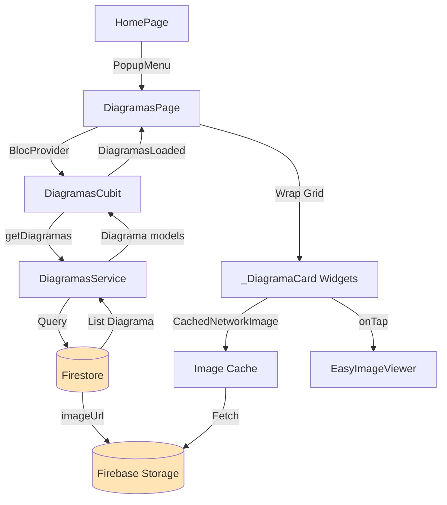
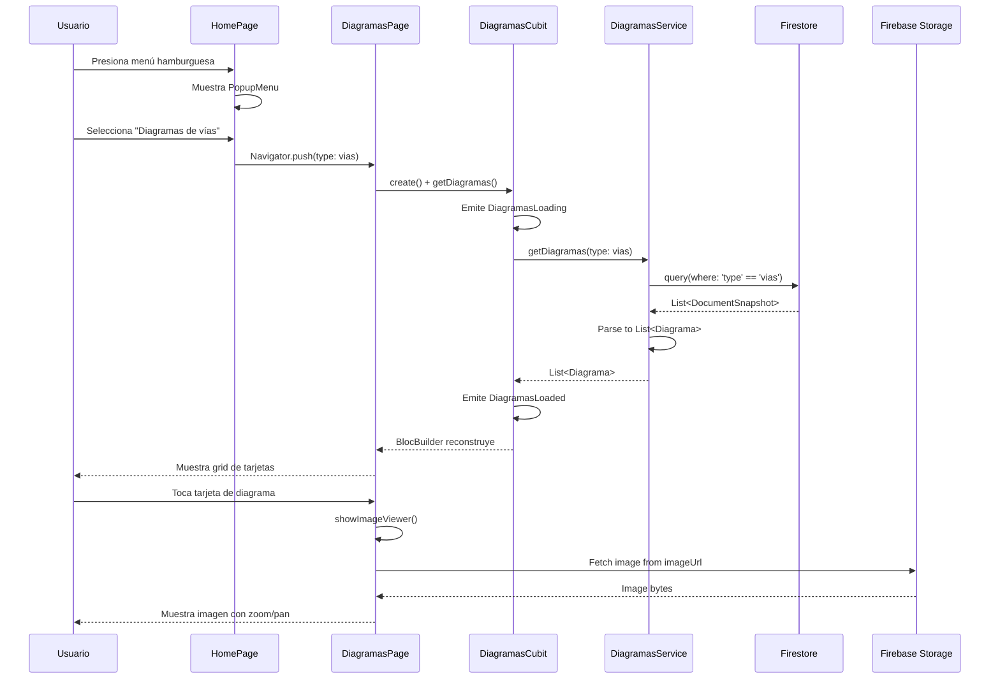

# Visualización de Diagramas

> **Nivel**: Principiante-Intermedio
> **Prerrequisitos**: Widgets y UI, Firebase Firestore, State Management
> **Tiempo de lectura**: 15 minutos

## Introducción

Imagina que estás estudiando cómo se conectan diferentes partes del cerebro. Los cortes cerebrales te muestran estructuras individuales, pero ¿cómo visualizas las vías neuronales que atraviesan múltiples regiones? Para eso existen los diagramas: imágenes especializadas que ilustran conexiones, rutas y sistemas funcionales del sistema nervioso.

La aplicación incluye dos categorías de diagramas:
1. **Vías Neurales**: Diagramas que muestran cómo viajan las señales nerviosas (por ejemplo, la vía visual desde el ojo hasta la corteza occipital)
2. **Estructuras Subcorticales**: Visualizaciones de zonas profundas del cerebro que no son fácilmente visibles en cortes superficiales

Estos diagramas complementan los cortes cerebrales proporcionando una perspectiva diferente: mientras los cortes muestran "dónde están las cosas", los diagramas muestran "cómo se conectan las cosas".

### Experiencia de Usuario

Desde el menú principal, puedes acceder a la galería de diagramas. La galería presenta los diagramas como tarjetas en una cuadrícula. Cada tarjeta muestra una miniatura del diagrama con su nombre. Al tocar una tarjeta, el diagrama se abre en un visor de imágenes que permite:

- **Zoom**: Pellizcar para acercar y ver detalles
- **Pan**: Arrastrar para mover la imagen ampliada
- **Doble Toque**: Hacer zoom rápido a regiones específicas

Es como tener un libro de anatomía digital donde puedes examinar cada ilustración de cerca sin perder calidad.

### Organización de Contenido

Los diagramas se almacenan en Firestore, no en la aplicación. Esto significa que:
- Los profesores pueden añadir nuevos diagramas sin actualizar la app
- Las imágenes de alta resolución no aumentan el tamaño de descarga de la app
- El contenido puede actualizarse instantáneamente para todos los usuarios

Cada diagrama tiene:
- Un nombre descriptivo
- Una URL de la imagen alojada en Firebase Storage
- Un tipo (vías o subcorticales) que determina en qué categoría aparece

---

## Documentación Técnica Formal

### Fundamento Teórico

La visualización de diagramas implementa un patrón de galería de imágenes con carga diferida (lazy loading) y cache de red. Este enfoque optimiza el uso de ancho de banda cargando solo las imágenes visibles y almacenando en caché las imágenes descargadas para acceso offline (Nielsen, 1994).

El uso de Firebase Storage para alojar imágenes separadas del código de la aplicación permite la actualización dinámica de contenido sin redistribución de la aplicación, un patrón común en aplicaciones de contenido educativo (Moroney, 2017).

### Arquitectura de Visualización de Diagramas



### Implementación en la Aplicación NeuroAnatomía

#### Modelo de Datos: Diagrama

El modelo `Diagrama` representa un diagrama individual:

```dart
// Ubicación: /lib/models/diagrama.dart:6-46
enum DiagramaType {
  @JsonValue('vias')
  vias(title: "Diagramas de vías", value: "vias"),

  @JsonValue('subcorticales')
  subcorticales(title: "Zonas subcorticales", value: "subcorticales");

  final String title;
  final String value;

  const DiagramaType({required this.title, required this.value});
}

@JsonSerializable()
class Diagrama extends Equatable {
  final String nombre;
  final String imageUrl;
  final DiagramaType type;

  const Diagrama({
    required this.nombre,
    required this.imageUrl,
    required this.type,
  });

  factory Diagrama.fromJson(Map<String, dynamic> json) =>
      _$DiagramaFromJson(json);

  Map<String, dynamic> toJson() => _$DiagramaToJson(this);

  @override
  List<Object?> get props => [nombre, imageUrl, type];
}
```

**Características del modelo:**

1. **Enum con Valores JSON**:
   ```dart
   @JsonValue('vias')
   ```
   Permite serialización consistente entre Dart y Firestore.

2. **Enum Mejorado (Enhanced Enums)**:
   ```dart
   vias(title: "Diagramas de vías", value: "vias")
   ```
   Cada valor del enum tiene propiedades asociadas (título para UI, valor para Firestore).

3. **Inmutabilidad**:
   Todos los campos son `final`, haciendo el modelo inmutable y thread-safe.

#### DiagramasService: Capa de Datos

El servicio encapsula el acceso a Firestore para diagramas:

```dart
// Ubicación: /lib/services/diagramas_service.dart:4-25
class DiagramasService {
  final FirebaseFirestore _firestore = FirebaseFirestore.instance;

  DiagramasService();

  Future<List<Diagrama>> getDiagramas(DiagramaType type) async {
    final QuerySnapshot<Map<String, dynamic>> querySnapshot = await _firestore
        .collection('diagramas')
        .where('type', isEqualTo: type.value)
        .get();

    final List<Diagrama> diagramas = [];
    for (final QueryDocumentSnapshot<Map<String, dynamic>> doc
        in querySnapshot.docs) {
      final diagramaJson = doc.data();
      diagramas.add(Diagrama.fromJson(diagramaJson));
    }

    return diagramas;
  }
}
```

**Operaciones de consulta:**

1. **Filtrado por Tipo**:
   ```dart
   .where('type', isEqualTo: type.value)
   ```
   Recupera solo los diagramas del tipo especificado (vías o subcorticales).

2. **Colección Simple**:
   A diferencia de las notas (que usan subcolecciones anidadas), los diagramas están en una colección plana de nivel superior.

3. **Parseo Manual**:
   ```dart
   for (final doc in querySnapshot.docs) {
     diagramas.add(Diagrama.fromJson(doc.data()));
   }
   ```
   Convierte cada documento Firestore en un objeto `Diagrama`.

#### DiagramasPage: Galería de Imágenes

La página implementa una cuadrícula de tarjetas con diagramas:

```dart
// Ubicación: /lib/pages/diagramas_page/diagramas_page.dart:9-137
class DiagramasPage extends StatelessWidget {
  final DiagramaType type;

  @override
  Widget build(BuildContext context) {
    return Scaffold(
      appBar: AppBar(title: Text(type.title)),
      body: BlocProvider<DiagramasCubit>(
        create: (context) =>
            DiagramasCubit(DiagramasService(), type: type)..getDiagramas(),
        child: _DiagramasPageDisplay(type: type),
      ),
    );
  }
}

class _DiagramasPageDisplay extends StatelessWidget {
  final DiagramaType type;

  @override
  Widget build(BuildContext context) {
    return BlocBuilder<DiagramasCubit, DiagramasState>(
      builder: (context, state) {
        if (state is DiagramasLoading) {
          return const Center(child: CircularProgressIndicator());
        } else if (state is DiagramasLoaded) {
          final diagramas = state.diagramas
              .where((diagrama) => diagrama.type == type)
              .toList();

          if (diagramas.isEmpty) {
            return const Center(child: Text('No hay diagramas'));
          }

          return SingleChildScrollView(
            physics: const BouncingScrollPhysics(),
            padding: const EdgeInsets.only(bottom: 16),
            child: SafeArea(
              child: SizedBox(
                width: double.infinity,
                child: Wrap(
                  alignment: WrapAlignment.spaceEvenly,
                  children: diagramas
                      .map((diagrama) => _DiagramaCard(diagrama: diagrama))
                      .toList(),
                ),
              ),
            ),
          );
        } else if (state is DiagramasError) {
          return Center(child: Text(state.message));
        } else {
          return const Center(child: Text('Error'));
        }
      },
    );
  }
}
```

**Layout con Wrap**:
```dart
Wrap(
  alignment: WrapAlignment.spaceEvenly,
  children: diagramas.map((d) => _DiagramaCard(diagrama: d)).toList(),
)
```

`Wrap` es como `Row`, pero automáticamente envuelve los elementos a la siguiente línea cuando no caben, creando una cuadrícula fluida que se adapta a diferentes tamaños de pantalla.

#### DiagramaCard: Tarjeta Individual

Cada diagrama se presenta como una tarjeta con imagen y título:

```dart
// Ubicación: /lib/pages/diagramas_page/diagramas_page.dart:81-136
class _DiagramaCard extends StatelessWidget {
  final Diagrama diagrama;

  @override
  Widget build(BuildContext context) {
    return GestureDetector(
      onTap: () {
        final imageProvider = CachedNetworkImageProvider(diagrama.imageUrl);
        showImageViewer(context, imageProvider, doubleTapZoomable: true);
      },
      child: SizedBox(
        width: MediaQuery.of(context).size.width * 0.45,
        child: Card(
          child: Column(
            children: [
              Container(
                height: 164,
                width: double.infinity,
                clipBehavior: Clip.antiAlias,
                decoration: BoxDecoration(
                  borderRadius: BorderRadius.circular(8),
                ),
                child: CachedNetworkImage(
                  imageUrl: diagrama.imageUrl,
                  fit: BoxFit.cover,
                  fadeInDuration: const Duration(milliseconds: 250),
                  progressIndicatorBuilder: (context, url, progress) {
                    return const Center(child: CircularProgressIndicator());
                  },
                ),
              ),
              Padding(
                padding: const EdgeInsets.all(8.0),
                child: SizedBox(
                  height: 40,
                  child: Center(
                    child: Text(
                      diagrama.nombre,
                      style: Theme.of(context).textTheme.titleSmall,
                      textAlign: TextAlign.center,
                    ),
                  ),
                ),
              ),
            ],
          ),
        ),
      ),
    );
  }
}
```

**Componentes clave:**

1. **CachedNetworkImage**:
   ```dart
   CachedNetworkImage(
     imageUrl: diagrama.imageUrl,
     fit: BoxFit.cover,
     fadeInDuration: const Duration(milliseconds: 250),
     progressIndicatorBuilder: (context, url, progress) {
       return const Center(child: CircularProgressIndicator());
     },
   )
   ```

   **Características:**
   - **Cache automático**: Primera carga desde red, subsecuentes desde disco
   - **Fade-in animado**: Transición suave al cargar
   - **Indicador de progreso**: Spinner mientras carga
   - **BoxFit.cover**: Rellena el contenedor manteniendo aspect ratio

2. **Tamaño Responsive**:
   ```dart
   width: MediaQuery.of(context).size.width * 0.45
   ```
   Cada tarjeta ocupa 45% del ancho de pantalla, permitiendo ~2 columnas con espacio entre ellas.

3. **EasyImageViewer**:
   ```dart
   showImageViewer(context, imageProvider, doubleTapZoomable: true)
   ```
   Abre un visor modal con zoom y pan integrados.

### Navegación a DiagramasPage

Desde HomePage, un `PopupMenuButton` permite acceder a las categorías:

```dart
// Ubicación: /lib/pages/home_page/home_page.dart:55-69
PopupMenuButton<DiagramaType>(
  itemBuilder: (context) {
    return DiagramaType.values.map((type) {
      return PopupMenuItem(
        value: type,
        child: Text(type.title),
      );
    }).toList();
  },
  onSelected: (value) {
    Navigator.of(context).push(MaterialPageRoute(builder: (context) {
      return DiagramasPage(type: value);
    }));
  },
)
```

**Generación dinámica de menú**: El menú se construye iterando sobre `DiagramaType.values`, asegurando que cualquier tipo nuevo añadido al enum aparezca automáticamente.

### Diagrama de Flujo de Datos



### Especificaciones Técnicas

#### Estructura de Datos en Firestore

Ejemplo de documento de diagrama:

```json
{
  "nombre": "Vía Piramidal",
  "imageUrl": "https://firebasestorage.googleapis.com/.../via_piramidal.jpg",
  "type": "vias"
}
```

Colección: `diagramas/` (nivel superior, sin subcolecciones)

#### Cache de Imágenes

`cached_network_image` implementa un sistema de cache de dos niveles:

1. **Memory Cache**: Imágenes recientemente vistas permanecen en RAM
2. **Disk Cache**: Imágenes descargadas se guardan en almacenamiento local

**Configuración por defecto:**
```dart
maxCacheAge: Duration(days: 30)
maxCacheObjects: 100
```

#### Optimización de Imágenes

Las imágenes en Firebase Storage deben estar optimizadas:

- **Formato**: JPEG para fotografías, PNG para diagramas con texto
- **Resolución**: 1920x1080 máximo (Full HD) para balance calidad/tamaño
- **Compresión**: 85% calidad JPEG recomendado
- **Tamaño de archivo**: <500KB para carga rápida en redes móviles

#### Layout con Wrap

`Wrap` calcula automáticamente el layout:

```dart
Wrap(
  alignment: WrapAlignment.spaceEvenly,  // Distribuir espacio uniformemente
  spacing: 8.0,                          // Espacio horizontal entre items
  runSpacing: 8.0,                       // Espacio vertical entre filas
  children: [...],
)
```

Con tarjetas de 45% ancho:
- Pantalla pequeña (~360px): 2 columnas
- Pantalla mediana (~768px): 2-3 columnas
- Pantalla grande (~1024px): 4+ columnas

### Mejores Prácticas

1. **Separación de Tipos en Constructor**:
   ```dart
   DiagramasCubit(DiagramasService(), type: type)
   ```
   Pasar el tipo en la creación del Cubit permite lógica específica de tipo.

2. **Filtrado en UI**:
   ```dart
   final diagramas = state.diagramas.where((d) => d.type == type).toList();
   ```
   Aunque la consulta ya filtra por tipo, un filtro adicional en UI añade seguridad.

3. **Nombres Descriptivos**:
   Los nombres de diagramas deben ser claros y específicos: "Vía Piramidal" mejor que "Diagrama 1".

4. **Placeholder durante Carga**:
   ```dart
   progressIndicatorBuilder: (context, url, progress) {
     return const Center(child: CircularProgressIndicator());
   }
   ```
   Proporciona feedback visual durante la descarga.

5. **Error Handling**:
   ```dart
   errorWidget: (context, url, error) => Icon(Icons.error)
   ```
   Mostrar ícono de error si la imagen no carga.

### Desafíos Comunes

#### Problema: Imágenes no cargan

**Causas posibles:**
1. URL incorrecta en Firestore
2. Permisos de Firebase Storage mal configurados
3. Sin conexión a internet

**Solución**:
- Verificar URLs en Firestore
- Configurar reglas de Storage:
  ```javascript
  rules_version = '2';
  service firebase.storage {
    match /b/{bucket}/o {
      match /diagramas/{fileName} {
        allow read: if request.auth != null;
      }
    }
  }
  ```
- Implementar `errorWidget` con mensaje descriptivo

#### Problema: Layout inconsistente en diferentes pantallas

**Causa**: Tamaños fijos de tarjeta no se adaptan bien.

**Solución**: Usar porcentajes de ancho de pantalla:
```dart
width: MediaQuery.of(context).size.width * 0.45
```

#### Problema: Consumo excesivo de datos móviles

**Causa**: Imágenes de alta resolución sin optimización.

**Solución**:
- Comprimir imágenes antes de subir a Storage
- Considerar implementar versiones thumbnail:
  ```dart
  final thumbnailUrl = diagrama.imageUrl.replaceAll('.jpg', '_thumb.jpg');
  ```

#### Problema: Visor de imagen no permite zoom

**Causa**: `doubleTapZoomable` no configurado.

**Solución**:
```dart
showImageViewer(context, imageProvider, doubleTapZoomable: true);
```

#### Problema: Cache crece excesivamente

**Causa**: Muchas imágenes descargadas sin límite de cache.

**Solución**: Configurar `cached_network_image`:
```dart
CachedNetworkImage(
  imageUrl: url,
  cacheManager: CacheManager(
    Config(
      'diagramas_cache',
      maxNrOfCacheObjects: 50,
      stalePeriod: Duration(days: 7),
    ),
  ),
)
```

### Extensiones Futuras

1. **Categorías Adicionales**: Añadir más tipos de diagramas (embriología, patología, etc.)
2. **Búsqueda**: Implementar barra de búsqueda para filtrar diagramas por nombre
3. **Favoritos**: Permitir marcar diagramas favoritos para acceso rápido
4. **Anotaciones**: Habilitar que usuarios dibujen o añadan notas sobre diagramas
5. **Compartir**: Opción para compartir diagramas con otros estudiantes

## Referencias

### Documentación Interna
- [Firebase Firestore](/docs/firebase/03-cloud-firestore.md)
- [Services y Repositories](/docs/firebase/04-services-and-repositories.md)
- [Layouts y Responsive Design](/docs/ui-ux/02-layouts-and-responsive-design.md)
- [Visualización Interactiva del Cerebro](/docs/features/01-interactive-brain-visualization.md)

### Referencias Externas

1. **cached_network_image package** (2024). https://pub.dev/packages/cached_network_image
2. **easy_image_viewer package** (2024). https://pub.dev/packages/easy_image_viewer
3. **Firebase Storage Documentation** (2024). "Upload files". https://firebase.google.com/docs/storage/web/upload-files
4. **Flutter Wrap Widget** (2024). https://api.flutter.dev/flutter/widgets/Wrap-class.html
5. **Nielsen, J.** (1994). *Usability Engineering*. Morgan Kaufmann. Chapter 5: "Response Times".
6. **Moroney, L.** (2017). *The Definitive Guide to Firebase*. Apress. Chapter 6: "Firebase Storage".
7. **Google Image Optimization** (2024). "Best practices for images". https://developers.google.com/web/fundamentals/performance/optimizing-content-efficiency/image-optimization

## Lecturas Adicionales

- **Siguiente**: [Material Design](/docs/ui-ux/01-material-design.md) - Aprende los principios de diseño detrás de la UI
- **Relacionado**: [Navigation y Routing](/docs/ui-ux/03-navigation-and-routing.md) - Profundiza en cómo funcionan las navegaciones en Flutter
- **Avanzado**: Implementación de thumbnails y lazy loading para galerías grandes
- **Optimización**: Estrategias de prefetching para mejorar UX
