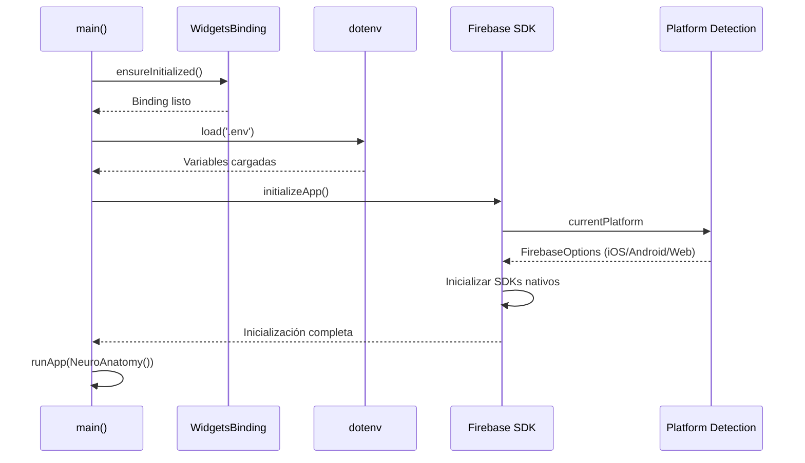

# Firebase: Fundamentos

> **Nivel**: Principiante
> **Prerrequisitos**: Conocimientos básicos de Flutter y Dart
> **Tiempo de lectura**: 15 minutos

## Introducción

Imagina que quieres construir una casa. Podrías fabricar tus propios ladrillos, instalar tu propia electricidad, y construir tu propio sistema de plomería desde cero. O podrías contratar especialistas que ya tienen estas cosas listas para usar. Firebase es exactamente eso para aplicaciones móviles: un conjunto de servicios ya construidos y listos para usar que te evitan tener que crear todo desde cero.

Cuando construyes una aplicación, necesitas varios componentes fundamentales: un lugar para guardar datos, una forma de que los usuarios inicien sesión, un lugar para almacenar fotos y archivos, y más. Firebase te proporciona todos estos servicios de forma integrada, probada y escalable. Es como tener un equipo completo de ingenieros de backend trabajando para ti, sin tener que contratarlos.

Firebase es lo que se conoce como una plataforma BaaS (Backend as a Service), que significa "Backend como Servicio". En lugar de que tú construyas y mantengas servidores, bases de datos, y sistemas de autenticación, Firebase lo hace por ti. Tú simplemente te conectas a sus servicios usando código muy simple, y ellos se encargan de toda la complejidad detrás de escena.

Para esta aplicación de neuroanatomía, Firebase nos proporciona tres servicios esenciales:

1. **Firebase Authentication**: Maneja el registro e inicio de sesión de usuarios
2. **Cloud Firestore**: Almacena toda la información de cortes cerebrales, diagramas y notas de usuarios
3. **Firebase Storage**: Guarda todas las imágenes de cortes cerebrales y diagramas

Piensa en Firebase como la infraestructura invisible que hace que la aplicación funcione. Cuando un estudiante toca una región del cerebro y ve información, cuando guarda una nota de estudio, o cuando genera un quiz con inteligencia artificial, Firebase está trabajando en segundo plano para hacer que todo eso sea posible de forma rápida, segura y confiable.

La belleza de Firebase es que escala automáticamente. Si mañana mil estudiantes usan la app simultáneamente, Firebase maneja la carga sin que tengas que hacer nada. Es como tener un restaurante donde la cocina automáticamente se hace más grande cuando llegan más clientes.

## Configuración de Firebase en la Aplicación

Cuando la aplicación arranca, lo primero que hace es inicializar Firebase. Este proceso es como establecer la conexión telefónica antes de poder hacer una llamada. Sin esta inicialización, ningún servicio de Firebase funcionaría.

En el archivo principal de la aplicación (`/lib/main.dart`), puedes ver exactamente cómo se configura Firebase:

```dart
// Líneas 15-21 de /lib/main.dart
WidgetsFlutterBinding.ensureInitialized();
await dotenv.load(fileName: '.env');
OpenAI.apiKey = Env.openAIAPIKey;
await Firebase.initializeApp(
  name: 'NeuroAnatomy',
  options: DefaultFirebaseOptions.currentPlatform,
);
```

Veamos qué hace cada línea:

1. **`WidgetsFlutterBinding.ensureInitialized()`**: Prepara Flutter para poder ejecutar código asíncrono antes de que la aplicación arranque. Es como asegurarte de que el motor del auto esté listo antes de intentar conducir.

2. **`await dotenv.load(fileName: '.env')`**: Carga las variables de entorno desde un archivo `.env`. Este archivo contiene información sensible como claves de API que no queremos compartir públicamente en el código. Es como tener un sobre cerrado con contraseñas en lugar de escribirlas en la pared.

3. **`await Firebase.initializeApp(...)`**: Esta es la línea mágica que conecta tu aplicación con Firebase. El parámetro `name: 'NeuroAnatomy'` le da un nombre a esta instancia de Firebase, y `DefaultFirebaseOptions.currentPlatform` le dice qué configuración usar dependiendo de si la app se está ejecutando en Android, iOS o web.

El `await` delante de estas llamadas es crucial. Significa "espera a que esto termine antes de continuar". No podemos usar Firebase hasta que esté completamente inicializado, así como no puedes hablar por teléfono hasta que se establezca la llamada.

## Variables de Entorno y Seguridad

Observa que la aplicación usa un archivo `.env` para almacenar información sensible. Este es un patrón de seguridad fundamental. Las claves de API son como las llaves de tu casa: no las dejas pegadas en la puerta para que todos las vean. El archivo `.env` permite que cada desarrollador tenga sus propias claves sin exponerlas en el código que se sube a repositorios públicos como GitHub.

Firebase también tiene otro archivo importante llamado `firebase_options.dart` (importado en la línea 12). Este archivo contiene la configuración específica de Firebase para diferentes plataformas. Es generado automáticamente por la herramienta FlutterFire CLI y contiene información como:

- El ID del proyecto de Firebase
- La clave de API para comunicarse con Firebase
- URLs de los servicios de Firebase que usarás
- Configuraciones específicas para Android, iOS y web

---

## Documentación Técnica Formal

### Fundamento Teórico

Firebase es una plataforma BaaS (Backend as a Service) desarrollada por Google que proporciona infraestructura de backend escalable para aplicaciones móviles y web. Firebase abstrae la complejidad del desarrollo de backend mediante servicios administrados que incluyen autenticación, bases de datos NoSQL, almacenamiento de archivos, funciones serverless, analítica y notificaciones push.

El modelo BaaS representa un cambio paradigmático en el desarrollo de aplicaciones, permitiendo que equipos pequeños o desarrolladores individuales construyan aplicaciones de nivel empresarial sin necesidad de expertise en administración de servidores, escalabilidad de bases de datos, o seguridad de infraestructura. Firebase maneja automáticamente la replicación de datos, balanceo de carga, y disponibilidad geográfica distribuida.

Firebase se integra con Flutter mediante el conjunto de paquetes FlutterFire, que proporcionan bindings nativos a los SDKs de Firebase para iOS y Android, así como implementaciones web. Esta integración permite que código Dart interactúe directamente con servicios de Firebase usando APIs idiomáticas de Dart, incluyendo soporte completo para programación asíncrona mediante Future y Stream.

### Implementación en la Aplicación NeuroAnatomía

#### Arquitectura de Conexión

La aplicación NeuroAnatomía utiliza tres servicios principales de Firebase:

1. **Firebase Authentication**: Gestión de identidad y sesiones de usuarios
2. **Cloud Firestore**: Base de datos NoSQL para almacenamiento de datos estructurados
3. **Firebase Storage**: Sistema de almacenamiento de objetos para archivos multimedia

#### Inicialización de Firebase

La inicialización de Firebase se realiza en el punto de entrada de la aplicación (`/lib/main.dart:14-23`):

```dart
void main() async {
  WidgetsFlutterBinding.ensureInitialized();
  await dotenv.load(fileName: '.env');
  OpenAI.apiKey = Env.openAIAPIKey;
  await Firebase.initializeApp(
    name: 'NeuroAnatomy',
    options: DefaultFirebaseOptions.currentPlatform,
  );
  runApp(const NeuroAnatomy());
}
```

**Análisis técnico del flujo de inicialización:**

1. **`WidgetsFlutterBinding.ensureInitialized()`**: Garantiza que el binding de widgets de Flutter esté inicializado antes de ejecutar código asíncrono en `main()`. Este paso es necesario porque `main()` normalmente es síncrono en aplicaciones Flutter, pero aquí necesitamos ejecutar operaciones asíncronas (`await`) antes de iniciar el widget tree.

2. **Carga de variables de entorno**: La biblioteca `flutter_dotenv` carga configuraciones desde `.env`, implementando el patrón de Twelve-Factor App para separar configuración del código fuente. Esto permite diferentes configuraciones para desarrollo, staging y producción sin modificar código.

3. **`Firebase.initializeApp()`**: Inicializa el SDK de Firebase con opciones específicas de plataforma. El parámetro `options: DefaultFirebaseOptions.currentPlatform` utiliza configuración generada automáticamente por FlutterFire CLI que incluye:
   - `apiKey`: Clave de API para autenticación con servicios de Firebase
   - `projectId`: Identificador único del proyecto en Firebase Console
   - `messagingSenderId`: ID para Firebase Cloud Messaging
   - `appId`: Identificador único de la aplicación
   - Configuraciones específicas de plataforma (iOS bundle ID, Android package name)

El parámetro `name: 'NeuroAnatomy'` permite tener múltiples instancias de Firebase en una sola aplicación, aunque en este caso solo se usa una instancia.

#### Configuración de Plataforma

El archivo `firebase_options.dart` (importado en línea 12) contiene la clase `DefaultFirebaseOptions` con configuraciones específicas para cada plataforma:

```dart
class DefaultFirebaseOptions {
  static FirebaseOptions get currentPlatform {
    if (kIsWeb) {
      return web;
    }
    switch (defaultTargetPlatform) {
      case TargetPlatform.android:
        return android;
      case TargetPlatform.iOS:
        return ios;
      // ...
    }
  }
}
```

Esta abstracción permite que el mismo código funcione en múltiples plataformas, seleccionando automáticamente la configuración correcta en tiempo de ejecución.

### Especificaciones Técnicas

#### Gestión de Configuración Sensible

La aplicación implementa el patrón de separación de configuración mediante dos mecanismos:

1. **Variables de entorno (`.env`)**: Para secretos que no deben versionarse
   ```
   OPENAI_API_KEY=sk-...
   ```

2. **Archivo de opciones de Firebase**: Para configuración de Firebase (puede versionarse ya que contiene claves públicas, no secretas)

**Importante**: Aunque `firebase_options.dart` contiene una `apiKey`, esta NO es una clave secreta. Es una clave pública que identifica el proyecto de Firebase. La seguridad se implementa mediante Firebase Security Rules, no mediante oscurecimiento de la API key.

#### Ciclo de Vida de Inicialización

El diagrama siguiente muestra el flujo de inicialización:



### Mejores Prácticas

#### Seguridad de Credenciales

1. **Archivo `.env` en `.gitignore`**: Asegurar que credenciales nunca se suban a control de versiones
2. **Variables de entorno en CI/CD**: En producción, las variables deben inyectarse mediante el sistema de CI/CD
3. **Rotación de claves**: Las API keys deben rotarse periódicamente

#### Manejo de Errores de Inicialización

La inicialización de Firebase puede fallar por múltiples razones:
- Configuración incorrecta en `firebase_options.dart`
- Problemas de red impidiendo conexión inicial
- Configuración de proyecto de Firebase eliminada o deshabilitada

Para producción, se recomienda envolver la inicialización en try-catch:

```dart
try {
  await Firebase.initializeApp(
    name: 'NeuroAnatomy',
    options: DefaultFirebaseOptions.currentPlatform,
  );
} on FirebaseException catch (e) {
  // Manejar error de inicialización
  print('Error inicializando Firebase: ${e.message}');
}
```

#### Optimización de Rendimiento

Firebase se inicializa de forma asíncrona, lo que puede añadir tiempo al arranque de la aplicación. Para optimizar:

1. **Inicialización perezosa de servicios secundarios**: Solo inicializar servicios que se necesitan inmediatamente
2. **Splash screen durante inicialización**: Mostrar pantalla de carga mientras Firebase se inicializa
3. **Precarga de datos críticos**: Mientras Firebase inicializa, preparar otros recursos de la aplicación

### Desafíos Comunes

#### Error: "Firebase already initialized"

Ocurre cuando se intenta llamar `Firebase.initializeApp()` múltiples veces. Solución:

```dart
if (Firebase.apps.isEmpty) {
  await Firebase.initializeApp(/* ... */);
}
```

#### Error: "MissingPluginException"

Indica que los plugins nativos de Firebase no están correctamente instalados. Soluciones:

1. Ejecutar `flutter pub get`
2. Para iOS: ejecutar `cd ios && pod install`
3. Limpiar build: `flutter clean && flutter pub get`

#### Problemas de configuración multiplataforma

Diferentes plataformas requieren pasos de configuración adicionales:

- **iOS**: Requiere `GoogleService-Info.plist` en el directorio iOS
- **Android**: Requiere `google-services.json` en `android/app/`
- **Web**: Requiere configuración en `web/index.html`

La herramienta FlutterFire CLI automatiza estos pasos:

```bash
flutterfire configure
```

## Referencias

### Documentación Interna
- [02-firebase-authentication.md](./02-firebase-authentication.md) - Autenticación de usuarios con Firebase
- [03-cloud-firestore.md](./03-cloud-firestore.md) - Base de datos Firestore
- [FIRESTORE_DATABASE_GUIDE.md](../../FIRESTORE_DATABASE_GUIDE.md) - Estructura detallada de la base de datos

### Referencias Externas

1. **Firebase Official Documentation** (2024). _Firebase for Flutter_. https://firebase.google.com/docs/flutter/setup
2. **Moroney, L.** (2017). _The Definitive Guide to Firebase: Build Android Apps on Google's Mobile Platform_. Apress.
3. **Tamboli, A.** (2019). _Google Cloud Platform for Architects_. Packt Publishing.
4. **Google Cloud** (2024). _Firebase Architecture Overview_. https://firebase.google.com/docs/projects/architecture
5. **Smet, B. D.** (2021). _Flutter for Beginners: An introductory guide to building cross-platform mobile applications with Flutter and Dart 2_ (2nd ed.). Packt Publishing.

## Lecturas Adicionales

**Siguientes pasos recomendados:**
- Leer [02-firebase-authentication.md](./02-firebase-authentication.md) para entender cómo se gestionan usuarios
- Explorar [03-cloud-firestore.md](./03-cloud-firestore.md) para comprender el almacenamiento de datos
- Revisar la [Guía de Arquitectura](../architecture/01-app-architecture-overview.md) para ver cómo Firebase encaja en la arquitectura general

**Temas avanzados:**
- Firebase Cloud Functions para lógica de backend serverless
- Firebase Performance Monitoring para optimización
- Firebase Remote Config para configuración dinámica
- Firebase Security Rules para control de acceso granular
