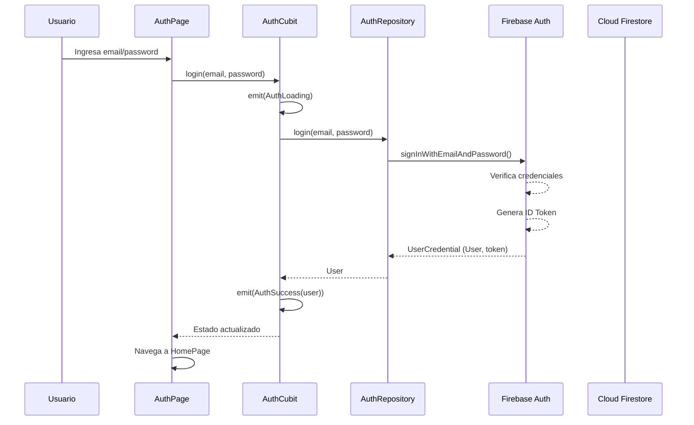
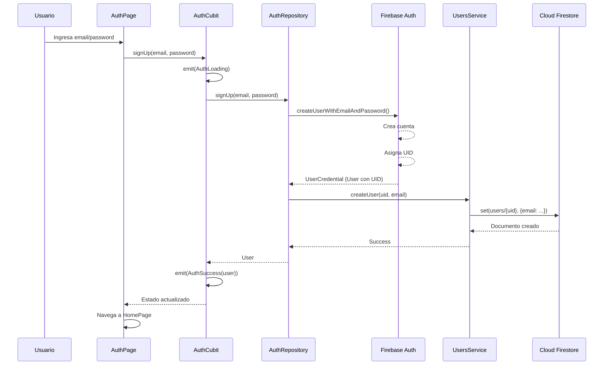

# Firebase Authentication

> **Nivel**: Principiante-Intermedio
> **Prerrequisitos**: Firebase Fundamentals, conceptos básicos de autenticación
> **Tiempo de lectura**: 20 minutos

## Introducción

Imagina que tienes un diario personal donde guardas tus pensamientos más privados. No querrías que cualquier persona pudiera abrirlo y leerlo, ¿verdad? Por eso los diarios tienen cerraduras y llaves. Firebase Authentication es exactamente eso para tu aplicación: el sistema de cerraduras y llaves que asegura que solo las personas correctas puedan acceder a su información personal.

En la aplicación de neuroanatomía, cada estudiante crea notas personales sobre estructuras cerebrales, genera quizzes personalizados, y rastrea su progreso de aprendizaje. Toda esta información es privada y única para cada usuario. Firebase Authentication nos permite identificar quién es cada usuario y asegurar que solo puedan ver y modificar su propia información.

El proceso de autenticación funciona en tres pasos básicos:

1. **Registro (Sign Up)**: Cuando un nuevo estudiante se une, proporciona un email y una contraseña. Firebase crea una cuenta para ellos y les asigna un identificador único (UID). Es como obtener tu primer documento de identidad.

2. **Inicio de sesión (Login)**: Cuando un estudiante regresa a la app, proporciona su email y contraseña. Firebase verifica que sean correctos y, si lo son, le da acceso a la aplicación. Es como mostrar tu identificación en la entrada de un edificio.

3. **Sesión activa**: Una vez que el usuario ha iniciado sesión, Firebase mantiene un registro de que está autenticado. La app puede verificar en cualquier momento "¿quién es el usuario actual?" y Firebase responde con su información. Es como llevar una credencial puesta que te identifica mientras estás dentro del edificio.

Cuando un usuario cierra sesión (logout), Firebase "olvida" quién era, y la próxima vez tendrá que iniciar sesión nuevamente.

Lo más importante de Firebase Authentication es que maneja toda la seguridad pesada por ti. No guardas contraseñas en texto plano, no te preocupas por algoritmos de encriptación complejos, ni manejas tokens de sesión manualmente. Firebase hace todo eso de forma segura y probada.

## Cómo Funciona en la Aplicación

La aplicación NeuroAnatomía usa un patrón arquitectónico donde toda la lógica de autenticación está encapsulada en una clase llamada `AuthRepository`. Piensa en un repositorio como un bibliotecario: tú le pides algo ("quiero iniciar sesión con este email y contraseña"), y el bibliotecario se encarga de todos los detalles complejos para obtenerlo.

El `AuthRepository` se encuentra en `/lib/repositories/auth_repository.dart` y proporciona cinco funciones principales:

### 1. Iniciar Sesión (Login)

Cuando un usuario intenta iniciar sesión, la aplicación llama al método `login()`:

```dart
// Líneas 7-17 de /lib/repositories/auth_repository.dart
Future<User?> login(String email, String password) async {
  try {
    final credentials = await _firebaseAuth.signInWithEmailAndPassword(
      email: email,
      password: password,
    );
    return credentials.user!;
  } catch (e) {
    throw Exception(e);
  }
}
```

Este método recibe el email y contraseña que el usuario escribió en la pantalla de login, se los pasa a Firebase Authentication mediante `signInWithEmailAndPassword()`, y espera la respuesta. Si el email y contraseña son correctos, Firebase devuelve un objeto `User` con información del usuario. Si son incorrectos, Firebase lanza un error que capturamos en el bloque `catch`.

El `await` es crucial aquí: significa que la aplicación se queda esperando mientras Firebase verifica las credenciales (lo cual puede tomar unos segundos si la conexión es lenta). Es como esperar en línea mientras el cajero verifica tu tarjeta de crédito.

### 2. Registrarse (Sign Up)

Cuando un nuevo usuario crea una cuenta, la aplicación llama a `signUp()`:

```dart
// Líneas 19-34 de /lib/repositories/auth_repository.dart
Future<User?> signUp(String email, String password) async {
  try {
    final credentials = await _firebaseAuth.createUserWithEmailAndPassword(
      email: email,
      password: password,
    );
    await UsersService().createUser(credentials.user!.uid, email: email);
    return credentials.user!;
  } on FirebaseAuthException catch (e) {
    if (e.code == 'weak-password') {
    } else if (e.code == 'email-already-in-use') {}
  } catch (e) {
    throw Exception(e);
  }
  return null;
}
```

Aquí hay algo interesante: después de crear la cuenta en Firebase Authentication (línea 21-24), la aplicación también llama a `UsersService().createUser()` (línea 25). ¿Por qué? Firebase Authentication solo guarda email y contraseña. Si queremos guardar información adicional del usuario (como sus notas de estudio), necesitamos crear un documento separado en Firestore. Es como cuando te registras en un gimnasio: primero te dan acceso (authentication), y luego crean un expediente con tu información (Firestore).

Observa también que hay un bloque especial `on FirebaseAuthException` que captura errores específicos de Firebase, como contraseña débil o email ya registrado. Esto permite dar mensajes de error más específicos al usuario.

### 3. Actualizar Nombre

Los usuarios pueden actualizar su nombre de usuario:

```dart
// Líneas 36-49 de /lib/repositories/auth_repository.dart
Future<User?> updateName(String name) async {
  try {
    final user = _firebaseAuth.currentUser;
    if (user != null) {
      await user.updateDisplayName(name);
      await UsersService().updateUser(user.uid, name: name);
      final updatedUser = _firebaseAuth.currentUser;
      return updatedUser;
    }
  } catch (e) {
    throw Exception(e);
  }
  return null;
}
```

Nota cómo primero obtenemos el usuario actual con `_firebaseAuth.currentUser` (línea 38). Este es un getter especial que siempre contiene el usuario que está actualmente autenticado, o `null` si nadie ha iniciado sesión. Es como preguntarle a Firebase "¿quién está usando la app ahora mismo?"

Después actualizamos el nombre tanto en Firebase Authentication (línea 40) como en Firestore (línea 41), para mantener los dos sistemas sincronizados.

### 4. Cerrar Sesión (Logout)

Cuando un usuario quiere salir de la aplicación:

```dart
// Líneas 65-71 de /lib/repositories/auth_repository.dart
Future<void> logout() async {
  try {
    await _firebaseAuth.signOut();
  } catch (e) {
    throw Exception(e);
  }
}
```

Este es el método más simple. Solo le dice a Firebase "olvida al usuario actual". Después de esto, `_firebaseAuth.currentUser` será `null`, y la aplicación automáticamente redirigirá al usuario a la pantalla de login.

### 5. Obtener Usuario Actual

En cualquier momento, cualquier parte de la aplicación puede preguntar quién está autenticado:

```dart
// Línea 73 de /lib/repositories/auth_repository.dart
User? get currentUser => _firebaseAuth.currentUser;
```

Este es un getter que simplemente devuelve el usuario actual. Es muy útil para código que necesita saber "¿quién está usando la app?" sin tener que pasar el usuario como parámetro por todas partes.

## Flujo de Autenticación en la Aplicación

Veamos cómo se conecta todo esto con la interfaz de usuario. En `/lib/main.dart`, hay lógica que decide qué pantalla mostrar basándose en el estado de autenticación:

```dart
// Líneas 43-66 de /lib/main.dart
BlocBuilder<AuthCubit, FirebaseAuthState>(
  builder: (context, state) {
    if (state is AuthSuccess) {
      return Navigator(
        onGenerateInitialRoutes: (navigator, initialRoute) {
          return [
            MaterialPageRoute(
              builder: (context) => const HomePage(),
            ),
          ];
        },
      );
    } else if (state is AuthFailure ||
        state is AuthInitial ||
        state is AuthLoading) {
      return const AuthPage();
    } else {
      return const Scaffold(
        body: Center(
          child: CircularProgressIndicator(),
        ),
      );
    }
  }
)
```

Este código usa el patrón BLoC (que se explica en detalle en la documentación de BLoC). Lo importante aquí es entender la lógica:

- **Si el estado es `AuthSuccess`**: El usuario está autenticado, así que mostramos la página principal (`HomePage`)
- **Si el estado es `AuthFailure`, `AuthInitial`, o `AuthLoading`**: El usuario no está autenticado o hay un error, así que mostramos la página de autenticación (`AuthPage`)
- **En cualquier otro caso**: Mostramos un indicador de carga mientras se determina el estado

Es como un guardia en la puerta: si tienes credencial válida, te deja pasar a la aplicación. Si no, te redirige a la recepción para que obtengas una.

---

## Documentación Técnica Formal

### Fundamento Teórico

Firebase Authentication es un servicio de gestión de identidad que implementa protocolos de autenticación estándar de la industria, incluyendo OAuth 2.0, OpenID Connect, y SAML. Proporciona SDKs que abstraen la complejidad de implementar flujos de autenticación seguros, gestión de sesiones, y almacenamiento seguro de credenciales.

El servicio soporta múltiples métodos de autenticación:

- **Email/Password**: Autenticación tradicional con credenciales
- **Proveedores OAuth**: Google, Facebook, Twitter, GitHub, Microsoft, Apple
- **Autenticación telefónica**: Verificación mediante SMS
- **Autenticación anónima**: Usuarios temporales sin credenciales
- **Custom authentication**: Integración con sistemas de autenticación existentes

Firebase Authentication se integra automáticamente con Firebase Security Rules, permitiendo control de acceso a nivel de documento en Firestore y Storage basado en el UID del usuario autenticado.

### Implementación en la Aplicación NeuroAnatomía

#### Arquitectura del AuthRepository

La aplicación implementa el patrón Repository para aislar la lógica de autenticación de la lógica de negocio y presentación. El `AuthRepository` encapsula todas las operaciones relacionadas con Firebase Authentication:

```dart
// /lib/repositories/auth_repository.dart:1-74
class AuthRepository {
  final _firebaseAuth = FirebaseAuth.instance;

  Future<User?> login(String email, String password) async { /* ... */ }
  Future<User?> signUp(String email, String password) async { /* ... */ }
  Future<User?> updateName(String name) async { /* ... */ }
  Future<User?> updatePassword(String password) async { /* ... */ }
  Future<void> logout() async { /* ... */ }
  User? get currentUser => _firebaseAuth.currentUser;
}
```

**Ventajas del patrón Repository:**

1. **Separación de responsabilidades**: La lógica de autenticación está aislada del resto de la aplicación
2. **Testabilidad**: Los tests pueden mockear el repository sin depender de Firebase
3. **Flexibilidad**: Cambiar de proveedor de autenticación solo requiere modificar el repository
4. **Reusabilidad**: Múltiples partes de la app usan la misma instancia del repository

#### Flujo de Autenticación Detallado

##### Login con Email y Contraseña

```dart
// /lib/repositories/auth_repository.dart:7-17
Future<User?> login(String email, String password) async {
  try {
    final credentials = await _firebaseAuth.signInWithEmailAndPassword(
      email: email,
      password: password,
    );
    return credentials.user!;
  } catch (e) {
    throw Exception(e);
  }
}
```

**Flujo técnico:**

1. **Validación del lado del cliente**: Antes de llamar a este método, la UI debería validar formato de email
2. **Llamada al SDK**: `signInWithEmailAndPassword()` envía una petición HTTPS a Firebase Authentication API
3. **Verificación en servidor**: Firebase verifica el hash de la contraseña contra su base de datos
4. **Generación de token**: Si las credenciales son válidas, Firebase genera un ID Token JWT (JSON Web Token)
5. **Almacenamiento local**: El SDK almacena el token de forma segura en el keychain (iOS) o EncryptedSharedPreferences (Android)
6. **Retorno de User**: El objeto `User` contiene UID, email, displayName, y otros metadatos

**Manejo de errores comunes:**

```dart
on FirebaseAuthException catch (e) {
  switch (e.code) {
    case 'user-not-found':
      // Email no registrado
    case 'wrong-password':
      // Contraseña incorrecta
    case 'invalid-email':
      // Formato de email inválido
    case 'user-disabled':
      // Cuenta deshabilitada
    case 'too-many-requests':
      // Demasiados intentos fallidos
  }
}
```

##### Registro de Usuario

```dart
// /lib/repositories/auth_repository.dart:19-34
Future<User?> signUp(String email, String password) async {
  try {
    final credentials = await _firebaseAuth.createUserWithEmailAndPassword(
      email: email,
      password: password,
    );
    await UsersService().createUser(credentials.user!.uid, email: email);
    return credentials.user!;
  } on FirebaseAuthException catch (e) {
    if (e.code == 'weak-password') {
    } else if (e.code == 'email-already-in-use') {}
  } catch (e) {
    throw Exception(e);
  }
  return null;
}
```

**Flujo de registro:**

1. **Creación en Authentication**: `createUserWithEmailAndPassword()` crea el usuario en Firebase Authentication
2. **Generación de UID**: Firebase asigna un UID único (28 caracteres alfanuméricos)
3. **Creación de documento en Firestore**: `UsersService().createUser()` crea un documento en `users/{uid}` para almacenar datos adicionales del usuario
4. **Sincronización**: Ambas operaciones deben completarse para que el registro sea exitoso

**Consideraciones de seguridad:**

- Firebase require mínimo 6 caracteres para contraseñas (configurable en console)
- Las contraseñas nunca se almacenan en texto plano; Firebase usa bcrypt con salt
- Los emails se normalizan (lowercased) automáticamente
- La creación de cuenta puede restringirse en Firebase Console (requerir verificación de email, por ejemplo)

##### Actualización de Perfil

```dart
// /lib/repositories/auth_repository.dart:36-49
Future<User?> updateName(String name) async {
  try {
    final user = _firebaseAuth.currentUser;
    if (user != null) {
      await user.updateDisplayName(name);
      await UsersService().updateUser(user.uid, name: name);
      final updatedUser = _firebaseAuth.currentUser;
      return updatedUser;
    }
  } catch (e) {
    throw Exception(e);
  }
  return null;
}
```

**Sincronización de datos:**

Este método ilustra un patrón importante: mantener sincronizados Firebase Authentication y Firestore. Los datos del perfil se almacenan en dos lugares:

1. **Firebase Authentication**: `displayName` (límite de ~256 caracteres)
2. **Firestore**: Documento completo con datos adicionales

Esta duplicación es intencional:
- Authentication permite acceso rápido a datos básicos sin consultas a Firestore
- Firestore permite almacenar datos complejos y consultables

##### Gestión de Sesión

```dart
// /lib/repositories/auth_repository.dart:73
User? get currentUser => _firebaseAuth.currentUser;
```

**Persistencia de sesión:**

Firebase Authentication mantiene automáticamente la sesión del usuario mediante tokens persistentes:

- **ID Token**: JWT de corta duración (1 hora) que identifica al usuario
- **Refresh Token**: Token de larga duración que permite renovar el ID Token
- **Renovación automática**: El SDK renueva automáticamente el ID Token antes de expirar

La sesión persiste incluso si:
- La app se cierra y se vuelve a abrir
- El dispositivo se reinicia
- Pasan días o semanas

La sesión se invalida solo si:
- El usuario llama a `signOut()`
- Las credenciales se revocan desde Firebase Console
- La contraseña se cambia en otro dispositivo
- El token se manipula o corrompe

#### Integración con BLoC Pattern

La aplicación usa `AuthCubit` (un tipo simplificado de BLoC) para gestionar el estado de autenticación:

```dart
// /lib/main.dart:40-42
BlocProvider<AuthCubit>(
  create: (context) =>
      AuthCubit(authRepository: context.read<AuthRepository>()),
```

El `AuthCubit` es responsable de:
1. Llamar métodos del `AuthRepository`
2. Emitir estados de autenticación (`AuthInitial`, `AuthLoading`, `AuthSuccess`, `AuthFailure`)
3. Manejar lógica de negocio relacionada con autenticación

#### Navegación Basada en Estado de Autenticación

```dart
// /lib/main.dart:43-66
BlocBuilder<AuthCubit, FirebaseAuthState>(
  builder: (context, state) {
    if (state is AuthSuccess) {
      return Navigator(/* HomePage */);
    } else if (state is AuthFailure || state is AuthInitial || state is AuthLoading) {
      return const AuthPage();
    } else {
      return const Scaffold(body: Center(child: CircularProgressIndicator()));
    }
  }
)
```

Este patrón implementa "authenticated routing": la navegación depende completamente del estado de autenticación. Beneficios:

1. **Seguridad**: Imposible acceder a páginas protegidas sin autenticación
2. **UX consistente**: Usuarios siempre ven la pantalla correcta para su estado
3. **Manejo de estados transitorios**: Muestra loading mientras se determina el estado

### Diagramas de Arquitectura

#### Flujo de Login



#### Flujo de Registro



### Especificaciones Técnicas

#### Objeto User

El objeto `User` retornado por Firebase Authentication contiene:

```dart
class User {
  String uid;              // ID único del usuario (28 chars)
  String? email;           // Email del usuario
  String? displayName;     // Nombre para mostrar
  String? photoURL;        // URL de foto de perfil
  bool emailVerified;      // Si el email ha sido verificado
  bool isAnonymous;        // Si es usuario anónimo
  UserMetadata metadata;   // Fechas de creación y último login
  List<UserInfo> providerData;  // Info de proveedores OAuth vinculados
}
```

En esta aplicación solo se usa autenticación por email/password, por lo que `providerData` siempre tendrá un solo elemento.

#### Tokens y Seguridad

**ID Token (JWT):**

```
Header:
{
  "alg": "RS256",
  "typ": "JWT"
}

Payload:
{
  "iss": "https://securetoken.google.com/{project-id}",
  "aud": "{project-id}",
  "auth_time": 1234567890,
  "user_id": "{uid}",
  "sub": "{uid}",
  "iat": 1234567890,
  "exp": 1234571490,  // Expira en 1 hora
  "email": "user@example.com",
  "email_verified": false
}

Signature: (firmado con clave privada de Firebase)
```

Este token se envía automáticamente en el header `Authorization: Bearer {token}` en todas las peticiones a Firebase services.

#### Reglas de Seguridad basadas en Authentication

Firebase Security Rules pueden usar el objeto `request.auth`:

```javascript
// Firestore Security Rules
match /users/{userId} {
  // Solo el usuario propietario puede leer/escribir sus datos
  allow read, write: if request.auth != null
                      && request.auth.uid == userId;
}
```

Esto garantiza que aunque un usuario esté autenticado, solo puede acceder a sus propios datos.

### Mejores Prácticas

#### Validación de Inputs

Antes de llamar a métodos de authentication, validar:

```dart
bool isValidEmail(String email) {
  return RegExp(r'^[\w-\.]+@([\w-]+\.)+[\w-]{2,4}$').hasMatch(email);
}

bool isValidPassword(String password) {
  return password.length >= 6;
}
```

#### Manejo Robusto de Errores

```dart
Future<User?> login(String email, String password) async {
  try {
    final credentials = await _firebaseAuth.signInWithEmailAndPassword(
      email: email,
      password: password,
    );
    return credentials.user;
  } on FirebaseAuthException catch (e) {
    // Errores específicos de Firebase
    throw AuthException(e.code, e.message);
  } on NetworkException {
    // Sin conexión a internet
    throw AuthException('network-error', 'No internet connection');
  } catch (e) {
    // Otros errores
    throw AuthException('unknown', e.toString());
  }
}
```

#### Persistencia de Sesión Configurable

Firebase permite configurar la persistencia:

```dart
await _firebaseAuth.setPersistence(Persistence.LOCAL);  // Persistir en disco
await _firebaseAuth.setPersistence(Persistence.SESSION); // Solo en memoria
await _firebaseAuth.setPersistence(Persistence.NONE);    // No persistir
```

Para aplicaciones móviles, `LOCAL` es apropiado (comportamiento por defecto).

### Desafíos Comunes

#### Concurrencia en Actualización de Perfil

Si se actualiza `displayName` en Firebase Auth pero falla la actualización en Firestore, los datos quedan inconsistentes. Solución:

```dart
Future<User?> updateName(String name) async {
  final user = _firebaseAuth.currentUser;
  if (user == null) return null;

  try {
    // Actualizar Firestore primero
    await UsersService().updateUser(user.uid, name: name);
    // Solo si tiene éxito, actualizar Authentication
    await user.updateDisplayName(name);
    await user.reload();  // Recargar para obtener datos actualizados
    return _firebaseAuth.currentUser;
  } catch (e) {
    // Rollback o logging
    throw Exception('Failed to update name: $e');
  }
}
```

#### Verificación de Email

Para requerir verificación de email antes de permitir acceso:

```dart
Future<void> sendEmailVerification() async {
  final user = _firebaseAuth.currentUser;
  if (user != null && !user.emailVerified) {
    await user.sendEmailVerification();
  }
}

bool isEmailVerified() {
  return _firebaseAuth.currentUser?.emailVerified ?? false;
}
```

#### Recuperación de Contraseña

Implementar "olvidé mi contraseña":

```dart
Future<void> sendPasswordResetEmail(String email) async {
  try {
    await _firebaseAuth.sendPasswordResetEmail(email: email);
  } on FirebaseAuthException catch (e) {
    if (e.code == 'user-not-found') {
      throw Exception('No user found with this email');
    }
    rethrow;
  }
}
```

## Referencias

### Documentación Interna
- [01-firebase-fundamentals.md](./01-firebase-fundamentals.md) - Introducción a Firebase
- [03-cloud-firestore.md](./03-cloud-firestore.md) - Almacenamiento de datos de usuario
- [../bloc-pattern/02-cubit-simplified-bloc.md](../bloc-pattern/02-cubit-simplified-bloc.md) - AuthCubit explicado
- [FIRESTORE_DATABASE_GUIDE.md](../../FIRESTORE_DATABASE_GUIDE.md) - Estructura de colección users

### Referencias Externas

1. **Firebase Authentication Documentation** (2024). https://firebase.google.com/docs/auth
2. **Moroney, L.** (2017). _The Definitive Guide to Firebase_, Chapter 3: "Firebase Authentication". Apress.
3. **IETF** (2015). _RFC 7519: JSON Web Token (JWT)_. https://tools.ietf.org/html/rfc7519
4. **OWASP** (2024). _Authentication Cheat Sheet_. https://cheatsheetseries.owasp.org/cheatsheets/Authentication_Cheat_Sheet.html
5. **Hardt, D.** (2012). _RFC 6749: The OAuth 2.0 Authorization Framework_. https://tools.ietf.org/html/rfc6749

## Lecturas Adicionales

**Siguientes pasos recomendados:**
- Explorar [Cloud Firestore](./03-cloud-firestore.md) para entender cómo se almacenan los datos de usuario
- Revisar [AuthCubit](../bloc-pattern/02-cubit-simplified-bloc.md) para ver cómo se gestiona el estado de autenticación
- Leer sobre [Security Rules](https://firebase.google.com/docs/firestore/security/get-started) para proteger datos

**Temas avanzados:**
- Multi-factor authentication (MFA) con Firebase
- Social authentication (Google, Facebook, Apple Sign-In)
- Custom authentication tokens para integrar con backends existentes
- Account linking: vincular múltiples métodos de autenticación a una cuenta
