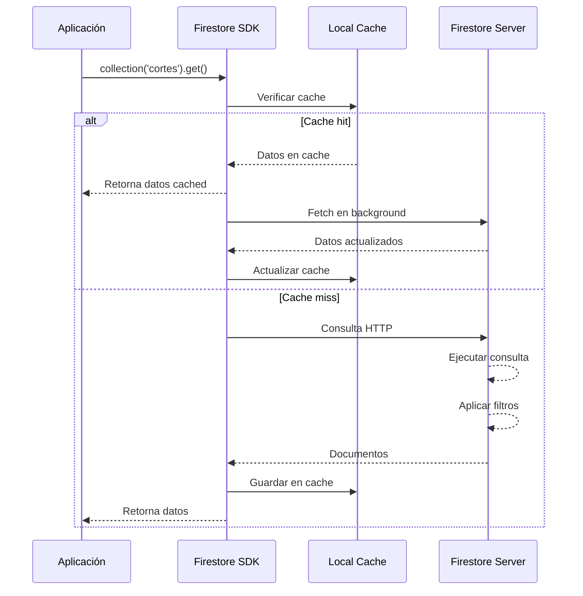
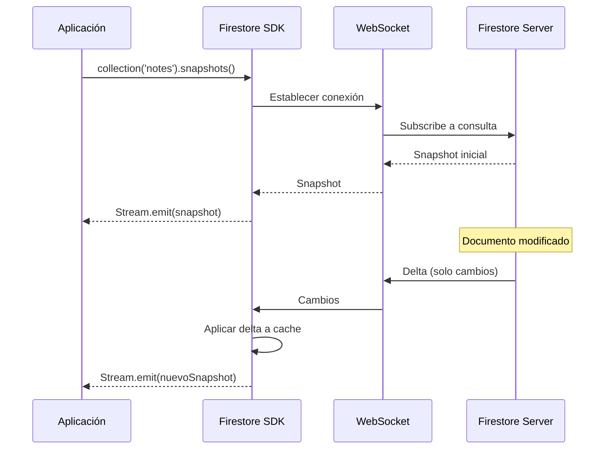

# Cloud Firestore

> **Nivel**: Intermedio
> **Prerrequisitos**: Firebase Fundamentals, conceptos básicos de bases de datos
> **Tiempo de lectura**: 25 minutos

## Introducción

Imagina que tienes una biblioteca gigante con millones de libros. Si organizas los libros al azar, encontrar un libro específico sería casi imposible. Por eso las bibliotecas usan sistemas de organización: secciones por tema, estantes numerados, fichas de catálogo. Cloud Firestore es la biblioteca digital de tu aplicación, pero aún más organizada y poderosa.

Firestore es una base de datos NoSQL (que significa "No solo SQL" o "Not Only SQL"). A diferencia de las bases de datos tradicionales que organizan información en tablas rígidas con filas y columnas (como Excel), Firestore organiza datos en una estructura más flexible de documentos y colecciones, similar a cómo organizarías carpetas y archivos en tu computadora.

Piensa en estas analogías:

- **Colección**: Es como una carpeta o un archivero. Contiene muchos documentos relacionados. Por ejemplo, una colección llamada "cortes" contiene todos los cortes cerebrales.

- **Documento**: Es como un archivo individual dentro de una carpeta. Contiene información sobre una cosa específica. Por ejemplo, un documento "hemisferio_derecho" dentro de la colección "cortes" contiene toda la información sobre ese corte cerebral específico.

- **Campos**: Son los datos individuales dentro de un documento. Como las líneas en una ficha: nombre, fecha, descripción. Por ejemplo, un campo "nombre" que dice "Hemisferio Derecho - Vista Lateral".

- **Subcolección**: Es como una carpeta dentro de otra carpeta. Un documento puede contener colecciones anidadas. Por ejemplo, el documento "hemisferio_derecho" tiene una subcolección "segmentos" que contiene todos los segmentos anatómicos de ese corte.

## Estructura de Datos en la Aplicación NeuroAnatomía

La aplicación usa tres colecciones principales en Firestore:

### 1. Colección "cortes"

Esta colección almacena todos los cortes cerebrales que los estudiantes pueden explorar. Cada documento representa una vista específica del cerebro (frontal, lateral, medial, etc.).

**Ejemplo de un documento:**
```
cortes/ABC123
├─ id: "hemisferio_derecho"
├─ nombre: "Hemisferio Derecho - Vista Lateral"
├─ realImage: "https://firebasestorage.googleapis.com/..."
├─ aquarelaImage: "https://firebasestorage.googleapis.com/..."
├─ derechaId: "frontal"
├─ izquierdaId: "posterior"
└─ Subcolecciones:
   ├─ segmentos/
   │  ├─ XYZ789
   │  │  ├─ id: "corteza_motora"
   │  │  ├─ nombre: "Corteza Motora Primaria"
   │  │  └─ path: ["M 662.47 444.693 L 625.117..."]
   │  └─ ...más segmentos
   └─ vistas/
      └─ ...vistas alternativas
```

Observa cómo cada documento tiene campos simples (texto, URLs) y también subcolecciones que contienen más documentos. Es una estructura jerárquica como un árbol genealógico.

### 2. Colección "diagramas"

Almacena diagramas educativos de vías neurológicas y estructuras anatómicas:

```
diagramas/DEF456
├─ nombre: "Tracto Corticoespinal"
├─ type: "via"
└─ imageUrl: "https://firebasestorage.googleapis.com/..."
```

Esta colección es más simple: cada documento solo tiene campos básicos, sin subcolecciones.

### 3. Colección "users"

Guarda los datos privados de cada estudiante:

```
users/{userId}
└─ structures/
   └─ corteza_motora/
      └─ notes/
         └─ noteId123
            ├─ title: "Funciones de la corteza motora"
            ├─ content: "Controla movimientos voluntarios..."
            ├─ createdAt: 2024-01-15T10:30:00Z
            └─ activities/
               └─ activityId456
                  ├─ type: "quiz"
                  ├─ score: 4
                  └─ totalQuestions: 5
```

Esta es la estructura más profundamente anidada: usuarios → estructuras → notas → actividades. Cada nivel representa una relación lógica. Las notas pertenecen a estructuras, y las actividades (como quizzes) pertenecen a notas específicas.

## Cómo Funciona Firestore en el Código

Veamos cómo el código interactúa con Firestore usando ejemplos reales de la aplicación.

### Leer Datos Simples: DiagramasService

El servicio más simple es `DiagramasService`, que obtiene diagramas de Firestore:

```dart
// /lib/services/diagramas_service.dart:9-24
Future<List<Diagrama>> getDiagramas(DiagramaType type) async {
  final QuerySnapshot<Map<String, dynamic>> querySnapshot = await _firestore
      .collection('diagramas')
      .where('type', isEqualTo: type.value)
      .get();

  final List<Diagrama> diagramas = [];
  for (final QueryDocumentSnapshot<Map<String, dynamic>> doc
      in querySnapshot.docs) {
    final diagramaJson = doc.data();
    diagramas.add(Diagrama.fromJson(diagramaJson));
  }

  return diagramas;
}
```

**Desglosemos este código:**

1. **`_firestore.collection('diagramas')`**: Accede a la colección "diagramas". Es como abrir una carpeta específica.

2. **`.where('type', isEqualTo: type.value)`**: Filtra los documentos. Solo trae diagramas donde el campo "type" sea igual a lo que buscamos ("via" o "estructura"). Es como buscar solo los libros rojos en una estantería de libros de colores mixtos.

3. **`.get()`**: Ejecuta la consulta y trae los documentos. Esta es una operación asíncrona (por eso el `await`), porque Firestore podría estar en la nube y toma tiempo obtener los datos.

4. **`querySnapshot.docs`**: Contiene todos los documentos que coincidieron con la consulta.

5. **`doc.data()`**: Extrae los datos del documento como un Map (diccionario) de Dart.

6. **`Diagrama.fromJson(diagramaJson)`**: Convierte el Map en un objeto Dart de tipo `Diagrama`. Esto hace que sea más fácil trabajar con los datos en el código.

### Leer Datos con Subcolecciones: CortesService

El servicio de cortes es más complejo porque necesita cargar documentos y sus subcolecciones:

```dart
// /lib/services/cortes_service.dart:10-52
Future<List<CorteCerebro>> getCortes() async {
  final QuerySnapshot<Map<String, dynamic>> querySnapshot =
      await _firestore.collection('cortes').get();

  final List<Map<String, dynamic>> cortesJson = [];
  for (final QueryDocumentSnapshot<Map<String, dynamic>> doc
      in querySnapshot.docs) {
    final corteJson = doc.data();

    // Obtener subcolección de segmentos
    final QuerySnapshot<Map<String, dynamic>> querySnapshot = await _firestore
        .collection('cortes')
        .doc(doc.id)
        .collection('segmentos')
        .get();

    final List<Map<String, dynamic>> segmentosJson = [];
    for (final QueryDocumentSnapshot<Map<String, dynamic>> doc
        in querySnapshot.docs) {
      segmentosJson.add(doc.data());
    }

    // Obtener subcolección de vistas
    final QuerySnapshot<Map<String, dynamic>> querySnapshotVistas =
        await _firestore
            .collection('cortes')
            .doc(doc.id)
            .collection('vistas')
            .get();

    final List<Map<String, dynamic>> vistasJson = [];
    for (final QueryDocumentSnapshot<Map<String, dynamic>> doc
        in querySnapshotVistas.docs) {
      vistasJson.add(doc.data());
    }

    corteJson['segmentos'] = segmentosJson;
    corteJson['vistas'] = vistasJson;
    cortesJson.add(corteJson);
  }

  return cortesJson
      .map((e) => CorteCerebro.fromJson(e))
      .sorted((a, b) => a.id.compareTo(b.id))
      .toList();
}
```

**Lo interesante aquí:**

1. Primero se cargan todos los documentos de la colección "cortes" (líneas 11-12)

2. Para cada corte, se hacen dos consultas adicionales para obtener sus subcolecciones:
   - Segmentos (líneas 18-23)
   - Vistas (líneas 30-35)

3. Los datos de las subcolecciones se agregan al JSON del corte principal (líneas 43-44)

4. Finalmente todo se convierte a objetos `CorteCerebro` (líneas 48-51)

Este patrón es común cuando trabajas con datos jerárquicos. Firestore no carga automáticamente las subcolecciones, así que debes consultarlas explícitamente.

### Operaciones CRUD: NotesService

El servicio de notas muestra las cuatro operaciones básicas: Create, Read, Update, Delete.

**Create (Crear):**
```dart
// /lib/services/notes_service.dart:10-19
Future<void> createNote(Note note) async {
  await _firestore
      .collection('users')
      .doc(userId)
      .collection('structures')
      .doc(note.structureId)
      .collection('notes')
      .doc(note.id)
      .set(note.toJson());
}
```

El método `.set()` crea un nuevo documento o sobrescribe uno existente. La ruta larga (`users/{userId}/structures/{structureId}/notes/{noteId}`) ubica exactamente dónde guardar la nota.

**Read (Leer):**
```dart
// /lib/services/notes_service.dart:45-55
Future<Note?> getNoteById(String structureId, String noteId) async {
  final DocumentSnapshot<Map<String, dynamic>> doc = await _firestore
      .collection('users')
      .doc(userId)
      .collection('structures')
      .doc(structureId)
      .collection('notes')
      .doc(noteId)
      .get();
  return doc.exists ? Note.fromJson(doc.data()!) : null;
}
```

Observa el chequeo `doc.exists`: Firestore puede intentar leer un documento que no existe, así que siempre debemos verificar antes de usar sus datos.

**Update (Actualizar):**
```dart
// /lib/services/notes_service.dart:33-43
Future<void> updateNoteById(String noteId, Note note) async {
  await _firestore
      .collection('users')
      .doc(userId)
      .collection('structures')
      .doc(note.structureId)
      .collection('notes')
      .doc(noteId)
      .update(note.toJson());
}
```

El método `.update()` modifica un documento existente. Si el documento no existe, lanza un error (a diferencia de `.set()` que lo crearía).

**Delete (Eliminar):**
```dart
// /lib/services/notes_service.dart:21-31
Future<void> deleteNoteById(String structureId, String noteId) async {
  await _firestore
      .collection('users')
      .doc(userId)
      .collection('structures')
      .doc(structureId)
      .collection('notes')
      .doc(noteId)
      .delete();
}
```

Simple y directo: `.delete()` elimina el documento permanentemente.

### Datos en Tiempo Real: Streams

Una característica poderosa de Firestore es la capacidad de escuchar cambios en tiempo real:

```dart
// /lib/services/notes_service.dart:72-87
Stream<List<Note>> getNotesStream(String structureId) {
  return _firestore
      .collection('users')
      .doc(userId)
      .collection('structures')
      .doc(structureId)
      .collection('notes')
      .snapshots()
      .map((QuerySnapshot<Map<String, dynamic>> querySnapshot) =>
          querySnapshot.docs
              .map((DocumentSnapshot<Map<String, dynamic>> doc) {
            final Map<String, dynamic> data = doc.data()!;
            data['id'] = doc.id;
            return Note.fromJson(data);
          }).toList());
}
```

En lugar de `.get()` que trae datos una sola vez, `.snapshots()` devuelve un Stream que emite datos cada vez que algo cambia en Firestore.

**¿Qué significa esto en práctica?**

Si un estudiante tiene dos dispositivos abiertos (teléfono y tablet) y crea una nota en el teléfono, la nota aparecerá automáticamente en la tablet sin necesidad de refrescar. Es como tener un documento de Google Docs donde varios usuarios pueden ver cambios en tiempo real.

---

## Documentación Técnica Formal

### Fundamento Teórico

Cloud Firestore es una base de datos NoSQL orientada a documentos, diseñada para escalabilidad horizontal y sincronización en tiempo real. A diferencia de las bases de datos relacionales (SQL) que organizan datos en tablas con esquemas rígidos, Firestore utiliza una estructura jerárquica de colecciones y documentos con esquemas flexibles.

**Características fundamentales:**

1. **Modelo de datos flexible**: Los documentos pueden contener subcollecciones, permitiendo estructuras profundamente anidadas sin necesidad de joins complejos
2. **Consultas potentes**: Soporta filtrado, ordenamiento y paginación eficiente con índices automáticos
3. **Sincronización en tiempo real**: Utiliza WebSockets para propagar cambios a clientes conectados con latencia mínima
4. **Modo offline**: SDK mantiene cache local y sincroniza automáticamente cuando se restaura la conectividad
5. **Transacciones ACID**: Garantiza atomicidad, consistencia, aislamiento y durabilidad
6. **Escalabilidad automática**: Distribuye datos geográficamente y escala horizontalmente sin intervención manual

Firestore implementa el modelo de consistencia eventual con lectura de sus propias escrituras (read-your-writes consistency), garantizando que un cliente siempre ve sus propias modificaciones inmediatamente.

### Implementación en la Aplicación NeuroAnatomía

#### Modelo de Datos

La aplicación implementa tres colecciones de nivel superior:

```
/cortes/                    # Contenido educativo público
  {corteId}/
    id: string
    nombre: string
    realImage: string
    aquarelaImage?: string
    derechaId?: string
    izquierdaId?: string
    arribaId?: string
    abajoId?: string

    /segmentos/             # Subcolección: regiones anatómicas
      {segmentoId}/
        id: string
        nombre: string
        path: string[]

    /vistas/                # Subcolección: vistas alternativas
      {vistaId}/
        ...

/diagramas/                 # Diagramas educativos
  {diagramaId}/
    nombre: string
    type: "via" | "estructura"
    imageUrl: string

/users/                     # Datos privados de usuarios
  {userId}/
    email: string
    displayName?: string

    /structures/
      {structureId}/
        /notes/
          {noteId}/
            id: string
            title: string
            content: string
            structureId: string
            createdAt: Timestamp
            updatedAt: Timestamp

            /activities/
              {activityId}/
                type: string
                score: number
                totalQuestions: number
                completedAt: Timestamp
```

Este diseño refleja los principios de modelado de datos NoSQL:

1. **Desnormalización**: Los datos se duplican cuando es necesario para evitar joins
2. **Jerarquía lógica**: Las subcolecciones representan relaciones de pertenencia (has-a)
3. **Colecciones de nivel superior separadas**: Para diferentes niveles de acceso (público vs privado)

#### Consultas y Operaciones

##### Consultas Simples

```dart
// /lib/services/diagramas_service.dart:9-24
Future<List<Diagrama>> getDiagramas(DiagramaType type) async {
  final QuerySnapshot<Map<String, dynamic>> querySnapshot = await _firestore
      .collection('diagramas')
      .where('type', isEqualTo: type.value)
      .get();

  final List<Diagrama> diagramas = [];
  for (final QueryDocumentSnapshot<Map<String, dynamic>> doc
      in querySnapshot.docs) {
    final diagramaJson = doc.data();
    diagramas.add(Diagrama.fromJson(diagramaJson));
  }

  return diagramas;
}
```

**Análisis técnico:**

- **`.collection('diagramas')`**: Retorna `CollectionReference<Map<String, dynamic>>`
- **`.where('type', isEqualTo: ...)`**: Aplica filtro. Requiere índice simple (creado automáticamente)
- **`.get()`**: Retorna `Future<QuerySnapshot>` que se resuelve cuando los datos llegan
- **`querySnapshot.docs`**: Lista de `QueryDocumentSnapshot`, cada uno representando un documento

**Limitaciones de consultas en Firestore:**

- No soporta OR compuesto (se requiere in-array query o consultas separadas)
- Límite de 10 condiciones where con in o array-contains-any
- Consultas de rango solo en un campo a la vez
- Ordenamiento debe coincidir con filtros de rango

##### Consultas con Subcolecciones

```dart
// /lib/services/cortes_service.dart:10-52
Future<List<CorteCerebro>> getCortes() async {
  final QuerySnapshot<Map<String, dynamic>> querySnapshot =
      await _firestore.collection('cortes').get();

  final List<Map<String, dynamic>> cortesJson = [];
  for (final QueryDocumentSnapshot<Map<String, dynamic>> doc
      in querySnapshot.docs) {
    final corteJson = doc.data();

    final QuerySnapshot<Map<String, dynamic>> querySnapshot = await _firestore
        .collection('cortes')
        .doc(doc.id)
        .collection('segmentos')
        .get();

    final List<Map<String, dynamic>> segmentosJson = [];
    for (final QueryDocumentSnapshot<Map<String, dynamic>> doc
        in querySnapshot.docs) {
      segmentosJson.add(doc.data());
    }

    final QuerySnapshot<Map<String, dynamic>> querySnapshotVistas =
        await _firestore
            .collection('cortes')
            .doc(doc.id)
            .collection('vistas')
            .get();

    final List<Map<String, dynamic>> vistasJson = [];
    for (final QueryDocumentSnapshot<Map<String, dynamic>> doc
        in querySnapshotVistas.docs) {
      vistasJson.add(doc.data());
    }

    corteJson['segmentos'] = segmentosJson;
    corteJson['vistas'] = vistasJson;
    cortesJson.add(corteJson);
  }

  return cortesJson
      .map((e) => CorteCerebro.fromJson(e))
      .sorted((a, b) => a.id.compareTo(b.id))
      .toList();
}
```

**Consideraciones de rendimiento:**

Este código realiza 1 + (2 × N) consultas, donde N es el número de cortes. Si hay 10 cortes:
- 1 consulta para obtener cortes
- 20 consultas para obtener segmentos y vistas (2 por cada corte)
- Total: 21 consultas

**Optimizaciones posibles:**

1. **Collection Group Queries**: Consultar todas las subcolecciones de un tipo a la vez
   ```dart
   _firestore.collectionGroup('segmentos').get();
   ```

2. **Caching**: Implementar cache local para evitar consultas repetidas

3. **Paginación**: Cargar cortes en lotes en lugar de todos a la vez

##### Operaciones CRUD

**Create:**
```dart
// /lib/services/notes_service.dart:10-19
Future<void> createNote(Note note) async {
  await _firestore
      .collection('users')
      .doc(userId)
      .collection('structures')
      .doc(note.structureId)
      .collection('notes')
      .doc(note.id)
      .set(note.toJson());
}
```

Métodos de escritura:
- **`.set(data)`**: Sobrescribe documento completo (crea si no existe)
- **`.set(data, SetOptions(merge: true))`**: Combina con datos existentes
- **`.update(data)`**: Actualiza campos específicos (falla si documento no existe)

**Read:**
```dart
// /lib/services/notes_service.dart:57-70
Future<List<Note>> getNotes(String structureId) async {
  final QuerySnapshot<Map<String, dynamic>> querySnapshot = await _firestore
      .collection('users')
      .doc(userId)
      .collection('structures')
      .doc(structureId)
      .collection('notes')
      .get();
  return querySnapshot.docs.map((DocumentSnapshot<Map<String, dynamic>> doc) {
    final Map<String, dynamic> data = doc.data()!;
    data['id'] = doc.id;
    return Note.fromJson(data);
  }).toList();
}
```

**Importante**: `doc.data()` puede ser `null` si el documento no existe, por eso se usa `doc.data()!` solo después de verificar `doc.exists`.

**Update:**
```dart
// /lib/services/notes_service.dart:33-43
Future<void> updateNoteById(String noteId, Note note) async {
  await _firestore
      .collection('users')
      .doc(userId)
      .collection('structures')
      .doc(note.structureId)
      .collection('notes')
      .doc(noteId)
      .update(note.toJson());
}
```

`.update()` es atómico: si múltiples clientes actualizan simultáneamente, Firestore garantiza que no se pierdan cambios mediante last-write-wins con timestamps del servidor.

**Delete:**
```dart
// /lib/services/notes_service.dart:21-31
Future<void> deleteNoteById(String structureId, String noteId) async {
  await _firestore
      .collection('users')
      .doc(userId)
      .collection('structures')
      .doc(structureId)
      .collection('notes')
      .doc(noteId)
      .delete();
}
```

**Importante**: `.delete()` solo elimina el documento, NO las subcolecciones. Para eliminar recursivamente se requiere una Cloud Function o eliminar manualmente cada subcolección.

##### Streams y Sincronización en Tiempo Real

```dart
// /lib/services/notes_service.dart:72-87
Stream<List<Note>> getNotesStream(String structureId) {
  return _firestore
      .collection('users')
      .doc(userId)
      .collection('structures')
      .doc(structureId)
      .collection('notes')
      .snapshots()
      .map((QuerySnapshot<Map<String, dynamic>> querySnapshot) =>
          querySnapshot.docs
              .map((DocumentSnapshot<Map<String, dynamic>> doc) {
            final Map<String, dynamic> data = doc.data()!;
            data['id'] = doc.id;
            return Note.fromJson(data);
          }).toList());
}
```

**Funcionamiento interno:**

1. **`.snapshots()`** establece una conexión WebSocket persistente con Firestore
2. Firestore envía snapshot inicial con datos actuales
3. Cada vez que un documento en la consulta cambia, Firestore envía solo los cambios (delta)
4. El SDK reconstruye el snapshot completo localmente
5. El Stream emite el nuevo snapshot a todos los listeners

**Tipos de cambios:**

```dart
querySnapshot.docChanges.forEach((change) {
  if (change.type == DocumentChangeType.added) {
    print('Nuevo documento');
  }
  if (change.type == DocumentChangeType.modified) {
    print('Documento modificado');
  }
  if (change.type == DocumentChangeType.removed) {
    print('Documento eliminado');
  }
});
```

**Desconexión automática:** Los streams se cierran automáticamente cuando el widget que los escucha se destruye, evitando memory leaks.

### Diagramas de Arquitectura

#### Flujo de Consulta



#### Flujo de Stream en Tiempo Real



### Especificaciones Técnicas

#### Límites y Cuotas

**Límites de documentos:**
- Tamaño máximo: 1 MiB (1,048,576 bytes)
- Máximo 20,000 campos (incluyendo campos en maps anidados)
- Profundidad máxima de anidación: 100 niveles
- Nombre de campo: máximo 1,500 bytes

**Límites de consultas:**
- Máximo 100 documentos en batch get
- Máximo 500 documentos en batch write
- Límite de paginación recomendado: 50-100 documentos por página

**Índices:**
- Firestore crea automáticamente índices simples para cada campo
- Consultas compuestas requieren índices compuestos (creados automáticamente o manualmente)
- Máximo 200 índices compuestos por base de datos

#### Tipos de Datos Soportados

```dart
// Tipos primitivos
String: 'texto'
number: 42, 3.14
boolean: true, false
null: null

// Tipos complejos
Timestamp: Timestamp.now()
GeoPoint: GeoPoint(37.7749, -122.4194)
Blob: Blob(bytes)
DocumentReference: _firestore.doc('path/to/doc')

// Colecciones
Array: [1, 2, 3]
Map: {'key': 'value'}
```

**Conversión de Dart a Firestore:**

```dart
// Timestamp
DateTime en Dart → Timestamp en Firestore
createdAt: Timestamp.fromDate(DateTime.now())

// Arrays
List<dynamic> en Dart → Array en Firestore
tags: ['anatomía', 'neurología']

// Maps
Map<String, dynamic> en Dart → Map en Firestore
metadata: {'author': 'Juan', 'version': 1}
```

#### Serialización JSON

Los modelos implementan `fromJson()` y `toJson()` para conversión:

```dart
// /lib/models/note.dart
@JsonSerializable()
class Note extends Equatable {
  final String? id;
  final String title;
  final String content;
  final String structureId;
  final DateTime? createdAt;
  final DateTime? updatedAt;

  factory Note.fromJson(Map<String, dynamic> json) => _$NoteFromJson(json);
  Map<String, dynamic> toJson() => _$NoteToJson(this);
}
```

La anotación `@JsonSerializable()` usa code generation para generar las funciones de conversión automáticamente.

### Mejores Prácticas

#### 1. Diseño de Datos

**Cuándo usar subcolecciones vs campos:**

- **Campos**: Datos que siempre se consultan juntos
  ```dart
  {
    'nombre': 'Corteza Motora',
    'descripcion': 'Controla movimientos...'
  }
  ```

- **Subcolecciones**: Datos que pueden consultarse independientemente o crecer ilimitadamente
  ```dart
  cortes/{corteId}/segmentos/{segmentoId}
  ```

**Desnormalización estratégica:**

Duplicar datos para optimizar lecturas es aceptable en NoSQL:

```dart
// En lugar de guardar solo structureId
{
  'structureId': 'corteza_motora',
  'structureName': 'Corteza Motora Primaria'  // Duplicado para evitar join
}
```

#### 2. Optimización de Consultas

**Usar límites:**
```dart
_firestore.collection('notes').limit(20).get();
```

**Paginación con cursores:**
```dart
Query query = _firestore.collection('notes').orderBy('createdAt').limit(20);

// Primera página
QuerySnapshot firstPage = await query.get();

// Segunda página
DocumentSnapshot lastDoc = firstPage.docs.last;
QuerySnapshot secondPage = await query.startAfterDocument(lastDoc).get();
```

**Caché persistence:**
```dart
_firestore.settings = Settings(persistenceEnabled: true);
```

#### 3. Manejo de Errores

```dart
try {
  await _firestore.collection('notes').doc(id).get();
} on FirebaseException catch (e) {
  switch (e.code) {
    case 'permission-denied':
      // Usuario no tiene permisos
      break;
    case 'unavailable':
      // Servicio temporalmente no disponible
      break;
    case 'deadline-exceeded':
      // Timeout
      break;
    default:
      // Otro error
  }
}
```

#### 4. Seguridad con Rules

```javascript
// Firestore Security Rules
rules_version = '2';
service cloud.firestore {
  match /databases/{database}/documents {
    // Colecciones públicas de solo lectura
    match /cortes/{document=**} {
      allow read: if true;
      allow write: if request.auth != null && request.auth.token.admin == true;
    }

    // Datos privados de usuarios
    match /users/{userId}/{document=**} {
      allow read, write: if request.auth != null && request.auth.uid == userId;
    }
  }
}
```

### Desafíos Comunes

#### 1. Subcollections no se eliminan automáticamente

**Problema**: Al eliminar un documento, sus subcolecciones persisten.

**Solución**: Eliminar recursivamente o usar Cloud Functions:

```javascript
// Cloud Function
exports.deleteNoteAndActivities = functions.firestore
  .document('users/{userId}/structures/{structureId}/notes/{noteId}')
  .onDelete(async (snap, context) => {
    const batch = firestore().batch();
    const activities = await snap.ref.collection('activities').get();
    activities.docs.forEach(doc => batch.delete(doc.ref));
    await batch.commit();
  });
```

#### 2. Límites de consulta

**Problema**: No se puede hacer OR en diferentes campos.

**Solución**: Usar `in` con array de valores o hacer múltiples consultas:

```dart
// Múltiples tipos
_firestore.collection('diagramas').where('type', whereIn: ['via', 'estructura']).get();

// O consultas separadas
final vias = await _firestore.collection('diagramas').where('type', isEqualTo: 'via').get();
final estructuras = await _firestore.collection('diagramas').where('type', isEqualTo: 'estructura').get();
```

#### 3. Inconsistencias entre Auth y Firestore

**Problema**: Usuario existe en Authentication pero no en Firestore.

**Solución**: Usar Cloud Functions para crear automáticamente:

```javascript
exports.createUserDocument = functions.auth.user().onCreate((user) => {
  return firestore().collection('users').doc(user.uid).set({
    email: user.email,
    createdAt: FieldValue.serverTimestamp()
  });
});
```

## Referencias

### Documentación Interna
- [01-firebase-fundamentals.md](./01-firebase-fundamentals.md) - Introducción a Firebase
- [04-services-and-repositories.md](./04-services-and-repositories.md) - Capa de servicios
- [FIRESTORE_DATABASE_GUIDE.md](../../FIRESTORE_DATABASE_GUIDE.md) - Guía completa de estructura
- [../technical/02-json-serialization.md](../technical/02-json-serialization.md) - Serialización de modelos

### Referencias Externas

1. **Cloud Firestore Documentation** (2024). https://firebase.google.com/docs/firestore
2. **Tamboli, A.** (2019). _Cloud Firestore in Practice_. O'Reilly Media.
3. **NoSQL Distilled** - Pramod J. Sadalage & Martin Fowler (2012). Addison-Wesley.
4. **Google Cloud** (2024). _Best Practices for Cloud Firestore_. https://firebase.google.com/docs/firestore/best-practices
5. **Moroney, L.** (2017). _The Definitive Guide to Firebase_, Chapter 5: "Cloud Firestore". Apress.

## Lecturas Adicionales

**Siguientes pasos recomendados:**
- Explorar [Services and Repositories](./04-services-and-repositories.md) para ver patrones de uso
- Revisar [Data Flow](../architecture/03-data-flow.md) para entender flujo completo de datos
- Leer [FIRESTORE_DATABASE_GUIDE.md](../../FIRESTORE_DATABASE_GUIDE.md) para detalles de estructura

**Temas avanzados:**
- Firestore Transactions para operaciones atómicas
- Batch writes para operaciones múltiples eficientes
- Offline persistence y conflict resolution
- Collection Group Queries para consultas cross-collection
- Firestore Security Rules avanzadas con funciones custom
