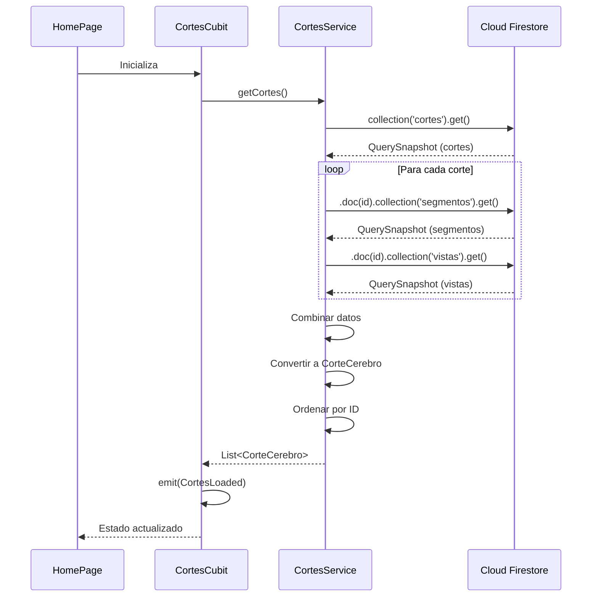
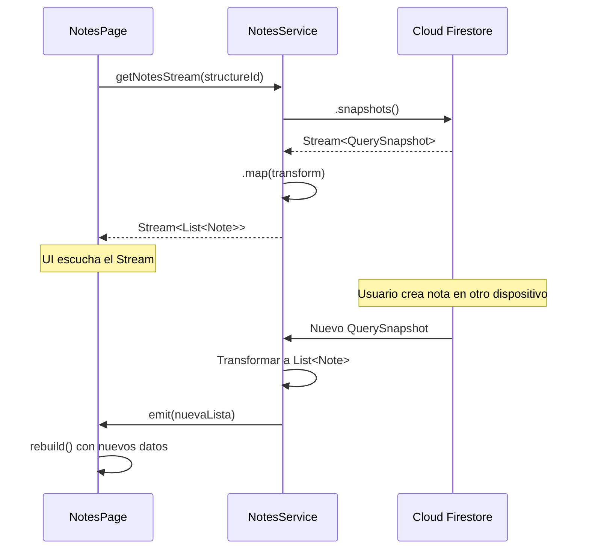

# Services y Repositories

> **Nivel**: Intermedio-Avanzado
> **Prerrequisitos**: Firebase Fundamentals, Cloud Firestore, conceptos de arquitectura de software
> **Tiempo de lectura**: 30 minutos

## Introducción

Imagina que estás construyendo una casa. Podrías mezclar el cemento, cortar la madera, instalar la electricidad y pintar las paredes todo tú mismo, haciendo todo en un solo lugar. Pero sería caótico, difícil de mantener, y si cometes un error, tendrías que deshacer todo. En su lugar, los constructores profesionales organizan el trabajo en especialistas: electricistas, plomeros, carpinteros, cada uno enfocado en su área de expertise.

En el desarrollo de software, especialmente con bases de datos, seguimos el mismo principio. En lugar de que cada pantalla de la aplicación hable directamente con Firebase, creamos capas especializadas que organizan y simplifican el acceso a los datos. Estas capas se llaman **Services** (Servicios) y **Repositories** (Repositorios).

Piensa en estas capas como el personal de un hotel:

- **Repository (Repositorio)**: Es como el conserje del hotel. Conoce todos los detalles de cómo funcionan las cosas internamente (dónde están las llaves, cómo acceder a las habitaciones, etc.), pero presenta una interfaz simple y amigable a los huéspedes. En código, el repository sabe cómo hablar con Firebase Authentication, pero el resto de la aplicación solo le dice "inicia sesión con este email y contraseña" sin preocuparse por los detalles técnicos.

- **Service (Servicio)**: Es como el gerente de operaciones del hotel. Coordina múltiples tareas complejas, combina información de diferentes fuentes, y aplica lógica de negocio. Por ejemplo, el `CortesService` no solo obtiene cortes cerebrales de Firebase, sino que también carga sus segmentos y vistas, los organiza, y los presenta listos para usar.

La separación en capas tiene beneficios enormes:

1. **Facilidad de mantenimiento**: Si cambias de Firebase a otra base de datos, solo modificas los services, no toda la aplicación.

2. **Testabilidad**: Puedes probar la lógica de negocio sin depender de una conexión real a Firebase.

3. **Claridad**: Cada clase tiene una responsabilidad clara. No hay código espagueti donde todo hace de todo.

4. **Reusabilidad**: Múltiples pantallas pueden usar el mismo service sin duplicar código.

## Repositories: La Capa de Acceso a Datos

Los repositories encapsulan toda la lógica de acceso a un sistema externo específico. En esta aplicación, tenemos `AuthRepository` que maneja toda la comunicación con Firebase Authentication.

### AuthRepository: Gestión de Identidad

El `AuthRepository` es relativamente simple porque Firebase Authentication ya hace la mayor parte del trabajo pesado. Su rol es proporcionar una interfaz limpia que el resto de la aplicación puede usar:

```dart
// /lib/repositories/auth_repository.dart:4-74
class AuthRepository {
  final _firebaseAuth = FirebaseAuth.instance;

  Future<User?> login(String email, String password) async { /* ... */ }
  Future<User?> signUp(String email, String password) async { /* ... */ }
  Future<User?> updateName(String name) async { /* ... */ }
  Future<User?> updatePassword(String password) async { /* ... */ }
  Future<void> logout() async { /* ... */ }
  User? get currentUser => _firebaseAuth.currentUser;
}
```

Observa cómo cada método tiene un nombre claro que describe exactamente qué hace: `login`, `signUp`, `logout`. Cualquier desarrollador que use esta clase sabe inmediatamente qué funcionalidad está disponible.

**¿Por qué no llamar directamente a FirebaseAuth desde la UI?**

Podrías argumentar: "Es solo una línea de código, ¿por qué envolverla en un repository?" Pero considera estos escenarios:

1. **Validación centralizada**: Si más adelante decides que todos los emails deben convertirse a minúsculas antes de autenticar, solo modificas un lugar (el repository) en lugar de buscar cada llamada a `signInWithEmailAndPassword` en toda la aplicación.

2. **Logging y analítica**: Podrías agregar código en el repository para rastrear cuántos usuarios inician sesión, cuántos fallan, etc.

3. **Manejo consistente de errores**: Todos los errores de autenticación pasan por el mismo código, garantizando mensajes de error consistentes.

4. **Testing**: En tests, puedes crear un `MockAuthRepository` que simula comportamiento sin conectarse a Firebase real.

## Services: La Capa de Lógica de Negocio

Los services son más complejos que los repositories porque aplican lógica de negocio específica de la aplicación. Veamos cada service en detalle.

### CortesService: Datos Complejos con Subcolecciones

Este service muestra el patrón más complejo: cargar datos jerárquicos con múltiples subcolecciones.

```dart
// /lib/services/cortes_service.dart:5-53
class CortesService {
  final FirebaseFirestore _firestore = FirebaseFirestore.instance;

  Future<List<CorteCerebro>> getCortes() async {
    final QuerySnapshot<Map<String, dynamic>> querySnapshot =
        await _firestore.collection('cortes').get();

    final List<Map<String, dynamic>> cortesJson = [];
    for (final QueryDocumentSnapshot<Map<String, dynamic>> doc
        in querySnapshot.docs) {
      final corteJson = doc.data();

      // Obtener segmentos
      final QuerySnapshot<Map<String, dynamic>> querySnapshot = await _firestore
          .collection('cortes')
          .doc(doc.id)
          .collection('segmentos')
          .get();

      final List<Map<String, dynamic>> segmentosJson = [];
      for (final QueryDocumentSnapshot<Map<String, dynamic>> doc
          in querySnapshot.docs) {
        segmentosJson.add(doc.data());
      }

      // Obtener vistas
      final QuerySnapshot<Map<String, dynamic>> querySnapshotVistas =
          await _firestore
              .collection('cortes')
              .doc(doc.id)
              .collection('vistas')
              .get();

      final List<Map<String, dynamic>> vistasJson = [];
      for (final QueryDocumentSnapshot<Map<String, dynamic>> doc
          in querySnapshotVistas.docs) {
        vistasJson.add(doc.data());
      }

      corteJson['segmentos'] = segmentosJson;
      corteJson['vistas'] = vistasJson;
      cortesJson.add(corteJson);
    }

    return cortesJson
        .map((e) => CorteCerebro.fromJson(e))
        .sorted((a, b) => a.id.compareTo(b.id))
        .toList();
  }
}
```

**¿Qué hace este código realmente?**

Imagina que Firestore es una biblioteca con libros (documentos) organizados en estantes (colecciones). Algunos libros tienen apéndices (subcolecciones). Este service:

1. **Va al estante de "cortes"** y obtiene todos los libros (documentos de cortes)
2. **Para cada libro** de cortes:
   - Abre el libro y lee su contenido principal (datos del corte)
   - Busca el apéndice "segmentos" y lee todas sus páginas (subcolección de segmentos)
   - Busca el apéndice "vistas" y lee todas sus páginas (subcolección de vistas)
   - Junta todo en una estructura completa
3. **Convierte** los datos JSON en objetos `CorteCerebro` que son fáciles de usar en Dart
4. **Ordena** los cortes por ID alfabéticamente

La línea más interesante es la final: `.sorted((a, b) => a.id.compareTo(b.id))`. Esto asegura que los cortes siempre se muestren en el mismo orden consistente, independientemente del orden en que Firestore los devuelva.

**¿Por qué este código está en un Service y no en la UI?**

Si cada pantalla que muestra cortes tuviera que cargar segmentos y vistas manualmente, duplicarías este código complejo en múltiples lugares. Si la estructura de Firestore cambia, tendrías que actualizar cada lugar. Con un service centralizado, el cambio se hace una vez.

### DiagramasService: Consultas con Filtros

Este es un service más simple pero muestra otro patrón común: filtrado de datos.

```dart
// /lib/services/diagramas_service.dart:4-25
class DiagramasService {
  final FirebaseFirestore _firestore = FirebaseFirestore.instance;

  Future<List<Diagrama>> getDiagramas(DiagramaType type) async {
    final QuerySnapshot<Map<String, dynamic>> querySnapshot = await _firestore
        .collection('diagramas')
        .where('type', isEqualTo: type.value)
        .get();

    final List<Diagrama> diagramas = [];
    for (final QueryDocumentSnapshot<Map<String, dynamic>> doc
        in querySnapshot.docs) {
      final diagramaJson = doc.data();
      diagramas.add(Diagrama.fromJson(diagramaJson));
    }

    return diagramas;
  }
}
```

La línea clave es `.where('type', isEqualTo: type.value)`. Esto filtra los diagramas en el servidor antes de traerlos al dispositivo. Es como pedirle a un bibliotecario "dame solo los libros de ciencia" en lugar de traer todos los libros y filtrarlos tú mismo.

**DiagramaType como Enum:**

El parámetro `DiagramaType` es un enum (enumeración), no un String. Esto previene errores:

```dart
// Con enum (correcto)
getDiagramas(DiagramaType.via)  // El IDE autocompleta, no puedes equivocarte

// Sin enum (propenso a errores)
getDiagramas("via")   // ¿"via" o "vía" o "Via"? Fácil cometer typos
```

### NotesService: CRUD Completo y Streams

Este service es el más completo, mostrando las cuatro operaciones CRUD (Create, Read, Update, Delete) más funcionalidad de tiempo real con Streams.

**Create (Crear):**
```dart
// /lib/services/notes_service.dart:10-19
Future<void> createNote(Note note) async {
  await _firestore
      .collection('users')
      .doc(userId)
      .collection('structures')
      .doc(note.structureId)
      .collection('notes')
      .doc(note.id)
      .set(note.toJson());
}
```

Observa la ruta profundamente anidada: `users/{userId}/structures/{structureId}/notes/{noteId}`. Esta estructura garantiza que:
1. Las notas están aisladas por usuario (privacidad)
2. Las notas están organizadas por estructura anatómica (organización lógica)
3. Cada nota tiene un ID único

**Read (Leer):**
```dart
// /lib/services/notes_service.dart:57-70
Future<List<Note>> getNotes(String structureId) async {
  final QuerySnapshot<Map<String, dynamic>> querySnapshot = await _firestore
      .collection('users')
      .doc(userId)
      .collection('structures')
      .doc(structureId)
      .collection('notes')
      .get();
  return querySnapshot.docs.map((DocumentSnapshot<Map<String, dynamic>> doc) {
    final Map<String, dynamic> data = doc.data()!;
    data['id'] = doc.id;
    return Note.fromJson(data);
  }).toList();
}
```

Algo interesante: `data['id'] = doc.id` (línea 67). Firestore no guarda el ID del documento como un campo dentro del documento mismo. Está almacenado por separado como metadata. Así que manualmente lo agregamos al Map antes de convertirlo a objeto `Note`. Es como agregarle una etiqueta con nombre a una carpeta que no la tenía escrita dentro.

**Stream en Tiempo Real:**
```dart
// /lib/services/notes_service.dart:72-87
Stream<List<Note>> getNotesStream(String structureId) {
  return _firestore
      .collection('users')
      .doc(userId)
      .collection('structures')
      .doc(structureId)
      .collection('notes')
      .snapshots()
      .map((QuerySnapshot<Map<String, dynamic>> querySnapshot) =>
          querySnapshot.docs
              .map((DocumentSnapshot<Map<String, dynamic>> doc) {
            final Map<String, dynamic> data = doc.data()!;
            data['id'] = doc.id;
            return Note.fromJson(data);
          }).toList());
}
```

Este método es casi idéntico a `getNotes()`, pero en lugar de `.get()` que trae datos una vez, usa `.snapshots()` que retorna un Stream que emite datos continuamente cada vez que algo cambia.

**¿Por qué tener ambos métodos?**

- **`getNotes()`**: Usar cuando solo necesitas los datos una vez, como al generar un reporte.
- **`getNotesStream()`**: Usar cuando quieres que la UI se actualice automáticamente cuando cambien los datos, como en una lista de notas que el usuario está viendo.

---

## Documentación Técnica Formal

### Fundamento Teórico

El patrón Repository, introducido por Eric Evans en "Domain-Driven Design" (2003), y el patrón Service Layer, descrito por Martin Fowler en "Patterns of Enterprise Application Architecture" (2002), son patrones arquitectónicos fundamentales para separar la lógica de acceso a datos de la lógica de negocio.

**Repository Pattern:**

El Repository actúa como una colección en memoria de objetos de dominio, encapsulando la lógica de persistencia y proporcionando una interfaz orientada a colecciones para acceder a datos. Los beneficios incluyen:

1. **Abstracción de persistencia**: El código de negocio no conoce detalles de Firestore, SQL, o cualquier mecanismo de almacenamiento
2. **Testabilidad**: Los repositories pueden ser mockeados fácilmente en tests unitarios
3. **Centralización de consultas**: Todas las consultas a una fuente de datos están en un solo lugar
4. **Consistencia**: Comportamiento uniforme en manejo de errores y transformación de datos

**Service Pattern:**

Los Services encapsulan operaciones de negocio que:
- Requieren coordinación entre múltiples repositories o fuentes de datos
- Implementan lógica de dominio que no pertenece a ninguna entidad específica
- Aplican transformaciones o cálculos complejos sobre datos

Los Services son stateless (sin estado), recibiendo todas las dependencias mediante inyección de dependencias o parámetros de constructor.

### Implementación en la Aplicación NeuroAnatomía

#### Arquitectura de Capas

La aplicación implementa una arquitectura de tres capas:

```
┌─────────────────────────────────┐
│   Presentation Layer            │
│   (Pages, Widgets, Cubits)      │
└───────────┬─────────────────────┘
            │ Usa
┌───────────▼─────────────────────┐
│   Business Logic Layer          │
│   (Services)                    │
└───────────┬─────────────────────┘
            │ Usa
┌───────────▼─────────────────────┐
│   Data Access Layer             │
│   (Repositories)                │
└───────────┬─────────────────────┘
            │ Accede
┌───────────▼─────────────────────┐
│   External Systems              │
│   (Firebase Auth, Firestore)    │
└─────────────────────────────────┘
```

#### AuthRepository: Repository para Firebase Authentication

```dart
// /lib/repositories/auth_repository.dart:4-74
class AuthRepository {
  final _firebaseAuth = FirebaseAuth.instance;

  Future<User?> login(String email, String password) async {
    try {
      final credentials = await _firebaseAuth.signInWithEmailAndPassword(
        email: email,
        password: password,
      );
      return credentials.user!;
    } catch (e) {
      throw Exception(e);
    }
  }

  Future<User?> signUp(String email, String password) async {
    try {
      final credentials = await _firebaseAuth.createUserWithEmailAndPassword(
        email: email,
        password: password,
      );
      await UsersService().createUser(credentials.user!.uid, email: email);
      return credentials.user!;
    } on FirebaseAuthException catch (e) {
      if (e.code == 'weak-password') {
      } else if (e.code == 'email-already-in-use') {}
    } catch (e) {
      throw Exception(e);
    }
    return null;
  }

  Future<User?> updateName(String name) async { /* ... */ }
  Future<User?> updatePassword(String password) async { /* ... */ }
  Future<void> logout() async { /* ... */ }
  User? get currentUser => _firebaseAuth.currentUser;
}
```

**Análisis de diseño:**

1. **Singleton implícito de FirebaseAuth**: `FirebaseAuth.instance` es un singleton proporcionado por el SDK de Firebase
2. **Manejo de errores con try-catch**: Captura excepciones y las relanza con contexto adicional
3. **Tipos de retorno consistentes**: Todos los métodos de autenticación retornan `Future<User?>`, proporcionando interfaz uniforme
4. **Sincronización con Firestore**: `signUp()` llama a `UsersService().createUser()` para mantener sincronizados Authentication y Firestore

**Consideraciones de acoplamiento:**

El `AuthRepository` llama a `UsersService()` directamente (línea 25), creando acoplamiento entre capas. Una arquitectura más desacoplada inyectaría `UsersService` como dependencia:

```dart
class AuthRepository {
  final FirebaseAuth _firebaseAuth;
  final UsersService _usersService;

  AuthRepository({
    FirebaseAuth? firebaseAuth,
    UsersService? usersService,
  }) : _firebaseAuth = firebaseAuth ?? FirebaseAuth.instance,
       _usersService = usersService ?? UsersService();
}
```

Esto facilitaría testing y seguiría el principio de Dependency Inversion.

#### CortesService: Agregación de Subcolecciones

```dart
// /lib/services/cortes_service.dart:5-53
class CortesService {
  final FirebaseFirestore _firestore = FirebaseFirestore.instance;

  Future<List<CorteCerebro>> getCortes() async {
    final QuerySnapshot<Map<String, dynamic>> querySnapshot =
        await _firestore.collection('cortes').get();

    final List<Map<String, dynamic>> cortesJson = [];
    for (final QueryDocumentSnapshot<Map<String, dynamic>> doc
        in querySnapshot.docs) {
      final corteJson = doc.data();

      final QuerySnapshot<Map<String, dynamic>> querySnapshot = await _firestore
          .collection('cortes')
          .doc(doc.id)
          .collection('segmentos')
          .get();

      final List<Map<String, dynamic>> segmentosJson = [];
      for (final QueryDocumentSnapshot<Map<String, dynamic>> doc
          in querySnapshot.docs) {
        segmentosJson.add(doc.data());
      }

      final QuerySnapshot<Map<String, dynamic>> querySnapshotVistas =
          await _firestore
              .collection('cortes')
              .doc(doc.id)
              .collection('vistas')
              .get();

      final List<Map<String, dynamic>> vistasJson = [];
      for (final QueryDocumentSnapshot<Map<String, dynamic>> doc
          in querySnapshotVistas.docs) {
        vistasJson.add(doc.data());
      }

      corteJson['segmentos'] = segmentosJson;
      corteJson['vistas'] = vistasJson;
      cortesJson.add(corteJson);
    }

    return cortesJson
        .map((e) => CorteCerebro.fromJson(e))
        .sorted((a, b) => a.id.compareTo(b.id))
        .toList();
  }
}
```

**Análisis de complejidad:**

- **Complejidad temporal**: O(N + M + P) donde N = cortes, M = segmentos totales, P = vistas totales
- **Número de consultas**: 1 + (2 × N) = 1 + 2N consultas
- **Latencia**: Todas las consultas a subcolecciones son secuenciales (await en loop), potencialmente lento

**Optimizaciones posibles:**

```dart
// Cargar subcolecciones en paralelo con Future.wait
Future<List<CorteCerebro>> getCortesOptimized() async {
  final cortesSnapshot = await _firestore.collection('cortes').get();

  final futures = cortesSnapshot.docs.map((doc) async {
    final corteJson = doc.data();

    // Ejecutar en paralelo
    final results = await Future.wait([
      _firestore.collection('cortes').doc(doc.id).collection('segmentos').get(),
      _firestore.collection('cortes').doc(doc.id).collection('vistas').get(),
    ]);

    corteJson['segmentos'] = results[0].docs.map((d) => d.data()).toList();
    corteJson['vistas'] = results[1].docs.map((d) => d.data()).toList();

    return CorteCerebro.fromJson(corteJson);
  });

  final cortes = await Future.wait(futures);
  return cortes.sorted((a, b) => a.id.compareTo(b.id));
}
```

Esta versión optimizada reduce significativamente el tiempo total al cargar subcolecciones en paralelo.

#### DiagramasService: Consultas Filtradas

```dart
// /lib/services/diagramas_service.dart:4-25
class DiagramasService {
  final FirebaseFirestore _firestore = FirebaseFirestore.instance;

  Future<List<Diagrama>> getDiagramas(DiagramaType type) async {
    final QuerySnapshot<Map<String, dynamic>> querySnapshot = await _firestore
        .collection('diagramas')
        .where('type', isEqualTo: type.value)
        .get();

    final List<Diagrama> diagramas = [];
    for (final QueryDocumentSnapshot<Map<String, dynamic>> doc
        in querySnapshot.docs) {
      final diagramaJson = doc.data();
      diagramas.add(Diagrama.fromJson(diagramaJson));
    }

    return diagramas;
  }
}
```

**Ventajas del uso de Enum:**

```dart
enum DiagramaType {
  via,
  estructura;

  String get value => name;  // 'via' o 'estructura'
}

// Uso type-safe
final vias = await DiagramasService().getDiagramas(DiagramaType.via);
```

El enum previene valores inválidos en tiempo de compilación, comparado con:

```dart
// Sin enum - propenso a errores
final vias = await getDiagramas('via');  // ¿'via', 'Via', 'vía'?
```

**Simplificación con map:**

El loop manual puede simplificarse usando operadores funcionales:

```dart
Future<List<Diagrama>> getDiagramas(DiagramaType type) async {
  final snapshot = await _firestore
      .collection('diagramas')
      .where('type', isEqualTo: type.value)
      .get();

  return snapshot.docs
      .map((doc) => Diagrama.fromJson(doc.data()))
      .toList();
}
```

#### NotesService: CRUD Completo con User Context

```dart
// /lib/services/notes_service.dart:4-88
class NotesService {
  final FirebaseFirestore _firestore = FirebaseFirestore.instance;
  final String userId;

  NotesService({required this.userId});

  Future<void> createNote(Note note) async {
    await _firestore
        .collection('users')
        .doc(userId)
        .collection('structures')
        .doc(note.structureId)
        .collection('notes')
        .doc(note.id)
        .set(note.toJson());
  }

  Future<void> deleteNoteById(String structureId, String noteId) async {
    await _firestore
        .collection('users')
        .doc(userId)
        .collection('structures')
        .doc(structureId)
        .collection('notes')
        .doc(noteId)
        .delete();
  }

  Future<void> updateNoteById(String noteId, Note note) async {
    await _firestore
        .collection('users')
        .doc(userId)
        .collection('structures')
        .doc(note.structureId)
        .collection('notes')
        .doc(noteId)
        .update(note.toJson());
  }

  Future<Note?> getNoteById(String structureId, String noteId) async {
    final DocumentSnapshot<Map<String, dynamic>> doc = await _firestore
        .collection('users')
        .doc(userId)
        .collection('structures')
        .doc(structureId)
        .collection('notes')
        .doc(noteId)
        .get();
    return doc.exists ? Note.fromJson(doc.data()!) : null;
  }

  Future<List<Note>> getNotes(String structureId) async {
    final QuerySnapshot<Map<String, dynamic>> querySnapshot = await _firestore
        .collection('users')
        .doc(userId)
        .collection('structures')
        .doc(structureId)
        .collection('notes')
        .get();
    return querySnapshot.docs.map((DocumentSnapshot<Map<String, dynamic>> doc) {
      final Map<String, dynamic> data = doc.data()!;
      data['id'] = doc.id;
      return Note.fromJson(data);
    }).toList();
  }

  Stream<List<Note>> getNotesStream(String structureId) {
    return _firestore
        .collection('users')
        .doc(userId)
        .collection('structures')
        .doc(structureId)
        .collection('notes')
        .snapshots()
        .map((QuerySnapshot<Map<String, dynamic>> querySnapshot) =>
            querySnapshot.docs
                .map((DocumentSnapshot<Map<String, dynamic>> doc) {
              final Map<String, dynamic> data = doc.data()!;
              data['id'] = doc.id;
              return Note.fromJson(data);
            }).toList());
  }
}
```

**Contexto de usuario como dependencia:**

A diferencia de otros services, `NotesService` requiere `userId` en el constructor. Esto garantiza que todas las operaciones se realicen en el contexto del usuario correcto:

```dart
// Uso correcto
final notesService = NotesService(userId: currentUser.uid);
await notesService.getNotes('corteza_motora');

// Imposible acceder a notas sin especificar usuario
// NotesService().getNotes(...)  // Error de compilación
```

Esta es una decisión de diseño de seguridad: previene accidentalmente acceder a datos de otros usuarios.

**Diferencia entre .set() y .update():**

```dart
// .set() - Sobrescribe documento completo
await docRef.set({'title': 'Nueva nota'});
// Resultado: solo campo 'title' existe, otros campos eliminados

// .set() con merge
await docRef.set({'title': 'Nueva nota'}, SetOptions(merge: true));
// Resultado: 'title' actualizado, otros campos preservados

// .update() - Actualiza solo campos especificados
await docRef.update({'title': 'Nueva nota'});
// Resultado: 'title' actualizado, otros campos preservados
// Falla si documento no existe
```

En `createNote()` se usa `.set()` porque es un documento nuevo. En `updateNoteById()` se usa `.update()` porque el documento debe existir.

**Streams vs Futures:**

```dart
// Future - Datos una sola vez
Future<List<Note>> getNotes(String structureId)

// Stream - Datos continuamente
Stream<List<Note>> getNotesStream(String structureId)
```

La implementación de Stream usa `.snapshots()` en lugar de `.get()`:

```dart
.snapshots()  // Retorna Stream<QuerySnapshot>
.map(...)     // Transforma a Stream<List<Note>>
```

Cada vez que un documento cambia en Firestore, el Stream emite un nuevo evento con la lista actualizada.

#### ChatGPTService: Integración con API Externa

```dart
// /lib/services/chat_gpt_service.dart:6-61
class ChatGPTService {
  static Future<Quiz> generateQuiz(String text) async {
    try {
      final quizResponse = await OpenAI.instance.chat.create(
        model: 'gpt-3.5-turbo',
        responseFormat: {"type": "json_object"},
        messages: [
          OpenAIChatCompletionChoiceMessageModel(
            content: [
              OpenAIChatCompletionChoiceMessageContentItemModel.text(
                'When I send text, create a small quiz. Each question has 4 short answers. '
                'Answer in JSON format: {"q":[{"q":"question","a":["correct","answer2","answer3","answer4"]}]}. '
                'Answer length <500 chars, avoid spaces/linebreaks.',
              )
            ],
            role: OpenAIChatMessageRole.system,
          ),
          OpenAIChatCompletionChoiceMessageModel(
            content: [
              OpenAIChatCompletionChoiceMessageContentItemModel.text(text)
            ],
            role: OpenAIChatMessageRole.user,
          )
        ],
        temperature: 0.3,
        maxTokens: 1000,
      );

      final quizStr = quizResponse.choices.first.message.content?.first.text;

      if (quizStr == null || quizStr.isEmpty) {
        throw Exception('Quiz not generated: empty response');
      }

      final quizJson = json.decode(quizStr);

      if (quizJson['q'] == null) {
        throw Exception('Invalid quiz format: missing "q" field');
      }

      for (var question in quizJson['q']) {
        if (question['a'] == null || (question['a'] as List).isEmpty) {
          throw Exception('Invalid question format: missing answers');
        }
        question['rightAnswer'] = question['a'][0];
        question['a'].shuffle();
      }

      return Quiz.fromJson(quizJson);
    } catch (e) {
      throw Exception('Error generating quiz: $e');
    }
  }
}
```

**Diferencias con otros services:**

1. **Método estático**: `generateQuiz()` es static porque no mantiene estado. Puede llamarse sin instanciar la clase:
   ```dart
   final quiz = await ChatGPTService.generateQuiz(text);
   ```

2. **Integración con API externa**: A diferencia de otros services que hablan con Firestore, este se comunica con la API de OpenAI

3. **Prompt engineering**: El mensaje de sistema (líneas 13-17) instruye al modelo sobre el formato exacto de respuesta esperado

4. **Post-procesamiento**: Después de recibir la respuesta (líneas 47-53):
   - Guarda la respuesta correcta antes de mezclar
   - Mezcla las opciones para que la respuesta correcta no siempre esté primera
   - Valida el formato de respuesta

**Manejo robusto de errores:**

```dart
if (quizStr == null || quizStr.isEmpty) {
  throw Exception('Quiz not generated: empty response');
}

if (quizJson['q'] == null) {
  throw Exception('Invalid quiz format: missing "q" field');
}

if (question['a'] == null || (question['a'] as List).isEmpty) {
  throw Exception('Invalid question format: missing answers');
}
```

Múltiples validaciones aseguran que datos malformados de la API no causen crashes en la aplicación.

### Diagramas de Arquitectura

#### Flujo de Datos: UI → Service → Firestore



#### Flujo de Stream en Tiempo Real



### Especificaciones Técnicas

#### Inyección de Dependencias

La aplicación usa `RepositoryProvider` de flutter_bloc para inyectar dependencies:

```dart
// /lib/main.dart:30-35
MultiRepositoryProvider(
  providers: [
    RepositoryProvider<AuthRepository>(
      create: (context) => AuthRepository(),
    ),
  ],
  child: MaterialApp(/* ... */),
)
```

Los services no están en el árbol de providers porque se instancian directamente cuando se necesitan. Esto es aceptable para services stateless.

Una arquitectura más rigurosa inyectaría todos los services:

```dart
MultiRepositoryProvider(
  providers: [
    RepositoryProvider<AuthRepository>(/* ... */),
    RepositoryProvider<CortesService>(
      create: (context) => CortesService(),
    ),
    RepositoryProvider<NotesService>(
      create: (context) => NotesService(userId: context.read<AuthRepository>().currentUser!.uid),
    ),
  ],
)
```

#### Async/Await y Error Handling

Todos los métodos de services son asíncronos (`Future<T>`). El patrón común es:

```dart
Future<ReturnType> methodName(params) async {
  try {
    final result = await firestoreOperation();
    return processedResult;
  } on SpecificException catch (e) {
    // Manejar error específico
  } catch (e) {
    // Manejar error genérico
    throw Exception('Context: $e');
  }
}
```

**Best practice**: Relanzar excepciones con contexto adicional para debugging:

```dart
catch (e) {
  throw Exception('Error fetching cortes: $e');
}
```

### Mejores Prácticas

#### 1. Separación de Responsabilidades

**Correcto:**
```dart
class NotesService {
  // Solo lógica de acceso a datos
  Future<List<Note>> getNotes(String structureId) { /* ... */ }
}

class NotesCubit {
  // Lógica de negocio y estado
  Future<void> loadNotes(String structureId) async {
    emit(NotesLoading());
    try {
      final notes = await _notesService.getNotes(structureId);
      emit(NotesLoaded(notes));
    } catch (e) {
      emit(NotesError(e.toString()));
    }
  }
}
```

**Incorrecto:**
```dart
class NotesService {
  // NO mezclar lógica de estado en service
  Future<void> loadNotesAndEmitState() {
    emit(NotesLoading());  // ¡Mal! Services no deben emitir estados
    // ...
  }
}
```

#### 2. Constructor con Dependencias

**Para testing y flexibilidad:**

```dart
class CortesService {
  final FirebaseFirestore firestore;

  CortesService({FirebaseFirestore? firestore})
      : firestore = firestore ?? FirebaseFirestore.instance;

  Future<List<CorteCerebro>> getCortes() async {
    final snapshot = await firestore.collection('cortes').get();
    // ...
  }
}

// En tests
final mockFirestore = MockFirebaseFirestore();
final service = CortesService(firestore: mockFirestore);
```

#### 3. Paginación para Grandes Conjuntos de Datos

```dart
class CortesService {
  Future<List<CorteCerebro>> getCortesPaginated({
    int limit = 20,
    DocumentSnapshot? startAfter,
  }) async {
    Query query = _firestore
        .collection('cortes')
        .orderBy('id')
        .limit(limit);

    if (startAfter != null) {
      query = query.startAfterDocument(startAfter);
    }

    final snapshot = await query.get();
    // ... transformar a List<CorteCerebro>
  }
}
```

#### 4. Cache para Reducir Consultas

```dart
class CortesService {
  List<CorteCerebro>? _cachedCortes;
  DateTime? _lastFetch;
  final Duration _cacheValidity = Duration(minutes: 5);

  Future<List<CorteCerebro>> getCortes({bool forceRefresh = false}) async {
    if (!forceRefresh &&
        _cachedCortes != null &&
        _lastFetch != null &&
        DateTime.now().difference(_lastFetch!) < _cacheValidity) {
      return _cachedCortes!;
    }

    _cachedCortes = await _fetchCortesFromFirestore();
    _lastFetch = DateTime.now();
    return _cachedCortes!;
  }
}
```

### Desafíos Comunes

#### 1. Null Safety y Documentos Inexistentes

**Problema:**
```dart
final doc = await _firestore.collection('notes').doc(id).get();
final note = Note.fromJson(doc.data()!);  // Crash si documento no existe
```

**Solución:**
```dart
final doc = await _firestore.collection('notes').doc(id).get();
if (!doc.exists) {
  return null;  // O lanzar excepción específica
}
final note = Note.fromJson(doc.data()!);
```

#### 2. Consultas Secuenciales vs Paralelas

**Problema**: Consultas secuenciales son lentas:
```dart
final segmentos = await getSegmentos(corteId);
final vistas = await getVistas(corteId);
// Tiempo total = T(segmentos) + T(vistas)
```

**Solución**: Ejecutar en paralelo:
```dart
final results = await Future.wait([
  getSegmentos(corteId),
  getVistas(corteId),
]);
final segmentos = results[0];
final vistas = results[1];
// Tiempo total = max(T(segmentos), T(vistas))
```

#### 3. Memory Leaks con Streams

**Problema**: Streams no cerrados causan memory leaks:
```dart
final stream = notesService.getNotesStream(structureId);
stream.listen((notes) {
  // Manejar notas
});
// Stream nunca se cierra
```

**Solución**: Guardar StreamSubscription y cancelarla:
```dart
StreamSubscription? _notesSubscription;

void initState() {
  super.initState();
  _notesSubscription = notesService
      .getNotesStream(structureId)
      .listen((notes) { /* ... */ });
}

void dispose() {
  _notesSubscription?.cancel();
  super.dispose();
}
```

O usar `StreamBuilder` que maneja el ciclo de vida automáticamente.

## Referencias

### Documentación Interna
- [01-firebase-fundamentals.md](./01-firebase-fundamentals.md) - Configuración de Firebase
- [02-firebase-authentication.md](./02-firebase-authentication.md) - AuthRepository explicado
- [03-cloud-firestore.md](./03-cloud-firestore.md) - Operaciones de Firestore
- [../architecture/01-app-architecture-overview.md](../architecture/01-app-architecture-overview.md) - Arquitectura completa
- [../technical/01-async-programming.md](../technical/01-async-programming.md) - Async/await en detalle

### Referencias Externas

1. **Fowler, M.** (2002). _Patterns of Enterprise Application Architecture_. Addison-Wesley. (Capítulo sobre Service Layer)
2. **Evans, E.** (2003). _Domain-Driven Design: Tackling Complexity in the Heart of Software_. Addison-Wesley. (Repository Pattern)
3. **Martin, R. C.** (2017). _Clean Architecture: A Craftsman's Guide to Software Structure and Design_. Prentice Hall.
4. **Vernon, V.** (2013). _Implementing Domain-Driven Design_. Addison-Wesley.
5. **Firebase Documentation** (2024). _Structure Your Database_. https://firebase.google.com/docs/firestore/manage-data/structure-data

## Lecturas Adicionales

**Siguientes pasos recomendados:**
- Explorar [BLoC Pattern](../bloc-pattern/01-bloc-pattern-fundamentals.md) para entender cómo se usa el estado con services
- Revisar [Data Flow](../architecture/03-data-flow.md) para ver el flujo completo desde UI hasta Firebase
- Leer [Async Programming](../technical/01-async-programming.md) para profundizar en Future y Stream

**Temas avanzados:**
- Implementar Repository genérico con tipos parametrizados
- Usar GetIt o Provider para inyección de dependencias más robusta
- Implementar offline-first architecture con sincronización
- Crear interceptores para logging y analytics en servicios
