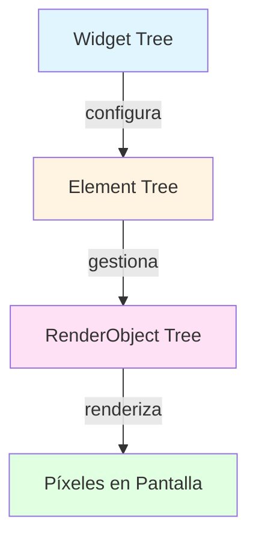
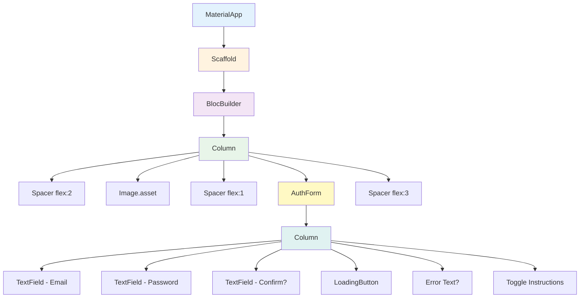

# Widgets y Construcción de Interfaces de Usuario

> **Nivel**: Principiante
> **Prerrequisitos**: 01-introduction-to-flutter.md
> **Tiempo de lectura**: 20 minutos

## Introducción

### Todo es un Widget

En Flutter, existe un concepto fundamental que puede parecer extraño al principio: **todo es un widget**. El título de tu app es un widget. El botón que presionas es un widget. El espacio vacío entre dos elementos es un widget. Incluso cosas invisibles como la estructura que organiza otros elementos son widgets.

Piensa en los widgets como bloques de LEGO. Así como puedes construir desde una casa simple hasta un castillo complejo usando los mismos bloques básicos de LEGO, en Flutter construyes interfaces desde botones simples hasta pantallas complejas usando widgets. Y al igual que los bloques de LEGO se pueden anidar unos dentro de otros (un castillo contiene torres, las torres contienen ventanas), los widgets se anidan para crear jerarquías llamadas "árboles de widgets".

### El Árbol de Widgets

Imagina un árbol genealógico familiar. En la cima tienes a los ancestros, luego sus hijos, luego los nietos, y así sucesivamente. El árbol de widgets funciona de manera similar:

```
MaterialApp (raíz)
  └─ Scaffold (padre)
      ├─ AppBar (hijo 1)
      └─ Column (hijo 2)
          ├─ Text (nieto 1)
          ├─ Image (nieto 2)
          └─ Button (nieto 3)
```

Cada widget puede contener otros widgets, creando una jerarquía. El widget en la raíz (MaterialApp en este caso) es como el tronco del árbol, y todo lo demás se ramifica desde ahí.

### StatelessWidget vs StatefulWidget

Esta es una de las distinciones más importantes en Flutter. Piensa en la diferencia entre una fotografía y un video:

**StatelessWidget = Fotografía**

Un StatelessWidget es como una fotografía: se muestra una vez y nunca cambia. Una vez que Flutter lo dibuja en la pantalla, permanece exactamente igual sin importar qué suceda. Es perfecto para elementos que no necesitan cambiar, como un logo, un texto estático, o un ícono.

Ejemplo simple: Una página de autenticación (AuthPage) que solo muestra un formulario. La página en sí no cambia, simplemente organiza otros widgets.

**StatefulWidget = Video**

Un StatefulWidget es como un video: puede cambiar con el tiempo, mostrando diferentes "fotogramas". Cuando el usuario interactúa con la app (presiona un botón, escribe texto), o cuando llega nueva información del servidor, el widget puede "reconstruirse" mostrando nueva información.

Ejemplo: Un formulario de login (AuthForm) que cambia entre mostrar campos de "login" y "registro", o que muestra mensajes de error cuando algo falla.

### El Ciclo de Vida de un StatefulWidget

Los StatefulWidgets tienen una "vida" que pasa por diferentes etapas, como las estaciones del año:

1. **Primavera - `initState()`**: El widget nace y se prepara. Aquí inicializas variables, comienzas a escuchar datos, preparas controladores. Sucede una sola vez.

2. **Verano - `build()`**: El widget se muestra en pantalla. Este método se ejecuta cada vez que el widget necesita redibujarse. Es como repintar una habitación: puede ocurrir muchas veces.

3. **Otoño - `didUpdateWidget()`**: El widget recibe nueva configuración desde su padre. Es como cuando cambias de ropa según la ocasión.

4. **Invierno - `dispose()`**: El widget se elimina permanentemente. Aquí limpias todo: cancelas escuchas de datos, eliminas controladores, liberas memoria. Sucede una sola vez, al final.

### BuildContext: Tu Ubicación en el Árbol

El BuildContext es como tu ubicación GPS en el árbol de widgets. Te dice exactamente dónde estás y te permite:

1. **Mirar hacia arriba**: Encontrar widgets ancestros (como encontrar el Scaffold más cercano)
2. **Acceder a recursos compartidos**: Temas, configuración regional, información de medios de pantalla
3. **Navegar**: Ir a otras pantallas

Cuando ves `context.read<AuthCubit>()`, estás diciendo: "Busca hacia arriba en el árbol hasta encontrar un AuthCubit y dámelo".

### Ejemplo Real: AuthPage y AuthForm

En la aplicación de neuroanatomía, veamos cómo funcionan estos conceptos:

**AuthPage** (StatelessWidget):
```dart
class AuthPage extends StatelessWidget {
  @override
  Widget build(BuildContext context) {
    return Scaffold(
      body: Column(
        children: [
          Spacer(flex: 2),
          Image.asset('assets/logo_with_text.png', height: 160),
          Spacer(flex: 1),
          AuthForm(state: state),
          Spacer(flex: 3),
        ],
      ),
    );
  }
}
```

AuthPage no tiene estado propio. Simplemente organiza elementos: espacios (Spacer), una imagen (Image), y un formulario (AuthForm). Es como un marco de foto que nunca cambia, aunque la foto dentro (AuthForm) pueda cambiar.

**AuthForm** (StatefulWidget):
```dart
class AuthForm extends StatefulWidget {
  @override
  State<AuthForm> createState() => _AuthFormState();
}

class _AuthFormState extends State<AuthForm> {
  bool isLogin = true;  // Estado: ¿Estamos en modo login o registro?
  bool isLoading = false;  // Estado: ¿Está cargando?

  @override
  Widget build(BuildContext context) {
    // Se reconstruye cada vez que llamamos setState()
    return Column(
      children: [
        TextField(...),
        if (!isLogin) TextField(...),  // Solo aparece en modo registro
        LoadingButton(
          onPressed: () {
            setState(() {
              isLoading = true;  // Cambia el estado y redibuja
            });
            // ... lógica de login
          },
        ),
      ],
    );
  }
}
```

AuthForm sí tiene estado: recuerda si estamos en modo "login" o "registro" (`isLogin`), y si está cargando (`isLoading`). Cuando estos valores cambian, el widget se redibuja automáticamente mostrando diferentes elementos.

---

## Documentación Técnica Formal

### Fundamento Teórico

#### Paradigma Declarativo de UI

Flutter implementa un paradigma declarativo de construcción de interfaces de usuario, en contraste con el enfoque imperativo tradicional. En programación declarativa de UI, se describe *qué* debe mostrarse en función del estado actual, en lugar de *cómo* transicionar entre estados (Windmill, 2020).

**Enfoque Imperativo (tradicional)**:
```
button.setText("Login")
button.setColor(blue)
button.setEnabled(true)
```

**Enfoque Declarativo (Flutter)**:
```dart
Text(isLogin ? "Login" : "Register")
```

El framework se encarga de determinar los cambios necesarios y aplicarlos eficientemente.

#### Sistema de Widgets

Los widgets en Flutter son descripciones inmutables de parte de la interfaz de usuario. Un widget no es la vista renderizada en pantalla, sino una *configuración* que describe cómo debe verse la vista (Flutter Widget Framework Documentation, 2024).

**Propiedades de los Widgets**:

1. **Inmutabilidad**: Los widgets son inmutables. Todos sus campos deben ser `final`.
2. **Composición**: Los widgets se componen en árboles jerárquicos.
3. **Reconstrucción Eficiente**: Flutter puede reconstruir widgets frecuentemente sin impacto significativo en rendimiento.

#### Widget Tree, Element Tree, y RenderObject Tree

Flutter mantiene tres árboles paralelos durante la ejecución:

1. **Widget Tree**: Configuración inmutable, se recrea frecuentemente
2. **Element Tree**: Mantiene la estructura y el estado, persiste entre reconstrucciones
3. **RenderObject Tree**: Maneja el layout, pintura y hit-testing

Esta separación permite reconstruir widgets frecuentemente sin recalcular layout o repintar innecesariamente.



#### StatelessWidget

Un StatelessWidget describe parte de la interfaz de usuario que no depende de estado mutable. Su método `build()` se ejecuta cuando:

1. El widget se inserta en el árbol por primera vez
2. El widget padre cambia su configuración
3. Un InheritedWidget del que depende cambia

**Firma técnica**:
```dart
abstract class StatelessWidget extends Widget {
  const StatelessWidget({Key? key}) : super(key: key);

  @protected
  Widget build(BuildContext context);
}
```

#### StatefulWidget

Un StatefulWidget es un widget que mantiene estado mutable que puede cambiar durante la vida del widget. Se compone de dos clases:

1. **StatefulWidget**: Inmutable, define la configuración
2. **State**: Mutable, contiene el estado y la lógica

**Separación de responsabilidades**:
- StatefulWidget se puede recrear frecuentemente
- State persiste entre reconstrucciones del widget

**Firma técnica**:
```dart
abstract class StatefulWidget extends Widget {
  const StatefulWidget({Key? key}) : super(key: key);

  @protected
  State createState();
}

abstract class State<T extends StatefulWidget> {
  T get widget;
  BuildContext get context;

  @protected
  void initState();

  @protected
  void didUpdateWidget(covariant T oldWidget);

  @protected
  Widget build(BuildContext context);

  @protected
  void dispose();

  @protected
  void setState(VoidCallback fn);
}
```

### Implementación en la Aplicación NeuroAnatomía

#### Ejemplo de StatelessWidget: AuthPage

Ubicación: `/lib/pages/auth_page/auth_page.dart`

```dart
// /lib/pages/auth_page/auth_page.dart (líneas 6-30)
class AuthPage extends StatelessWidget {
  const AuthPage({super.key});

  @override
  Widget build(BuildContext context) {
    return Scaffold(
      body: BlocBuilder<AuthCubit, FirebaseAuthState>(
        builder: (context, state) {
          return Column(
            children: [
              const Spacer(flex: 2),
              Image.asset(
                'assets/logo_with_text.png',
                height: 160,
              ),
              const Spacer(flex: 1),
              AuthForm(state: state),
              const Spacer(flex: 3),
            ],
          );
        },
      ),
    );
  }
}
```

**Análisis técnico**:
- AuthPage no mantiene estado local, por lo tanto extiende StatelessWidget
- Utiliza BlocBuilder para reaccionar a cambios de estado de AuthCubit (gestión de estado externa)
- La reconstrucción es controlada por BLoC, no por estado interno del widget
- Constructor const permite optimizaciones del compilador

#### Ejemplo de StatefulWidget: AuthForm

Ubicación: `/lib/pages/auth_page/widgets/auth_form.dart`

```dart
// /lib/pages/auth_page/widgets/auth_form.dart (líneas 8-14)
class AuthForm extends StatefulWidget {
  final FirebaseAuthState state;
  const AuthForm({super.key, required this.state});

  @override
  State<AuthForm> createState() => _AuthFormState();
}

// /lib/pages/auth_page/widgets/auth_form.dart (líneas 16-23)
class _AuthFormState extends State<AuthForm> {
  bool isLogin = true;
  bool isLoading = false;

  final emailController = TextEditingController();
  final passwordController = TextEditingController();
  final confirmPasswordController = TextEditingController();

  @override
  Widget build(BuildContext context) {
    // ... construcción de UI
  }
}
```

**Análisis técnico**:
- `isLogin` y `isLoading`: Estado local mutable
- `TextEditingController`: Requiere dispose(), por lo tanto necesita StatefulWidget
- Acceso a estado del widget: `widget.state` (línea 92)
- Cambio de estado: `setState(() { isLogin = !isLogin; })` (líneas 120-122)

#### Ciclo de Vida en AuthForm

```dart
// Implícito, llamado automáticamente al crear el widget
@override
void initState() {
  super.initState();
  // Aquí se inicializarían listeners si fueran necesarios
  // Los TextEditingController ya están inicializados en la declaración
}

// Llamado cada vez que el widget padre actualiza la configuración
@override
void didUpdateWidget(AuthForm oldWidget) {
  super.didUpdateWidget(oldWidget);
  // Aquí se compararía oldWidget.state con widget.state
  // para reaccionar a cambios en las props
}

// Llamado antes de remover el widget del árbol
@override
void dispose() {
  // CRÍTICO: Limpiar controladores para evitar memory leaks
  emailController.dispose();
  passwordController.dispose();
  confirmPasswordController.dispose();
  super.dispose();
}
```

**Nota**: En el código actual, el método `dispose()` no está explícitamente implementado, lo cual representa un potencial memory leak. Mejores prácticas requieren siempre disponer de controladores.

#### BuildContext: Navegación en el Árbol

```dart
// /lib/pages/auth_page/widgets/auth_form.dart (líneas 66-69)
await context.read<AuthCubit>().login(
  emailController.text,
  passwordController.text,
);
```

**Análisis técnico**:
- `context`: BuildContext proporcionado automáticamente en el método build
- `read<AuthCubit>()`: Extension method de flutter_bloc que busca hacia arriba en el árbol hasta encontrar un Provider de AuthCubit
- El BuildContext es válido mientras el widget esté en el árbol
- Uso de `mounted` (línea 80): Verifica que el BuildContext siga siendo válido antes de llamar setState después de operaciones asíncronas

### Diagrama: Árbol de Widgets de AuthPage



### Especificaciones Técnicas

#### Métodos del Ciclo de Vida - Orden de Ejecución

1. **Constructor**: Inicialización de campos finales
2. **initState()**: Una vez, al insertar en el árbol
3. **didChangeDependencies()**: Después de initState y cuando InheritedWidget cambia
4. **build()**: Múltiples veces, cuando el widget necesita reconstruirse
5. **didUpdateWidget()**: Cuando el padre actualiza la configuración
6. **setState()**: Marca el widget como "dirty" para reconstrucción
7. **deactivate()**: Cuando el widget se remueve del árbol (pero puede reinsertarse)
8. **dispose()**: Una vez, al remover permanentemente

#### setState() - Funcionamiento Interno

```dart
void setState(VoidCallback fn) {
  // 1. Ejecuta la función que modifica el estado
  fn();

  // 2. Marca el Element como "dirty"
  _element.markNeedsBuild();

  // 3. Programa un rebuild para el próximo frame
  SchedulerBinding.instance.scheduleFrame();
}
```

**Importante**: El callback de setState debe ser sincrónico. Operaciones async deben completarse antes de llamar setState:

```dart
// ❌ INCORRECTO
setState(() async {
  await fetchData();
});

// ✅ CORRECTO
final data = await fetchData();
setState(() {
  this.data = data;
});
```

### Mejores Prácticas

#### 1. Preferir StatelessWidget cuando sea posible

StatelessWidget es más ligero y permite optimizaciones del compilador (const constructors).

#### 2. Mantener build() puro

El método build() puede ejecutarse frecuentemente. Evitar:
- Operaciones costosas
- Efectos secundarios
- Modificación de estado

#### 3. Siempre disponer de recursos

```dart
@override
void dispose() {
  _controller.dispose();
  _subscription?.cancel();
  super.dispose();
}
```

#### 4. Verificar mounted antes de setState después de async

```dart
Future<void> loadData() async {
  final data = await fetchData();
  if (mounted) {  // Verifica que el widget siga en el árbol
    setState(() {
      this.data = data;
    });
  }
}
```

#### 5. Usar const constructors cuando sea posible

```dart
const Text('Hello')  // ✅ Puede reutilizarse
Text('Hello')        // ❌ Se crea nueva instancia
```

### Desafíos Comunes

#### Desafío 1: setState en widget desmontado

**Problema**: Llamar setState después de que el widget se removió del árbol.

**Solución**:
```dart
if (mounted) {
  setState(() {
    // actualizar estado
  });
}
```

#### Desafío 2: BuildContext inválido después de async

**Problema**: Usar BuildContext después de operación asíncrona cuando el widget ya no existe.

**Solución**:
```dart
Future<void> navigate() async {
  await someOperation();
  if (mounted) {
    Navigator.of(context).push(...);
  }
}
```

#### Desafío 3: setState llamado durante build

**Problema**: Intentar modificar estado mientras se está construyendo la UI.

**Solución**: Usar addPostFrameCallback:
```dart
@override
void didChangeDependencies() {
  super.didChangeDependencies();
  WidgetsBinding.instance.addPostFrameCallback((_) {
    setState(() {
      // actualización segura
    });
  });
}
```

## Referencias

### Documentación Interna

- [Introducción a Flutter](./01-introduction-to-flutter.md) - Conceptos básicos de Flutter
- [Gestión de Estado](./03-state-management-intro.md) - Siguiente lectura recomendada
- [Patrón BLoC](../bloc-pattern/01-bloc-pattern-fundamentals.md) - Para gestión de estado más compleja

### Referencias Externas

1. **Flutter Widget Framework Documentation** (2024). Flutter Widgets Introduction. https://docs.flutter.dev/development/ui/widgets-intro
2. **Windmill, E.** (2020). *Flutter in Action*. Manning Publications. Chapter 3: "Widgets and the Element Tree".
3. **Vos, B.** (2021). *Flutter for Beginners*. Packt Publishing. Chapter 4: "Introduction to Widgets".
4. **Soares, P.** (2021). *Flutter Complete Reference*. Alberto Miola. Section 2.2: "The Widget Lifecycle".
5. **Flutter Widget Catalog** (2024). https://docs.flutter.dev/development/ui/widgets
6. **Nystrom, B.** (2014). *Game Programming Patterns*. Genever Benning. Chapter on "State" pattern (applicable to StatefulWidget design).

## Lecturas Adicionales

### Siguientes Pasos

- **03-state-management-intro.md**: Aprende sobre gestión de estado en aplicaciones complejas
- **bloc-pattern/01-bloc-pattern-fundamentals.md**: Descubre el patrón BLoC usado en esta app

### Temas Avanzados

- **Keys en Flutter**: Cuándo y cómo usar GlobalKey, ValueKey, UniqueKey
- **InheritedWidget**: Cómo funcionan los widgets que propagan datos hacia abajo en el árbol
- **RenderObject**: Para crear widgets completamente personalizados con control total sobre layout y pintura
