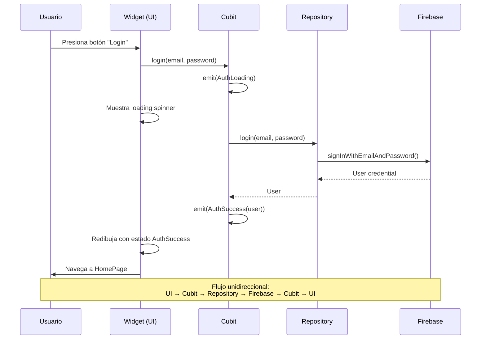

# Introducción a la Gestión de Estado

> **Nivel**: Intermedio
> **Prerrequisitos**: 02-widgets-and-ui.md
> **Tiempo de lectura**: 18 minutos

## Introducción

### ¿Qué es el Estado?

Imagina que estás leyendo un libro. El "estado" es tu marcador de página: te dice exactamente dónde estás en tu lectura. Cuando cierras el libro y lo vuelves a abrir, necesitas ese marcador para continuar donde lo dejaste. Sin él, estarías perdido.

En una aplicación, el estado es toda la información que necesita recordar para funcionar correctamente:
- ¿El usuario ha iniciado sesión?
- ¿Qué corte cerebral está viendo actualmente?
- ¿Qué texto ha escrito en el campo de búsqueda?
- ¿La aplicación está cargando datos del servidor?

### El Problema: ¿Dónde Guardar el Marcador?

Aquí viene el desafío: en una aplicación compleja, tienes muchos "libros" (pantallas, componentes) que necesitan saber cosas diferentes. Algunos necesitan su propio marcador privado (estado local), otros necesitan compartir el mismo marcador (estado compartido), y algunos necesitan un marcador que persista incluso si cierras la app (estado persistente).

Gestionar todos estos marcadores de manera eficiente, sin perderlos y sin que se contradigan entre sí, es lo que llamamos "gestión de estado".

### Estado Local vs Estado de Aplicación

**Estado Local = Tu Diario Personal**

El estado local es como un diario personal: solo tú lo lees, solo tú lo escribes, y cuando cierras el diario, nadie más necesita saber qué hay ahí. En Flutter, es el estado que vive dentro de un solo widget.

Ejemplos:
- Un campo de texto mientras escribes (antes de guardar)
- Si un menú desplegable está abierto o cerrado
- La posición actual en un carrusel de imágenes

**Estado de Aplicación = El Tablón de Anuncios de la Oficina**

El estado de aplicación es como el tablón de anuncios en una oficina: muchas personas necesitan leer la información, y cuando alguien la actualiza, todos necesitan ver la versión nueva. Este estado es compartido entre múltiples pantallas o componentes.

Ejemplos:
- Información del usuario autenticado (necesaria en toda la app)
- Los cortes cerebrales cargados desde Firebase
- Las notas del usuario
- El tema de la aplicación (claro/oscuro)

### El Problema con setState()

Recordemos que `setState()` es la forma más básica de actualizar la UI en Flutter. Es como tener una alarma en tu teléfono: cuando suena, te recuerda mirar algo.

Para estado local simple, `setState()` es perfecto:

```dart
// ✅ Perfecto para estado local simple
class Counter extends StatefulWidget {
  @override
  _CounterState createState() => _CounterState();
}

class _CounterState extends State<Counter> {
  int count = 0;

  @override
  Widget build(BuildContext context) {
    return Text('Count: $count');
  }

  void increment() {
    setState(() {
      count++;
    });
  }
}
```

Pero imagina que necesitas compartir ese contador entre 10 pantallas diferentes. Tendrías que:
1. Pasar el valor como parámetro a través de cada widget intermedio (incluso si no lo usan)
2. Pasar también la función `increment()` hacia abajo
3. Cada vez que cambies algo, reconstruir toda la cadena de widgets

Es como tener que pasar un mensaje secreto de mano en mano a través de 20 personas, cuando podrías simplemente publicarlo en el tablón de anuncios.

### Patrones de Gestión de Estado en Flutter

La comunidad de Flutter ha desarrollado varios patrones para resolver este problema. Es como tener diferentes tipos de sistemas de correo:

**1. Provider (Oficina de Correos Local)**
- Simple y directo
- Bueno para apps pequeñas y medianas
- Oficial de Google
- Usa InheritedWidget bajo el capó

**2. BLoC (Sistema de Mensajería Corporativo)**
- Muy estructurado y predecible
- Separa completamente la lógica de negocio de la UI
- Excelente para apps grandes y equipos grandes
- Usa streams (flujos de datos)
- Más código inicial, pero muy escalable

**3. Riverpod (Correo Moderno con Tracking)**
- Evolución de Provider
- Type-safe y testeable
- No depende de BuildContext
- Muy popular en apps nuevas

**4. GetX (Correo Express Todo-en-Uno)**
- Muy simple y rápido de implementar
- Incluye gestión de estado, navegación, y más
- Menos código boilerplate
- Controvertido: algunos lo aman, otros prefieren soluciones más "puras"

### ¿Por Qué Esta App Usa BLoC?

La aplicación de neuroanatomía usa el patrón BLoC (Business Logic Component). ¿Por qué?

1. **Separación Clara**: La lógica de negocio (como cargar cortes cerebrales desde Firebase) está completamente separada de la UI (cómo se muestran). Esto hace que el código sea más fácil de entender, probar y modificar.

2. **Flujo de Datos Unidireccional**: Los datos fluyen en una sola dirección, como un río:
   ```
   Usuario → Evento → BLoC → Nuevo Estado → UI se Actualiza
   ```
   No hay flujos bidireccionales confusos que puedan crear bugs difíciles de rastrear.

3. **Testabilidad**: Puedes probar toda la lógica de negocio sin necesidad de crear widgets o simular toques en pantalla.

4. **Escalabilidad**: A medida que la app crece, el patrón BLoC mantiene todo organizado.

5. **Propósito Académico**: Para una tesis, BLoC es un patrón bien documentado con fundamentos sólidos, respaldado por Google, con abundante literatura académica y profesional.

### Cómo Funciona BLoC en Esta App

Piensa en BLoC como un gerente de restaurante:

1. **Los clientes (UI)** hacen pedidos → *Eventos*
2. **El gerente (BLoC)** procesa el pedido, coordina con la cocina → *Lógica de Negocio*
3. **El gerente entrega la comida** → *Nuevo Estado*
4. **El cliente recibe su comida** → *UI se Actualiza*

Ejemplo concreto en la app de neuroanatomía:

```
Usuario toca "siguiente corte cerebral"
   ↓
AuthForm emite evento: LoadNextCorte
   ↓
CortesCubit procesa: busca el siguiente corte en Firebase
   ↓
CortesCubit emite estado: CortesLoaded(siguiente_corte)
   ↓
HomePage escucha el cambio y se redibuja mostrando el nuevo corte
```

El usuario nunca habla directamente con Firebase. La UI nunca sabe de dónde vienen los datos. Todo está perfectamente separado.

---

## Documentación Técnica Formal

### Fundamento Teórico

#### Definición de Estado en Aplicaciones Reactivas

En el contexto de desarrollo de aplicaciones, el estado se define como el conjunto de datos que determinan el comportamiento y la representación visual de la aplicación en un momento dado (Fowler, 2002). La gestión de estado se refiere a los patrones, técnicas y herramientas utilizadas para:

1. Almacenar datos de aplicación
2. Modificar datos de forma controlada
3. Propagar cambios a componentes dependientes
4. Mantener consistencia entre múltiples fuentes de verdad

#### Taxonomía del Estado

**Estado Local (Component State)**

Estado que pertenece y es gestionado por un único componente de UI, típicamente implementado con StatefulWidget en Flutter.

**Características**:
- Alcance limitado a un widget y sus descendientes directos
- Ciclo de vida vinculado al ciclo de vida del widget
- No requiere mecanismos de propagación complejos
- Implementado mediante `setState()` en Flutter

**Casos de uso**: Animaciones locales, estado de formularios, UI temporal (diálogos, tooltips)

**Estado de Aplicación (Application State)**

Estado compartido entre múltiples componentes, pantallas o módulos de la aplicación.

**Características**:
- Alcance global o semi-global
- Ciclo de vida independiente de widgets individuales
- Requiere mecanismo de propagación (streams, notificadores, InheritedWidget)
- Puede requerir persistencia

**Casos de uso**: Autenticación de usuario, datos de dominio, configuración de aplicación, caché de red

**Estado Efímero vs Estado Persistente**

- **Efímero**: Existe solo mientras la app está en ejecución (posición de scroll)
- **Persistente**: Se mantiene entre sesiones (preferencias de usuario, datos descargados)

#### Limitaciones de setState()

`setState()` es el mecanismo fundamental de actualización de estado en Flutter, pero presenta limitaciones en aplicaciones complejas:

**Problema 1: Prop Drilling**

Pasar estado a través de múltiples niveles de widgets intermedios que no utilizan el estado.

```dart
// Anti-pattern: Prop drilling
WidgetA(user) → WidgetB(user) → WidgetC(user) → WidgetD(user)
// Solo WidgetD usa 'user', pero todos deben declararlo
```

**Problema 2: Falta de Separación de Responsabilidades**

La lógica de negocio queda acoplada al código de UI, violando el principio de Single Responsibility (Martin, 2017).

**Problema 3: Dificultad de Testing**

Testing de lógica requiere instanciar widgets completos, no unit tests puros.

**Problema 4: Inconsistencia de Estado**

Múltiples copias del mismo estado en diferentes widgets pueden desincronizarse.

#### Patrones de Gestión de Estado en Flutter

##### 1. Provider

Wrapper sobre InheritedWidget que facilita la inyección de dependencias y propagación de estado.

**Fundamento**: Observer pattern + Dependency Injection

**Ventajas**:
- Recomendado oficialmente por Google
- API simple e intuitiva
- Bien integrado con Flutter

**Limitaciones**:
- Menos estructura que BLoC para apps grandes
- Requiere cuidado con rebuilds innecesarios

##### 2. BLoC (Business Logic Component)

Patrón presentado por Paolo Soares en Google I/O 2018, basado en programación reactiva con Streams.

**Fundamento**: Observer pattern + Unidirectional data flow + Reactive programming

**Arquitectura**:
```
UI → Events → BLoC → States → UI
```

**Principios**:
1. Separación completa de UI y lógica de negocio
2. Flujo de datos unidireccional
3. Testabilidad mediante streams puros
4. Reactividad mediante StreamController

**Ventajas**:
- Separación rigurosa de responsabilidades
- Altamente testeable
- Escalable a apps complejas
- Documentación extensa

**Limitaciones**:
- Más boilerplate que otros patrones
- Curva de aprendizaje de streams

##### 3. Riverpod

Evolución de Provider creada por Remi Rousselet.

**Ventajas**:
- Type-safe compile-time
- No requiere BuildContext
- Testing simplificado
- Scoping explícito

**Limitaciones**:
- Menos maduro que BLoC o Provider
- Requiere code generation para características avanzadas

##### 4. GetX

Solución "todo-en-uno" para gestión de estado, navegación, y dependencias.

**Ventajas**:
- Mínimo boilerplate
- Rendimiento optimizado
- API simple

**Limitaciones**:
- Menos predecible que soluciones basadas en arquitectura
- Opiniones divididas en la comunidad sobre buenas prácticas

### Implementación en la Aplicación NeuroAnatomía

#### Selección de BLoC Pattern

La aplicación implementa el patrón BLoC mediante la biblioteca `flutter_bloc` (versión 8.x). Esta elección se fundamenta en:

1. **Requisitos de Arquitectura**: Aplicación educativa compleja con múltiples fuentes de datos (Firebase, OpenAI API)
2. **Separación de Capas**: Necesidad de testear lógica de negocio independientemente de UI
3. **Propósito Académico**: BLoC está bien documentado académicamente y es un patrón de industria estándar

#### Estructura de Estado en la Aplicación

La aplicación organiza el estado en múltiples Cubits (variante simplificada de BLoC):

**1. AuthCubit** - Gestión de Autenticación
- **Estados**: AuthInitial, AuthLoading, AuthSuccess, AuthFailure
- **Responsabilidad**: Login, registro, logout, actualización de perfil
- **Alcance**: Global (toda la app)

**2. CortesCubit** - Gestión de Cortes Cerebrales
- **Estados**: CortesInitial, CortesLoading, CortesLoaded, CortesError
- **Responsabilidad**: Cargar cortes desde Firebase, navegación entre cortes
- **Alcance**: HomePage y componentes relacionados

**3. DiagramasCubit** - Gestión de Diagramas Anatómicos
- **Estados**: DiagramasInitial, DiagramasLoading, DiagramasLoaded, DiagramasError
- **Responsabilidad**: Cargar y cachear diagramas
- **Alcance**: DiagramasPage

**4. QuizCubit** - Gestión de Quizzes Generados por IA
- **Estados**: QuizInitial, QuizLoading, QuizLoaded, QuizError
- **Responsabilidad**: Generar quizzes vía OpenAI API
- **Alcance**: QuizPage

**5. CorteInteractivoCubit** - Gestión de Interacción con Cortes
- **Estados**: Selección de segmentos, zoom, pan
- **Responsabilidad**: Manejo de interacciones de usuario con visualizaciones
- **Alcance**: InteractiveIlustracion widget

#### Flujo de Datos Completo: Ejemplo de Login

```dart
// 1. Usuario presiona botón de login en AuthForm
// /lib/pages/auth_page/widgets/auth_form.dart (líneas 66-69)
await context.read<AuthCubit>().login(
  emailController.text,
  passwordController.text,
);

// 2. AuthCubit procesa el evento
// /lib/cubits/auth_cubit/auth_cubit.dart (líneas 20-28)
Future<void> login(String email, String password) async {
  emit(AuthLoading(email: email, password: password));
  try {
    final user = await authRepository.login(email, password);
    if (user != null) emit(AuthSuccess(user: user));
  } catch (e) {
    emit(AuthFailure(message: e.toString()));
  }
}

// 3. AuthRepository ejecuta la lógica de Firebase
// /lib/repositories/auth_repository.dart
Future<User?> login(String email, String password) async {
  final credential = await FirebaseAuth.instance
      .signInWithEmailAndPassword(email: email, password: password);
  return credential.user;
}

// 4. UI reacciona al cambio de estado
// /lib/main.dart (líneas 43-66)
BlocBuilder<AuthCubit, FirebaseAuthState>(
  builder: (context, state) {
    if (state is AuthSuccess) {
      return HomePage();  // Navega a home
    } else if (state is AuthFailure) {
      return AuthPage();  // Muestra error
    }
    // ...
  }
)
```

#### Provisión de Dependencias

La aplicación utiliza `RepositoryProvider` para inyección de dependencias:

```dart
// /lib/main.dart (líneas 30-35)
MultiRepositoryProvider(
  providers: [
    RepositoryProvider<AuthRepository>(
      create: (context) => AuthRepository(),
    ),
  ],
  child: MaterialApp(...)
)
```

Los Cubits se instancian con acceso a repositorios vía `context.read<>()`:

```dart
// /lib/main.dart (líneas 40-42)
BlocProvider<AuthCubit>(
  create: (context) =>
      AuthCubit(authRepository: context.read<AuthRepository>()),
  child: ...
)
```

### Diagrama: Flujo de Estado con BLoC



### Especificaciones Técnicas

#### Comparativa de Patrones

| Característica | setState() | Provider | BLoC | Riverpod | GetX |
|---------------|-----------|----------|------|----------|------|
| Complejidad de Setup | Baja | Media | Alta | Media | Baja |
| Separación UI/Lógica | No | Parcial | Completa | Parcial | Parcial |
| Testabilidad | Baja | Media | Alta | Alta | Media |
| Boilerplate | Mínimo | Medio | Alto | Medio | Mínimo |
| Type Safety | Sí | Parcial | Sí | Completo | Limitado |
| Curva de Aprendizaje | Mínima | Baja | Alta | Media | Baja |
| Escalabilidad | Baja | Media | Alta | Alta | Media |

### Mejores Prácticas

#### 1. Usar Estado Local Cuando Sea Apropiado

No todo el estado necesita BLoC. Para UI simple y local, `setState()` es suficiente y más eficiente.

```dart
// ✅ Apropiado para setState
class AnimatedButton extends StatefulWidget {
  @override
  _AnimatedButtonState createState() => _AnimatedButtonState();
}

class _AnimatedButtonState extends State<AnimatedButton> {
  bool _isPressed = false;  // Estado puramente visual y local
  // ...
}
```

#### 2. Mantener Estados Inmutables

Los estados de BLoC deben ser inmutables y usar Equatable para comparaciones eficientes:

```dart
// ✅ Estado inmutable con Equatable
class CortesLoaded extends CortesState {
  final List<CorteCerebro> cortes;

  const CortesLoaded({required this.cortes});

  @override
  List<Object> get props => [cortes];
}
```

#### 3. Un Cubit por Responsabilidad

Cada Cubit debe tener una responsabilidad única (Single Responsibility Principle).

```dart
// ✅ Cubits separados por dominio
AuthCubit       // Solo autenticación
CortesCubit     // Solo gestión de cortes cerebrales
QuizCubit       // Solo generación de quizzes
```

#### 4. Usar BlocProvider en el Nivel Apropiado

Proveer Cubits en el nivel más bajo posible que aún cubra todos los consumidores:

```dart
// ❌ Demasiado alto - disponible globalmente cuando solo HomePage lo necesita
MaterialApp(
  home: BlocProvider<CortesCubit>(...)
)

// ✅ Nivel apropiado - solo disponible donde se necesita
class HomePage extends StatelessWidget {
  @override
  Widget build(BuildContext context) {
    return BlocProvider<CortesCubit>(
      create: (context) => CortesCubit()..loadCortes(),
      child: HomePageView(),
    );
  }
}
```

### Desafíos Comunes

#### Desafío 1: Múltiples Rebuilds Innecesarios

**Problema**: BlocBuilder se reconstruye en cada cambio de estado, incluso si solo necesita reaccionar a estados específicos.

**Solución**: Usar `buildWhen` para filtrar reconstrucciones:

```dart
BlocBuilder<AuthCubit, FirebaseAuthState>(
  buildWhen: (previous, current) {
    // Solo rebuilds cuando cambia de/a AuthSuccess
    return current is AuthSuccess || previous is AuthSuccess;
  },
  builder: (context, state) {
    // ...
  },
)
```

#### Desafío 2: Side Effects (Navegación, Snackbars)

**Problema**: Necesitas ejecutar acciones one-time en respuesta a cambios de estado, no reconstruir UI.

**Solución**: Usar BlocListener o BlocConsumer:

```dart
BlocListener<AuthCubit, FirebaseAuthState>(
  listener: (context, state) {
    if (state is AuthFailure) {
      ScaffoldMessenger.of(context).showSnackBar(
        SnackBar(content: Text(state.message)),
      );
    }
  },
  child: // ... UI normal
)
```

#### Desafío 3: Acceder a Múltiples Cubits

**Problema**: Un widget necesita datos de varios Cubits.

**Solución**: Usar MultiBlocBuilder o componer BlocBuilders:

```dart
BlocBuilder<AuthCubit, FirebaseAuthState>(
  builder: (context, authState) {
    return BlocBuilder<CortesCubit, CortesState>(
      builder: (context, cortesState) {
        // Acceso a ambos estados
        if (authState is AuthSuccess && cortesState is CortesLoaded) {
          // ...
        }
      },
    );
  },
)
```

## Referencias

### Documentación Interna

- [Widgets y UI](./02-widgets-and-ui.md) - Fundamentos de widgets
- [Patrón BLoC](../bloc-pattern/01-bloc-pattern-fundamentals.md) - Siguiente lectura recomendada
- [Arquitectura de la App](../architecture/01-app-architecture-overview.md) - Visión arquitectónica completa

### Referencias Externas

1. **Soares, P., & Mehta, S.** (2018). Build reactive mobile apps with Flutter. Google I/O 2018. https://www.youtube.com/watch?v=RS36gBEp8OI
2. **Angelov, F.** (2020). BLoC Library Documentation. https://bloclibrary.dev
3. **Flutter State Management Documentation** (2024). https://docs.flutter.dev/development/data-and-backend/state-mgmt
4. **Soares, P.** (2021). *Flutter Complete Reference*. Alberto Miola. Chapter 5: "State Management".
5. **Martin, R. C.** (2017). *Clean Architecture: A Craftsman's Guide to Software Structure and Design*. Prentice Hall.
6. **Fowler, M.** (2002). *Patterns of Enterprise Application Architecture*. Addison-Wesley.
7. **Gamma, E., Helm, R., Johnson, R., & Vlissides, J.** (1994). *Design Patterns: Elements of Reusable Object-Oriented Software*. Addison-Wesley. (Observer Pattern)

## Lecturas Adicionales

### Siguientes Pasos

- **bloc-pattern/01-bloc-pattern-fundamentals.md**: Profundiza en el patrón BLoC
- **bloc-pattern/02-cubit-simplified-bloc.md**: Aprende sobre Cubit
- **architecture/03-data-flow.md**: Flujos completos de datos en la app

### Temas Avanzados

- **Reactive Programming**: Streams, StreamController, Subjects
- **State Machines**: Modelar estados como máquinas de estado finitas
- **Event Sourcing**: Patrón avanzado de gestión de estado basado en eventos
